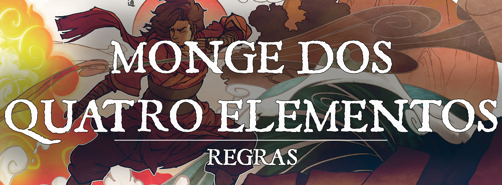

# Tradição de Monge: Monge dos Quatro Elementos

Você segue uma tradição monástica que lhe ensina a dominar os elementos. Quando você foca seu ki, você pode sintonizar-se com as forças da criação e dobrar os quatro elementos à sua vontade, utilizando-os como uma extensão do seu corpo. Alguns membros desta tradição se dedicam a um único elemento, mas outros tecem os elementos uns com os outros.

Muitos monges desta tradição tatuam seus corpos com representações de seus poderes de ki, normalmente imaginados como dragões se enrolando, mas também como fênixes, peixes, plantas, montanhas e ondas quebrando.

## Iniciado do Caminho

---

Quando você escolha esta tradição no 3º nível, você aprende como manipular os quatro elementos de maneiras súbitas. Você aprende 2 dos seguintes truques: *controlar chamas (control flames)*, *lufada (gust)*, *moldar terra (mold earth)* ou *moldar água (shape water)*. Você aprende dois truques adicionais desta lista no 6º nível.

## Discípulo dos Elementos

---

No 3º nível, você aprende disciplinas mágicas que controlam o poder dos quatro elementos. Algumas disciplinas exigem que você gaste pontos de ki quando você as utiliza.

Você aprende duas disciplinas elementais à sua escolha, que são detalhadas na seção de disciplinas elementais. Você aprende duas disciplinas elementais adicionais à sua escolha no 6º, 11º e 17º níveis.

Além disso, quando você adquire um nível nesta classe, você pode substituir uma disciplina elemental que você já conhecia por uma displina diferente. 

***Lançando Magias Elementais.*** Algumas disciplinas elementais lhe permitem lançar magias. Veja o Capítulo 10 do Livro do Jogador para as regras gerais de lançar magia. Para lançar uma destas magias você usa seu tempo de conjuração e outras regras, mas não precisa providenciar componentes materiais. Quando você lança uma magia com uma disciplina ela é lançada no nível mais baixo da magia, a menos que esta diga o contrário.

Ao atingir o 5º nível nesta classe, você pode gastar pontos de ki adicionais para aumentar o nível de uma magia de disciplina elemental que você possa lançar, desde que a magia tenha um efeito aprimorado em níveis mais altos, como mãos flamejantes (burning hands). O nível da magia aumenta em 1 por ponto de ki adicional que você gastar. Por exemplo, se você é um monge de 5º nível usando Golpe das Brasas Arrebatadoras para lançar mãos flamejantes (burning hands), você pode gastar 2 pontos de ki para lançá-la como uma magia de 2º nível (o custo base da disciplina de 1 ponto de ki, mais 1).

O número máximo de pontos de ki (seu custo base em pontos de ki mais quaisquer pontos adicionais) que você pode gastar em uma magia é 2, a menos que a disciplina especifique diferente. Este máximo aumenta para 3 no 9º nível, 4 no 13º nível e 5 no 17º.

#### Gasto Máximo de Pontos de Ki em Magias de Disciplinas

| Níveis | Gasto Máximo de Ki |
| --- | --- |
| 3-8 | 2 |
| 9-12 | 3 |
| 13-16 | 4 |
| 17-20 | 5 |

## Disciplinas Elementais de 3º Nível

---

Começando no 3º nível, você pode aprender as seguintes disciplinas:

**Tornar-se o Bule.** Você se adapta às energias, sintonizando-se com o elemento, tornando-se ele. Você pode gastar 1 ponto de ki para lançar *absorver elementos (absorb elements).*

**Passo sem Esforço.**O ar ao seu redor trabalha em unissom com seus movimentos, erguendo-lhe conforme você pula. A altura e a distância do seu pulo são dobradas (quadruplicadas com Passo do Vento) e você ganha vantagem em testes de Força (Atletismo) relacionados a pular.

**Postura da Montanha Duradoura.** Seu corpo e mente tornam-se tão rigidos e inabaláveis quanto o chão abaixo de você. Seu ki prende seus pés no chão e você torna-se imóvel. Quando você usa a ação de Esquiva, você não pode ser movido, empurrado, agarrado, amedrontado ou derrubado contra sua vontade até o começo do seu próximo turno, mesmo se compelido magicamente a fazê-lo. Você deve estar em cima do chão para usar esta habilidade.

**Presas da Cobra de Fogo.** Seus braços e pernas ficam envoltos em labaredas de fogo crepitante. Quando você faz um ataque desarmado no seu turno, você pode escolher materializar tentáculos de fogo que se estendem além do seu alcance normal. Seu alcance aumenta em 1,5 metros para aquele ataque, e ele causa dano de fogo, ao invés de dano contusivo. Se o ataque atingir, você pode gastar 1 ponto de ki para causar 1d10 de dano extra de fogo.

**Presa do Lobo de Gelo.** Você invoca um fragmento de gelo afiado e o arremessa no seu alvo. Você pode gastar 1 ponto de ki para lançar *faca de gelo (ice knife).*

**Punho dos Quatro Trovões.** Você bate seus punhos um contra o outro, causando um rugido estrondoso que arremessa para longe tudo ao seu redor. Você pode gastar 1 ponto de ki para *lançar onda de trovão (thunderwave).*

**Punho de Ar Contínuo.** Você invoca um redemoinho de ar e o concentra ao redor dos seus punhos. Quando você faz um ataque desarmado no seu turno, você pode escolher disparar rajadas concentradas de ar que vão além do seu alcance normal. Seu alcance aumenta em 1,5 para aquele ataque. Se o ataque atingir, você pode gastar 1 pontos de ki para forçar o alvo a fazer um teste de resistência de Força ou ser empurrado 3 metros para trás.

**Caminho de Gelo da Serpente Dourada.** Sempre que você usar a ação de Corrida, até o fim do seu turno para qualquer movimento que você faça sobre uma superfície você pode deixar um rastro de gelo escorregadio. O gelo conta como terreno difícil e dura até o começo do seu próximo turno.

**Texugo Rosnador.** Você treme o chão, causando um tremor que derruba seus inimigos. Você pode gastar 1 pontos de ki para lançar *tremor de terra (earth tremor)*.

**Corrida dos Espíritos do Vendaval.** Você lança uma rajada de ar com um empurrão da sua palma aberta. Você pode gastar 2 pontos de ki para lançar* lufada de vento (gust of wind).*

**Moldar a Nuvem de Chuva.** Você pode gastar 1 ponto de ki para lançar *criar ou destruir água (create or destroy water).*

**Golpe das Brasas Arrebatadoras.**Com um movimento em arco, você invoca uma rajada de brasas quentes. Você pode gastar 1 ponto de ki para lançar *mãos flamejantes (burning hands).*

**Chicote D'Água.** Você invoca um chicote longo e elástico de água pura que você segura em uma das pontas. Você pode gastar 1 ponto de ki como uma ação bônus para criar um chicote de água que empurra e puxa uma criatura para desequilibrá-la. Uma criatura que você pode ver a 9 metros de você deve fazer um teste de resistência de Destreza. Em uma falha, a criatura leva dano contusivo igual ao seu dado de Artes Marciais + seu modificador de Destreza, mais 1d10 de dano contusivo para cada ponto de ki adicional que você gastar, e você pode derrubá-la ou puxá-la até 7,5 metros em sua direção. Em um sucesso, a criatura leva metade do dano, e você não a puxa ou derruba. Você não pode usar Chicote D'Água e lançar uma magia no mesmo turno.

## Disciplinas Elementais de 6º Nível

---

Começando no 6º nível, você pode aprender as seguintes disciplinas:

**Uma Folha ao Vento.** Um vento poderoso sobe para segurá-lo conforme você cai. Sua Queda Lenta não requer mais uma reação para usar, e ao invés disso você pode usá-la automaticamente sempre que você estiver consciente e não estiver incapacitado, e ela nega todo dano de queda, independente de distância. Quando você usa a habilidade Queda Lenta, você também pode planar pelo ar para mover-se 1,5 em qualquer direção horizontal para cada 1,5 metros que você cair.

**Mão Esmagadora da Montanha**. Você foca sua força em um punho estendido, invocando uma mão de terra do chão. Você pode gastar 2 pontos de ki para lançar *agarrar terrestre de maximilian (maximilian's earthen grasp)*.

**Cortina de Vento Inflexível.** Você libera um rugido feroz conforme um vento poderoso começa a turbilhar ao seu redor. Você pode gastar 2 pontos de ki para lançar* vento protetor (warding wind)*.

**Gongo do Cume.**Você atinge o ar como se fosse um gongo. Você pode gastar 2 pontos de ki para lançar *estilhaçar (shatter).*

**Chama do Filhote.** Você foca seu ki em uma torrente de fogo que serpenteia para longe. Você gasta 2 pontos de ki para lançar *queimadura de aganazzar (aganazzar's scorcher).*

**Casco Impenetrável da Tartaruga de Ferro.** Você incoca uma barreira de terra para defender a si mesmo ou a um aliado. Como uma reação, você pode gastar 1 pontos de ki para usar sua habilidade Defletir Projéteis contra um ataque que você possa ver a 9 metros de você. Qualquer dano não prevenido por esta habilidade é recebido pelo alvo original do ataque. Se você reduzir o dano a 0, você não pode fazer um ataque com ele.

**Partícula do Sol.** O seu ki se manifesta como uma esfera estrondosa de fogo. Você pode gastar 2 pontos de ki para lançar *esfera flamejante (flaming sphere)*.

**Bando de Lebre de Gelo.** Uma rajada de bolas de neve mágicas jorram de um ponto a sua escolha dentro do alcance. Você pode gastar 2 pontos de ki para lançar enxame de bolas de *neve de snilloc (snilloc's snowball swarm).*

**Texugo Paciente Ouve.** Você estende seu ki ao chão abaixo de você. Você pode gastar 2 pontos de ki como uma ação bônus para ganhar sentido sísmico com um alcance de 9 metros, e uma velocidade de escavar igual à metade da sua velocidade de caminhada por até 1 minuto. Seu movimento deixa para trás um túnel que permance enquanto esta habilidade estiver ativa, então ele desmorona.

**Garras do Dragão Vermelho.** Raios de fogo surgem de suas mãos abertas para queimar seus inimigos. Você pode gastar 2 pontos de ki para lançar *raio ardente (scorching ray)*. Adicionalmente, você estende seu ki para apagar uma fonte de fogo, fazendo com que ele apague com uma explosão, ou lance uma fumaça negra. Você pode gastar 2 pontos de ki para lançar *pirotecnia (pyrotechnics)*

**Jato D'Água.** Você pode gastar 2 pontos de ki como uma ação para lançar um jato d'água em uma linha de 9 metros de comprimento e 1,5 metros de largura. Cada criatura na linha deve fazer um teste de resistência de Força, levando dano contundente igual ao seu dado de Artes Marciais + seu modificador de Sabedoria em uma falha, ou metade do dano em um sucesso. Adicionalmente, você pode mover cada alvo que falhar seu teste de resistência para um espaço não ocupado que esteja tocando a linha.

## Disciplinas Elementais do 11º Nível

---

Começando no 11º nível, você pode aprender as seguintes disciplinas:

**Dança dos Três Caminhos.** Você invoca seis esferas de terra do chão, as suspende no ar, e as inflama com seu ki flamejante. Com um pensamento, você lança estes meteoros flamejantes no seu inimigo. Você pode gastar 3 pontos de ki para lançar *meteroros diminutos de melf (melf's minute meteors)*.

**Terra Alcança o Céu.** Focando sua força com um grito profundo e estrondoso, você balança seus braços no alto, causando uma erupção de terra queimada e pedra que engole seus inimigos. Você pode gastar 3 pontos de ki para lançar **terra em erupção (erupting earth)**.

**Defesa Eterna da Montanha.** Seu corpo endurece como pedra. Você pode gastar 4 pontos de ki para lançar *pele de pedra (stoneksin)*, com você como alvo.

**Chamas da Fênix.** Com um movimento da mão, você pode conjurar uma pequena conta de energia ardente. Você pode gastar 3 pontos de ki para lançar* bola de fogo (fireball).*

**Punho dos Elementos.** Os elementos rodam ao redor da sua arma. Você pode gastar 3 pontos de ki para lançar *arma elemental (elemental weapon)*, escolhendo apenas entre os tipos de dano frio, fogo ou elétrico. Seus ataques desarmados contam como armas para o propósito desta disciplina.

**Prisão D'Água de Hua.**Você conjura uma esfera d'água que engloba e aprisiona os inimigos que tocam sua superfície. Você pode gastar 4 pontos de ki para lançar *esfera d'água (watery sphere)*.

**Postura da Névoa.** Uma névoa rodopiante envolve seu corpo e você se funde a ela, tornando-se uma nuvem. Você pode gastar 3 pontos de ki para lançar *forma gasosa (gaseous form)*, tendo você como alvo.

**Um Com as Marés.** Você estende seu ki e torna-se um com a água. Você gasta 3 pontos de ki como uma ação para ganhar adaptações subaquáticas por 8 horas. Enquanto esta habilidade estiver ativa, você pode respirar normalmente embaixo d'água, você ganha uma velocidade de natação igual à sua velocidade de caminhada, e você ganha visão cega com um ráio de 18 metros enquanto estiver embaixo d'água.

**Chuva da Geleira Frígida.**Você esfria o ar nos céus acima de você, condensando gotas de água em uma chuva gelada e granizo. Você pode gastar 3 pontos para lançar* tempestade de granizo (sleet storm)*.

**Erguer a Terra Peturbada.** Você agita a terra ao seu redor para agir, invocando uma parede de areia para servir como barricada. Você pode gastar 3 pontos de ki para *lançar parede de areia (wall of sand)*.

**Erguer a Água Calma.** Apesar de água ser movida facilmente, ela também pode oferecer grande resistência. Você pode gastar 3 pontos de ki para lançar *parede de água (wall of water).*

**Monte o Vento.** Você invoca um poderoso vento que envolve o seu corpo, empurrando-lhe para onde você quer ir. Você pode gastar 3 pontos para lançar* voar (fly)*, tendo você como alvo, exceto que sua velocidade é igual à sua velocidade de deslocamento.

**Rio da Chama Faminta.** Você move suas mãos para cima, fazendo uma parede de chamas quentes surgir do chão. Você pode gastar 4 pontos de ki para lançar *parede de fogo (wall of fire)*.

**Fúria do Mar.** Você conjura uma poderosa onda de água que cai sobre seus inimigos. Você pode gastar 3 pontos de ki para *lançar maremoto (tidal wave)*.

**Forma do Rio Corrente.** Você toca um corpo de água com seu ki, convencendo-o a trocar sua forma. Você pode gastar 4 pontos de ki para lançar *controlar água (control water)*.

**Postura do Punho Mágico.** Você flui sem esforço entre um ataque marcial e elemental. Quando você usa sua ação para usar uma disciplina elemental, você pode fazer um ataque desarmado como uma ação bônus, ou pode usar sua Rajada de Golpes.

**Vento Cruzado Arrebatador.** Uma parede forte de vento ergue-se do chão, empurrando para longe tudo em seu caminho. Você pode gastar 3 pontos de ki para lançar *parede de vento (wind wall)*.

## Disciplinas Elementais de 17º Nível

---

Começando no 17º nível, você pode aprender as seguitnes disciplinas:

**Avatar dos Elementos.** Como uma demonstração suprema da sua maestria sobre os elementos, você pode gastar 8 pontos de ki como uma ação para que os elementos da terra, fogo, ar e água formem uma esfera protetora ao redor do seu corpo, ganhando múltiplos benefícios por 1 minuto. Enquanto esta habilidade estiver ativa, você tem resistência a dano contusivo, perfurante, cortante, frio, fogo, elétrico e trovejante. Você também ganha uma velocidade de escavar, voar e nadar igual à sua velocidade de deslocamento. Finalmente, você pode usar qualquer uma das seguintes habilidades como uma ação bônus:

* Você cria um pequeno terremoto no chão em um raio de 4,5 metros ao seu redor. Cada criatura nessa área deve fazer um teste de resistência de Destreza. Numa falha, uma criatura leva 1d6 de dano contusivo e é derrubada.
* Você cria uma linha de fogo de 4,5 metros de comprimento e 1,5 metros de largura, estendendo na direção que você escolher. Cada criatura na linha deve fazer um teste de resistência de Destreza. Uma criatura leva 3d6 de dano em uma falha, ou metade disso em um sucesso.
* Você cria um cubo de 4,5 metros de vento rodopiante centrado em um ponto que você possa ver a 18 metros de você. Cada criatura na área deve fazer um teste de resistência de Constituição. Uma criatura leva 1d10 de dano contusivo numa falha, ou metade disto num sucesso. Se uma criatura Grande ou menor falhar no teste, esta criatura também é empurrada 3 metros para longe do centro do cubo.
* Você cria um cone de fragmentos de gelo de 4,5 metros extendendo da sua mão na direção que você escolher. Cada criatura no cone deve fazer um teste de resistência de Constituição. Uma criatura leva 2d6 de dano numa falha, ou metade disto num sucesso. Uma criatura que falhe no seu teste contra este efeito tem sua velocidade reduzida a metade até o começo do seu próximo turno.

**Sopro do Inverno.** Você inspira fundo e então exala, gerando um cone de ar frígido na sua frente que congela tudo em seu caminho. Você pode gastar 5 pontos de ki para lançar *cone de frio (cone of cold)*.

**Olhos de Fogo.** Seus inimigos podem tentar esconder-se na escuridão, mas o ki deles ilumina como uma tocha para você. Você pode lançar *ver invisibilidade (see invisibility)* sem gastar ki. Adicionalmente, enquanto estiver sob o efeito de ver invisibilidade, você pode gastar 2 pontos de ki como uma ação bônus para ganhar visão verdadeira até o fim do seu próximo turno.

**Olho do Furação.** Você estende seu ki para abraçar os ventos. Você pode gastar 5 pontos de ki par alançar *controlar ventos (control winds)*.

**Moldar a Montanha.** Você dominou as muitas formas que a terra pode tomar. Você pode gastar 5 pontos de ki para lançar *transmutar rocha (transmute rock)*.

**Vingança do Caranguejo Rodopiante.** Seu ki se manifesta como um lago d'água rodopiante, esmagando e puxando seus inimigos para seu centro. Você pode gastar 5 pontos de ki para lançar *turbilhão (maelstrom)*.

**Onda da Terra Rolante.** O chão treme e emite um pequeno murmúrio conforme uma parede de pedra surge à existência. Você pode gastar 5 pontos de ki para lançar *parede de pedra (wall of stone)*.