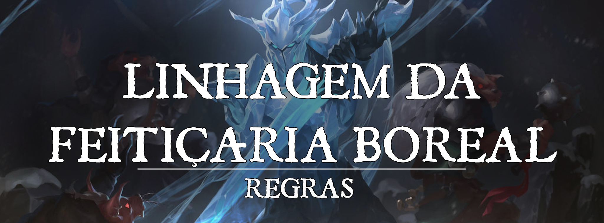

# Origem de Feitiçaria: Feitiçaria Boreal

Sua alma foi tocada por ventos gélidos do norte ou talvez a experiência de um rigoroso inverno tenha deixado sequelas para além do corpo. Assim, você naturalmente se sobressai em ambientes frios e possui uma resiliência sobrenatural, conseguindo manipular o frio para te proteger ou para imbuir suas armas.
 
 
## Canalização Glacial
 

Você aprende magias adicionais quando alcança certos níveis nesta classe, como mostrado na tabela de Magias Boreais. Cada uma dessas magias conta como magia de feiticeiro para você, mas não contam contra o número de magias de feiticeiros que você conhece.
 
 
## Magias Boreais:

---

| Nível de Feitiçeiro | Magias |
| --- | --- |
| 1 | Dedos Gelados (*Frost fingers*), Faca de Gelo (*Ice Knife*) |
| 3 | Geada Aprisionadora (*Rime's Binding Ice*), Enxame de Bolas de Neve de Snilloc(*Snilloc's Snowball Swarm*) |
| 5 | Tempestade de Granizo (*Sleet storm*), Fome de Hadar (*Hunger of Hadar*) |
| 7 | Tempestade de Gelo (*Ice storm*), Esfera Resiliente de Otiluke (*Otiluke's Resilient Sphere*) |
| 9 | Cone de Frio (*Cone of cold*), Escudo Antivida (*Antilife Shell*) |

 
 

---

## Égide Gélida
 

No primeiro nível, você ganha proficiência com armadura leve, escudos, armas simples e marciais.
 

Adicionalmente, você aprende a magia Armor of Agathys, que não conta contra o número de magias de feiticeiro que você conhece. Criaturas que recebem dano pela magia Armor of Agathys têm desvantagem no primeiro ataque que fizerem até o fim de seu próximo turno.
 

---

## Frio como Aço
 

No 6º nível, você pode gastar dois pontos de feitiçaria durante o seu turno para imbuir suas mãos com energia gélida, encantando seus ataques em combate corpo-a-corpo. Pelo próximo minuto, todos os seus ataques corpo-a-corpo se tornam ataques de magia corpo-a-corpo, utilizando seu modificador de conjuração de feiticeiro para as rolagens de ataque e de dano. Estes ataques causam 1d6 de dano de frio adicional. O dano de frio aumenta para 2d6 ao chegar no nível 18.
 

Magias que beneficiam seus ataques com arma corpo-a-corpo também beneficiam os ataques possibilitados por esta característica.
 
Adicionalmente, ao realizar a ação de ataque enquanto imbuído, você pode fazer dois ataques de magia corpo-a-corpo invés de um.
 

---

## Avatar da Nevasca
 
No 14º nível, você ganha resistência a dano de frio.
 

Utilizando uma ação você pode invocar uma tempestade de inverno para te cercar numa aura de raio de 30 pés por 1 minuto. Quando conjurar esta aura, você pode designar qualquer número de criaturas que você possa ver para não ser afetado por ela. Quando uma criatura entra na área pela primeira vez em um turno ou inicia o turno dentro dela, a velocidade dela é reduzida em 10 pés e ela precisa realizar uma salvaguarda de Constituição contra sua CD de magias de feiticeiro. Se falhar, ela recebe 2d8 de dano de frio. Você pode utilizar essa característica um número de vezes igual a metade de seu bônus de proficiência (arredondado para baixo). Você recupera todos os usos quando termina um descanso longo.
 

Adicionalmente, qualquer dano contundente, cortante e perfurante que você causar pode ser convertido em dano de frio enquanto a aura estiver ativa. Dano de frio causado a inimigos dentro da aura ignora resistência.
 

---

## Tumba Frígida
 

A partir do 18º nível, você ganha o poder de canalizar ventos polares para prender inimigos em gelo cristalino. Em seu turno, quando você causa dano de frio a uma criatura grande ou menor, você pode gastar 2 pontos de feitiçaria para forçar a criatura a fazer uma salvaguarda de Constituição, numa falha ela congela, ficando restringida por 1 minuto. Uma criatura restringida dessa forma pode usar sua ação para tentar quebrar o gelo que a prende, fazendo uma salvaguarda de força contra seu CD de magias de feiticeiro. Você pode gastar 4 pontos para tentar congelar uma criatura Enorme.
 

Adicionalmente, quando você causa dano de frio a uma criatura presa desta forma, você pode causar o dano máximo invés de rolar o dano de frio causado. Causar dano máximo quebra o gelo e libera a criatura.