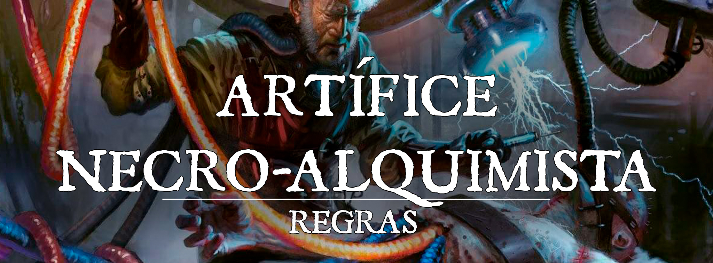

# Especialidade de Artifice: Necro-Alquimista

# Necro-Alquimista

Muitos tentam se imortalizar no sentido filosófico, deixando suas marcas no mundo, seja no ramo da arte ou no ramo científico, por exemplo. Outros, porém, buscam meios de fazer seu próprio corpo, ou o de outros, se tornar eterno. Como nem todos tem acesso às magias mais poderosas, um grupo de Alquimistas, liderados pelo estudo e influência de Nicholas Hemlock, de Nefastia, criou o que seria a versão mundana da Necromancia, no que toca ao reerguimento de cadáveres. Usando energia elétrica e seus conhecimentos científicos, os Necro-Alquimistas, ou Suturadores, buscam, montam e dão “vida” a seres já mortos que os obedecem lealmente. Muitos os julgam como imorais e lutam fielmente contra sua prática, mas a verdade é que a intenção do Necro-Alquimista e sua moral são reservadas a apenas ele.

### Proficiência em Ferramentas
---

Ao adotar esta especialização no 3º nível, você ganha proficiência com suprimentos de alquimista (alchemist’s supplies/tools). Se você já tiver essa proficiência, você ganha proficiência com outro tipo de ferramenta de artesão de sua escolha.

### Magias de Necro-Alquimista
---

Começando no 3º nível, você sempre tem certos feitiços preparados depois de atingir níveis específicos nesta classe, conforme mostrado na tabela de Feitiços do Necro-Alquimista. Esses feitiços contam como feitiços de artífice para você, mas não contam no número de feitiços de artífice que você prepara.

| Nível | Magias |
| --- | --- |
| 3 | Falsa Vida (*false life*), Raio de Bruxa (*witch bolt*) |
| 5 | Ajuda (*aid*), Melhorar Habilidade(*enhance ability*) |
| 9 |
| 13 | Aura de Vida (*aura of life*), Proteção contra a Morte (*death ward*) |
| 17 | Curar Ferimentos em massa (*mass cure wounds*), Levantar Morto(*raise dead*) |

 

### Abominações Suturadas
---

A partir do 3º nível, você aprende como animar cadáveres como criaturas conhecidas como Suturados, usando uma combinação de alquimia, máquinas e energia elétrica. Com 1 hora de trabalho e uso de seus Suprimentos de Alquimia, um Necro-Alquimista pode preparar um corpo para ser um Suturado.                                                                                                                                                                                                                                                              
Inicialmente, um Suturado só poderá ser de tamanho Médio ou menor e o Necro-Alquimista consegue apenas controlar um Suturado.

Um Suturado usa as estatísticas de um Zumbi típico, exceto pelas seguintes alterações:

* Um Suturado é considerado um Constructo
* O Suturado não recebe a habilidade Undead Fortitude
* O Suturado não possui alinhamento.
* Os compostos químicos inflamáveis que são utilizados para sua animação o tornam vulnerável a dano de Fogo.
* O ponto de vida máximo do Suturado é igual do Zumbi ou três vezes seu nível de Artífice, o que for maior.
* Quando o Necro-Alquimista cria um Suturado, ele pode adicionar uma das melhorias descritas abaixo

Se um Suturado for reduzido a 0 pontos de vida, ele morre (novamente). Um Suturado que tiver morrido a apenas 1 hora pode ser reanimado, desde que o Necro-Alquimista esteja a 5 pés dele e, como uma ação, utilize seus Suprimentos de Alquimista e gaste 1 Spell Slot de 1º Círculo ou maior. O Suturado retorna à vida após 1 minuto decorrido deste procedimento.

Em combate, o suturado tem sua própria iniciativa, mas obedece a quaisquer comandos verbais dados pelo seu Necro-Alquimista.

### Estímulo Elétrico
---

A partir do 5º nível, você pode usar eletricidade para impor uma pequena quantidade de controle em um alvo. Quando você ou uma criatura que você controla causa dano elétrico a uma outra criatura, você ou a criatura que você controla pode usar a reação para impor desvantagem em uma jogada de ataque que a criatura alvo fizer antes do início do seu próximo turno.
Adicionalmente, ao realizar um ataque de Slam, o Suturado pode optar por trocar o dano Contundente para Elétrico.

### Abominações Aprimoradas
---

A partir do 9º nível, você se torna capaz de criar Suturados melhores.Quaisquer Suturados que você animar possuem as seguintes propriedades adicionais:

* Os ataques dos Suturados são considerados Mágicos.
* A Força do Suturado é igual à inteligência do Necro-Alquimista, caso já não seja maior.
* Seus ataques e testes de resistência recebem um bônus igual ao bônus de proficiência do Necro-Alquimista.
* O ataque de Slam do Suturado causa 1d8 de dano Elétrico extra.
* O Suturado é imune a dano Elétrico e, caso receba dano elétrico de outra criatura, este será curado na mesma quantidade do dano que receberia.

Quando o Necro-Alquimista cria um Suturado, ele pode adicionar duas das melhorias descritas abaixo.

Além disso, caso o Necro-Alquimista utilize um Manual de Golems de Carne, se ele possui dois slots de magia de 5º nível, o Golem de Carne criado conta como um Suturado.

### Magnum Opus
---

No 15º nível, sua experimentação com produtos químicos diversos e a eletricidade fortaleceu sua fisiologia e permitiu você alcance um maior domínio de sua própria fisiologia e da criação de Suturados:

Você ganha resistência a dano elétrico e dano necrótico.

O Suturado recebe a característica Multiattack, caso já não tenha, podendo realizar dois ataques de Slam ou, caso tenha a característica Equipado, dois ataques com a arma equipada.

Quando o Necro-Alquimista cria um Suturado, ele pode adicionar três das melhorias descritas abaixo

Adicionalmente, a partir do 15º nível, os Suturados poderão ser de tamanho Grande e o Necro-Alquimista consegue  controlar dois Suturados por vez.

### Melhorias Suturadas
---

Ao criar um Suturado a partir do 9º Nível, você pode personalizá-la para atender às suas necessidades.
Esses ajustes podem exigir materiais extras na forma de partes do corpo suplementares.

**Alpinista**
O Suturado tem partes e membros do corpo que permitem maior facilidade de escalada, como uma cauda preênsil ou pés e garras próprios. O Suturado recebe movimento de escalada igual ao de caminhada.
Requisitos: Corpo original ou parte de corpo de criaturas que tenham movimento de escalada.

**Coordenação Motora**
O valor de Destreza do Suturado se torna 10 e sua velocidade de caminhada
se torna 30 pés, ou aumenta em 5 pés seja 30 pés ou superior. O Suturado adiciona a proficiência do Necro-Alquimista em testes de Acrobacia.

**Braços Extras**
O Suturado tem um conjunto extra de braços. O Suturado adiciona a proficiência do Necro-Alquimista em testes de Atletismo. 
Adicionalmente, quando uma criatura provoca um ataque de oportunidade o Suturado pode tentar agarrar a criatura ao invés de realizar um ataque normal.
Requisitos: Corpo original de criaturas de 4 braços ou utilizar um par de braços adicional do tamanho apropriado.

**Duas Cabeças**
O Suturado possui uma cabeça extra, concedendo-lhe vantagem em testes de Sabedoria (Percepção) e em testes de resistência contra as condições cego (blind), enfeitiçado (charmed), ensurdecido (deafened), assustado (frightened), atordoado (stunned) e
inconsciente (unconscious). 
Requisitos: Corpo original de criaturas de duas cabeças ou utilizar mais de uma cabeça na construção. O Suturado não pode ter a melhoria Decapitado.

**Decapitado**
O Suturado não possui cabeça, tendo em vez disso um dispositivo com uma série de sensores rudimentares embutidos nele. O Suturado não pode ser cegado ou ensurdecido e é imune a efeitos que dependem da visão, como Padrão Hipnótico (Hypnotic Pattern) ou o Olhar Petrificante da Medusa. O Suturado tem visão cega até 30 pés, mas é
cegos e surdos além desse raio. Um Suturado não pode ganhar esta melhoria se
também possui a melhoria Duas Cabeças.

**Intelecto Expandido**
A Inteligência do Suturado é aumentada para 10. O Suturado é capaz de entender e falar qualquer idioma que o Necro-Alquimista saiba, desde que possua uma boca.
Adicionalmente o Surtado recebe duas perícias conhecidas pelo Necro-alquimista.
O Suturado ainda é incapaz de desobedecer quaisquer ordens diretas dada pelo Necro-Alquimista a ele.

**Equipado**
Um Suturado pode se sintonizar um item mágico (que requeira sintonização) desde que o Necro-Alquimista também seja capaz. O equipamento conta para o número de itens sintonizados pelo Necro-Alquimista. O Suturado é considerado proficiente com este equipamento. Caso o equipamento possibilite executar uma ação que não seja a ação de ataque, o Necro-Alquimista deve gastar sua reação para dar o comando ao Suturado.

**Membros Alongados**
Os braços do Suturado são muito mais longos que o normal, aumentando o alcance de seus ataques corpo a corpo em 1,5 m (5 ft).

**Reanimação Instantânea**
Um Suturado que receber esse complexo de mecanismos em seu corpo tem mais facilidade em ser reanimado. Um Suturado que tiver morrido a apenas 1 hora pode ser reanimado, desde que o Necro-Alquimista esteja a 5 pés dele e, como uma ação, utilize seus Suprimentos de Alquimista, como uma ação e gaste 1 Spell Slot de 1º Círculo ou maior. O Suturado retorna à vida instantaneamente após o procedimento.