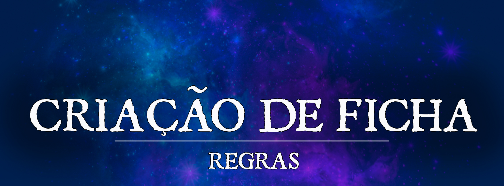

# Criação de Ficha

A criação de uma nova ficha em nosso servidor de RPG é simples e fácil de ser realizada. Para começar, basta marcar um arquivista, que é um membro da nossa equipe especialmente treinado para ajudar os jogadores na criação de suas fichas.

O arquivista irá lhe guiar e explicar como funciona o nosso sistema, além de ajudá-lo a encontrar qualquer informação necessária para a criação da sua ficha. Ele também irá ajudá-lo a entender as mecânicas do sistema de RPG D&D 5e, caso seja necessário.

A primeira etapa da criação da ficha será a criação de seu LOG, que é uma ficha de RPG online exclusiva e única para cada personagem. Esse será o registro utilizado para acompanhar o desenvolvimento do seu personagem durante todo seu caminho no jogo.

Em seguida, o arquivista irá lhe ajudar a criar uma ficha no Roll 20, que é uma cópia do seu LOG que pode ser utilizada para jogar ao vivo na mesa de qualquer mestre. Dessa forma, você estará pronto para começar suas aventuras com todas as informações necessárias em mãos.

Após a criação da sua ficha, você receberá o rank de @Capa Gris, que é o rank mais baixo de aventureiro na nossa guilda, a [Guilda da Aliança de Prata](../mundo/rubria/762967e0-2586-466f-a3ee-3c75ad65541c.md). E assim, você poderá começar suas aventuras e desbravar mundos incríveis, enfrentar desafios e evoluir seu personagem.

# Alterações Mecânicas e Homebrews

Alterações em mecânicas gerais, classes, raças, itens e magias podem ser encontradas no artigo abaixo:

[articleblock:c6ecca83-71b8-40c2-8c67-8ce02e04aa6b]

# Como Criar sua Ficha de D&D 5e

#### Observação Importante!
!!! info ""
    Aqui no Critical Bastards, todo personagem já começa no nível 3.

#### Passo 1: Escolha a raça, classe e crie a história de seu personagem
Antes de começar a jogar, você precisa escolher algumas coisas sobre o seu personagem. Você precisa decidir a raça, classe e história do seu personagem.

**Raça:** a raça é como você quer que seu personagem pareça e o que ele é capaz de fazer. Cada raça tem algumas características especiais, como força, skills e idiomas. Leia sobre as raças disponíveis para escolher a que você quer jogar.

**Classe:**a classe vai determinar como seu personagem funciona. Cada classe tem skills especiais que o personagem pode realizar. Escolha uma classe que você acha interessante e que você quer jogar.

**História:** A história de seu personagem é um pequeno ou grande texto que conta o passado de seu personagem pelo mundo até a inscrição na guilda. Além disso, sempre lembre se que o servidor trabalha com um cenário próprio e ele deve ser usado e respeitado.

Por questões principiológicas, o personagem necessita não só ser maior de idade como ter aparência condizente com um adulto ou jovem adulto.

#### Passo 2: Blocos de Status

O bloco de status é onde você registra as informações importantes sobre o seu personagem. Ele inclui suas pontuações de skill, modificadores de skill e proficiências.

**Pontuações de skill:**
As pontuações de skill representam as skills do seu personagem em diferentes áreas, como força ou inteligência. Você pode determiná-los a partir da [compra de pontos](https://5e.tools/statgen.html#pointbuy) 

**Modificador de skill:**

O Modificador de skill é um número que você usa para ajustar o resultado de um teste de skill. Por exemplo, se seu modificador de skill para uma determinada skill é +2, você adiciona +2 ao resultado de um teste de skill com essa skill.

#### Passo 3: Proficiências e idiomas

**Proficiências:**
As proficiências são skills ou itens que o seu personagem pode usar sem sofrer nenhuma penalidade. Isso inclui coisas como armaduras, armas ou kits de sobrevivência. Anote todas as proficiências do seu personagem e quaisquer bônus que eles tenham com essas skills ou itens.

**Idiomas:**
Verifique tanto a raça quanto o background do seu personagem para ver quais idiomas ele pode falar. Anote todas as idiomas conhecidas pelo seu personagem na sua ficha.

#### Passo 4: Equipamentos
Seus equipamentos são todos os itens que você está levando com você, como armadura, armas, equipamentos de viagem e de exploração, entre outros. Há duas maneiras de criar seu inventário inicial:

**Itens Iniciais:** A classe de seu personagem tem uma lista de itens que você pode começar a usar. Seu background também pode adicionar mais itens à sua lista.

**Itens Comprados:**Com base em sua classe, você pode usar o ouro inicial para comprar qualquer equipamento que desejar. O valor inicial de ouro é 125 PO para todas as classes.

#### Passo 5: Antecedente

Os antecedentes como o próprio nome diz são pequenas informações de seu passado que se atrelam aos seus antigos e até mesmo atuais afazeres. Um exemplo seria um personagem que trabalhava na segurança de uma cidade e que possui um antecedente de soldado. Por fim, os antecedentes também lhe concedem alguns benefícios, como:

**Proficiência em Perícias:** Escolha proficiência em duas perícias de sua escolha que se adequem a ideia de seu personagem.

**Feature de Background:** Cada antecedente possui uma pequena habilidade que o acompanha para facilitar a vida de seu personagem em algumas situações especificas.

**Além disso, esses feats disponibilizados com o Backgrounds NÃO fornecem aumento de atributo**.

**Proficiência em Ferramentas e Idiomas:** Nem todos os backgrounds oferecem esse pequeno bônus, mas alguns lhe concedem o poder de escolher a proficiência em uma ferramenta ou língua das citadas no próprio antecedente.

**Equipamentos:** Como citado no passo 4, antecedentes concedem itens iniciais extras ao seu personagem sendo alguns obrigatórios e outros escolhas entre opções.

**Talentos:** Um bônus que libera novas ações ou habilidades para o seu personagem, alguns backgrounds já possuem talentos prefixos como dos livros Astral Adventurer's Guide, Strixhaven, Dragonlance e Ravnica. Apesar disso, não se desespere caso o seu antecedente não lhe conceda um de imediato porque em casos como esse você pode escolher um da seguinte lista:

* Aberrant Dragonmark
* Actor
* Artificer Initiate**
* Athlete
* Chef
* Dungeon Delver
* Durable
* Eldritch Adept
* Elemental Adept
* Fey Touched
* Fighting Initiate
* Gift of the Chromatic Dragon 
* Gift of the Gem Dragon 
* Gift of the Metallic Dragon 
* Healer
* Heavily Armored
* Keen Mind
* Lightly Armored
* Linguist
* Magic Initiate
* Martial Adept
* Metamagic Adept
* Moderately Armored
* Poisoner
* Ritual Caster
* Shadow Touched
* Skilled
* Spell Sniper
* Tavern Brawler
* Telekinetic
* Telepathic
* Weapon Master
* Magia Ancestral do Gelo
* Magia Ancestral de Fogo
* Magia Ancestral das Tempestades
* Magia Ancestral de Pedra

!!! info ""
    O antecendente Wildspacer do livro Astral Adventurer's Guide **NÃO** é permitido.

-** O Feat Artificer Initiate foi modificado deixando de dar uma cantrip e passando a dar uma infusão de Artificer para o personagem. O nível base do jogador não conta para evoluir a infusão, apenas o nível de artificer no caso do personagem possuir aquela classe.

Quando um personagem atingir level 9, ele poderá escolher, gratuitamente, **qualquer** Talento, sem as restrições acima impostas.

#### Passo 6: Ataques e Lançamento de Feitiços
Na luta, a maioria dos personagens usa ataques físicos ou lança feitiços. Além disso, eles também têm acesso a ações especiais.

**Modificador de Ataque:**Este é o número que você adiciona a um dado de 20 lados ao tentar atacar alguém com uma arma. Você compara o número final ao AC do alvo e atinge se o seu número for igual ou maior que o AC do inimigo.

**Como calcular o Modificador de Ataque:**

* Para armas de alcance com proficiência: Adicione seu modificador de destreza ao seu modificador de proficiência.
* Para armas de alcance sem proficiência: Adicione apenas seu modificador de Destreza.
* Para armas de mão com proficiência: Adicione seu modificador de Força ao seu modificador de proficiência.
* Para armas de mão sem proficiência: Adicione apenas seu modificador de Força.
* Para armas que permitem escolher entre Força e Destreza: Escolha a skill que preferir. Adicione seu modificador de proficiência se você for hábil com a arma.
* Iniciativa: A iniciativa é a sua capacidade de agir rapidamente em situações perigosas. Para determinar a iniciativa, você rola um d20 e adiciona seu modificador de iniciativa. O modificador de iniciativa é o mesmo que o seu modificador de Destreza.

#### Mudanças de Atributos e proficiências do *Tasha's Cauldron of Everything*

Caso deseje, o jogador pode escolher seguir as regras de mudança de atributo e proficiências dadas pela raça do personagem do livro *Tasha's Cauldron of Everything.* Para que essas mudanças de fato ocorram deve-se deixar explicito ao Recrutador responsável por sua ficha quais atributos e proficiências foram trocadas.

| Proficiência | Reajuste Proficiência |
| --- | --- |
| Perícia | Perícia |
| Armadura | Arma Simples, Marcial ou Ferramenta |
| Arma Simples | Arma Simples ou Ferramenta |
| Arma Marcial | Arma Simples, Marcial ou Ferramenta |
| Ferramenta | Arma Simples ou Ferramenta |

