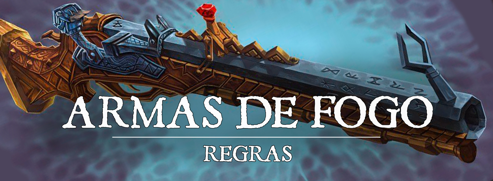

# Armas de Fogo

Para adequar melhor o conceito de um atirador ao servidor criamos algumas armas de fogo com traços diferentes do comum e, adicionalmente, para dar maior liberdade para quem quiser criar um personagem com esse arquétipo, nós remodelamos o feat Gunner.

# Feat Gunner

Requisito (Proficiência com armas marciais a distância)

Você se aperfeiçoou no uso das armas de fogo, se tornando um especialista na arte do tiro, o que lhe concede os seguintes benefícios: 

* Aumente sua pontuação de Destreza em 1, até o máximo de 20.
* Você ignora a propriedade de carregamento (Loading) de armas de fogo.
* Estar a 5 pés de uma criatura hostil não impõe desvantagem em suas jogadas de ataque à distância.
* Você ganha proficiência com as Ferramentas de Funileiro (Tinker's Tools).
* Quando você toma a ação de ataque e ataca com uma arma de uma mão, você pode utilizar sua ação bônus para realizar um ataque com uma arma de fogo de uma mão.

# Armas de Fogo

Um personagem que possua proficiência com armas marciais é capaz de utilizar as seguintes armas:

| Nome | Preço | Dano | Peso | Propriedades |
| --- | --- | --- | --- | --- |
| Pistola | 50 PO | 1d6 Perfurante | 6 lb. | Munição, Alcance (20/60), Carregamento, Leve, Barulhenta (20fts) |
| Revólver | 75 PO | 1d8 Perfurante | 8 lb. | Munição, Alcance (30/90), Carregamento, Leve Barulhenta (60fts) |
| Bacamarte | 100 PO | 1d10 Perfurante | 8 lb. | Munição, Alcance (15/30), Carregamento, Tiro Disperso, Duas Mãos, Pesada, Barulhenta (120 fts) |
| Rifle | 125 PO | 1d12 Perfurante | 15 lb. | Munição, Alcance (150/600), Carregamento, Fatal, Duas Mãos, Pesada, Barulhenta (120 fts) |

* **Barulhenta:** Disparar uma arma de fogo gera um som alto que pode ser escutado em certas distancias. 
* **Carregamento:**Por conta do tempo requerido para carregar esta arma, você pode atirar apenas uma munição quando você usa uma ação, ação bônus ou reação para realizar ataques, não importando o número de ataques que você possa fazer normalmente. Armas com essa característica requerem que você tenha ao menos uma mão livre para fazer o carregamento.
* **Munição:** Você pode usar uma arma que tenha a propriedade de munição para fazer um ataque à distância somente se tiver munição para disparar da arma. Cada vez que você ataca com a arma, você gasta uma peça de munição. Tirar a munição de uma aljava, caixa ou outro recipiente faz parte do ataque. Carregar uma arma de uma mão requer uma mão livre. A munição de uma arma de fogo é destruída após o uso.
* **Fatal**- Sempre que você realiza um acerto crítico com uma arma de fogo você deve rolar um dado, este dado é equivalente ao dado de dano da arma. 
* **Tiro Disperso** - Armas de fogo com esta característica dão dano em qualquer criatura adjacente ao alvo principal. Ao acertar um ataque contra uma criatura utilizando uma arma com a propriedade Tiro Disperso, todas as criaturas em 5fts do alvo principal recebem um dado da arma + modificador de atributo de dano perfurante. (Caso a arma seja mágica, este dano também se torna mágico.)

## Munições

| Nome | Preço | Qtd/Pacote |
| --- | --- | --- |
| Munição Balística | 5 PO | 20 |

