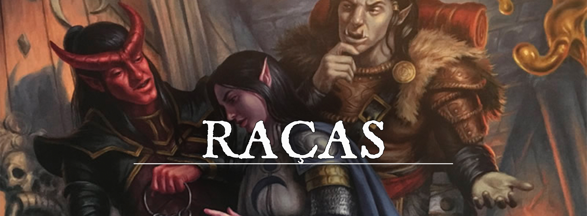

# Raça Expandida: Bullywug

# Os Bullywugs
O Povo Sapo é encontrado em diversas tribos nos vários pântanos de Pheros, mas não é incomum membros dessas tribos decidirem se aventurar. Exímios saltadores, nadadores natos e muito furtivos, os Bullywugs se destacam em vários grupos de viajantes. Existem três grandes tribos Bullywug em Pheros:

**Fugidos de Nefastia.** Estes bullywugs foram usados em diversos experimentos, capturados pelos piores e mais perversos alquimistas. Lutaram pela sua liberdade mas a tirania de alguns homens cruéis mantiveram essa tribo sobre a pior condição da existência, a mistura de escravidão e tortura. Quando conseguiram se libertar, fugiram para os pântanos próximos de Hoffenstein. Devido a todo histórico de perseguição eles tornaram-se avessos a tirania e opressão geralmente são Caóticos e bons.

**Boca de lama.** A tribo Boca de lama é comumente encontrada em Sankarr, ela é a tribo mais antiga e habita em muitos lugares do Pântano Sem Fim, seus membros são especialistas em se esconder na lama e possuem uma coloração barrosa que lembra a lama do pântano. Por mais que não pareçam, eles são calorosos e adoram caçar, dançar e festejar geralmente são neutros e bons.

**Filhos de Raulan.**Os enlouquecidos, as pestes ou os Filhos de Raulan; esse foi o nome dado para aqueles que saíram de Sankarr e seguiram os sussurros distantes, acreditaram na promessa de uma voz aberrante que sussurrava ao longe, foram atraídos pela fé de que iriam encontrar um pântano cheio de riquezas e fortunas, que elevaria o status da tribo, no entanto encontraram apenas desespero. Os filhos de Raulan possuem uma mente fraca, mas no fundo um bom coração, acreditam apenas em si mesmo e possuem uma péssima reputação entre as outras tribos, geralmente são caóticos e neutros.

### Características Dos Bullywugs
---

**Aumento de Pontos de Habilidade.**Você recebe 3 pontos de atributos que podem ser distribuídos da seguinte forma: Ou você escolhe 3 atributos para adicionar 1 ponto em cada ou você escolhe um atributo para adicionar 2 pontos e outro para adicionar 1 ponto.

**Idade.** Bullywugs emergem de sua fase de girino para se cuidarem sozinhos após 6 a 8 semanas, no entanto, apenas um por cento dos bullywugs alcançam a idade adulta. Eles são considerados maduros aos 12 anos e vivem cerca de 70 anos, caso não morram de morte violenta.

**Tamanho.** Bullywugs geralmente têm dimensões semelhantes às de um anão, mas podem variar muito, com altura entre 90 cm e 240 cm e peso entre 45 kg e 180 kg. Seu tamanho varia entre pequeno e grande.

**Alinhamento.** Em ocasiões raras, os bullywugs podem se aliar a figuras poderosas, mas quase inevitavelmente são egoístas e individualistas

**Velocidade.** Sua velocidade de caminhada base é de 30 pés e você possui uma velocidade de natação de 30 pés.

**Anfíbio.** Você pode respirar ar e água.

**Língua Preênsil.** Você pode segurar objetos com a sua língua. Ela tem um alcance de 10 pés e consegue levantar um número de libras igual a cinco vezes o seu valor de Força. Você pode usá-la para fazer as seguintes tarefas simples: levantar, soltar, segurar, empurrar ou puxar um objeto; abrir ou fechar uma porta ou um recipiente. Seu DM pode permitir que outras tarefas simples sejam adicionadas a essa lista de opções. Sua língua não pode empunhar armas ou escudos, nem realizar tarefas que exijam precisão manual, como usar ferramentas ou itens mágicos, ou realizar os componentes somáticos de um feitiço.

**Falar com Sapos e Rãs.** Você pode comunicar conceitos simples para sapos e rãs quando fala Bullywi.

**Furtivo.**Você possui proficiência na perícia de Furtividade.

**Salto em Pé.**Você pode fazer um salto parado em sua distância total, mesmo que não se mova antes.

**Camuflagem de Pântano.**Você tem vantagem em testes de Destreza (Furtividade) feitos para se esconder em terrenos pantanosos.

**Idiomas.** Você pode falar, ler e escrever Comum e Bullywi. Bullywi consiste em coaxadas, notas curtas, cliques, etc.