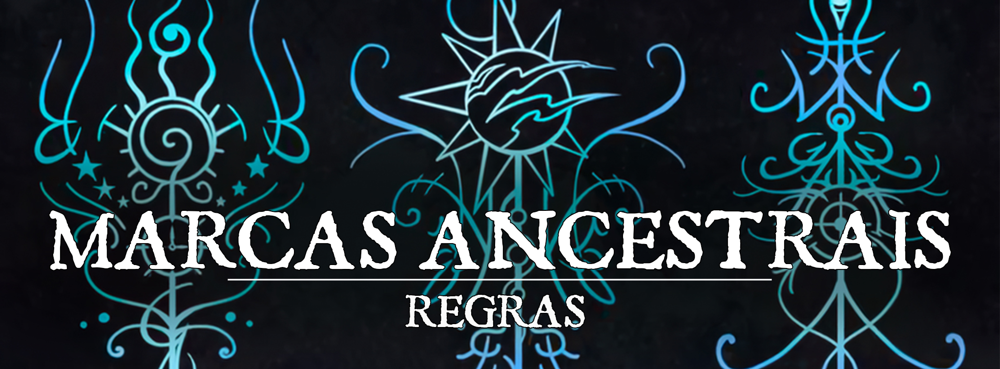

# Marcas Ancestrais

Num mundo cercado de divindades poderosas e entidades magníficas, não é incomum encontrarmos seres ímpares, que são diferentes daqueles que habitam o meio em que nasceram, estas pessoas especiais são chamadas de seres Marcados. Uma Marca Ancestral pode vir de diversas fontes diferentes, desde pactos de sangue antigos, bênçãos repentinas de alguma divindade e até mesmo maldições que passam de geração em geração, e estas marcas modificam a constituição daquele ser o fazendo diferente dos demais que estão ao seu redor, o tornando um ser único.

# Substituindo sua raça por uma Marca Ancestral.

Para substituir sua raça por uma Marca Ancestral você deve realizar algumas mudanças em suas características de raça. Você pode manter os seguintes elementos dessa raça: 

* Quaisquer proficiências em perícias que você ganhou e qualquer velocidade de escalar, voar ou nadar que você ganhou dela.
* O tipo de criatura.
* Características que permitem respirar debaixo d’água.
* Se você não mantiver nenhum desses elementos ou escolher essa linhagem na criação do personagem, você ganha proficiência em duas perícias à sua escolha.
* Além disso, você mantém a Idade, Tamanho, linguagem da raça humanoides escolhida para a marca.

É importante ressaltar que as raças com as marcas originais se mantêm inalteradas. O jogador pode escolher entre utilizar a raça original ou utilizar esta forma de linhagem na criação de seu personagem.

**Exemplo:**

Um elfo marca das sombras continua possuindo seus atributos inalterados e seus traços originais de elfo são mantidos como: Meditação Élfica (Trance) e Ancestralidade Feérica (Fey Ancestry)

**MAS**

Um loxodonte marca das sombras perde todas as suas características de loxodonte e mantém apenas as características da marca das sombras.

## Marca da Proteção

**Atributos:**Você pode adicionar 2 pontos em uma habilidade e 1 ponto em outra habilidade ou escolher 3 habilidades e adicionar 1 ponto em cada.

**Intuição do Guardião.**Quando você faz um teste de Inteligência (Investigação) ou um teste de habilidade usando ferramentas de ladrão, você pode rolar um d4 e adicionar o número rolado ao teste de habilidade.

 
**Sentinelas e Selos.** Você aprende os feitiços Alarme (alarm) e Armadura Arcana (Mage Armor) e pode utilizá-los uma vez sem gastar um espaço de magia com esta característica. A partir do 3º nível, você também aprende o feitiço Tranca Arcana (Arcane Lock) e pode utilizá-lo uma vez sem gastar um espaço de magia. Depois de lançar qualquer feitiço com esta característica, você não pode lançar esse feitiço desta forma até terminar um descanso longo. Inteligência, carisma ou sabedoria (selecionado ao escolher esta linhagem) é sua habilidade de conjuração para essas magias.

**Feitiços da Marca.** Se você tiver o recurso de classe Conjuração ou Magia de Pacto, os feitiços na tabela Marca da Proteção são adicionados à lista de feitiços de sua classe de conjuração.

| **Nível de Magia** | **Magias** |
| --- | --- |
| 1º | Alarme (Alarm), Armadura de Agathys (Armor of Agathys) |
| 2º | Tranca Arcana (Arcane Lock), Bater (Knock) |
| 3º | Glifo de Proteção (Glyph of Warding), Círculo Mágico (Magic Circle) |
| 4º | Baú Secreto de Leomund (Leomund's Secret Chest), Cão Fiel de Mordenkainen (Mordenkainen's Faithful Hound) |
| 5º | Casca Anti-Vida (Antilife Shell) |

## Marca das Sombras

**Atributos:** Você pode adicionar 2 pontos em uma habilidade e 1 ponto em outra habilidade ou escolher 3 habilidades e adicionar 1 ponto em cada.

**Visão no Escuro:** Você pode enxergar na penumbra a até 18 metros de você como se fosse luz plena e na escuridão como se fosse penumbra. Você não pode discernir cores no escuro, apenas tons de cinza.

**Intuição Astuta:** Quando você faz um teste de Carisma (Atuação) ou Destreza (Furtividade), você pode rolar um d4 e adicionar o número rolado ao teste de habilidade.

**Forma de Sombra:** Você conhece o truque "Ilusão Menor" (Minor Illusion). Você aprende o feitiço "Imagem Silenciosa" (Silent Image) e pode utilizá-lo uma vez sem gastar um espaço de magia com esta característica. A partir do 3º nível, você também aprende o feitiço "Invisibilidade" (Invisibility) e pode utilizá-lo uma vez sem gastar um espaço de magia. Depois de lançar qualquer feitiço com esta característica, você não pode lançar esse feitiço desta forma até terminar um descanso longo. Inteligência, carisma ou sabedoria (selecionado ao escolher esta linhagem) é sua habilidade de conjuração para essas magias.

**Feitiços da Marca:** Se você tiver o recurso de classe Conjuração ou Magia de Pacto, os feitiços na tabela Marca das Sombras são adicionados à lista de feitiços de sua classe de conjuração.

| **Nível de Magia** | **Magias** |
| --- | --- |
| 1º | Disfarce (Disguise Self), Imagem Silenciosa (Silent Image) |
| 2º | Escuridão (Darkness), Passos sem Rastro (Pass Without Trace) |
| 3º | Clarividência (Clairvoyance), Imagem Major (Major Image) |
| 4º | Invisibilidade Maior (Greater Invisibility), Terreno Ilusório (Hallucinatory Terrain) |
| 5º | Ludibriar (Mislead) |

## Marca dos Escribas

**Atributos:** Você pode adicionar 2 pontos em uma habilidade e 1 ponto em outra habilidade ou escolher 3 habilidades e adicionar 1 ponto em cada.

**Escriba talentoso.** Quando você faz um teste de Inteligência (História) ou um teste de habilidade usando suprimentos de calígrafo, você pode rolar um d4 e adicionar o número rolado ao teste de habilidade.

**Insight do escriba.** Você conhece o truque Mensagem (Message). Você aprende o feitiço Compreender Idiomas (Comprehend Languages) e pode utilizá-lo uma vez sem gastar um espaço de magia com esta característica. A partir do 3º nível, você também aprende o feitiço Boca Mágica (Magic Mouth) e pode utilizá-lo uma vez sem gastar um espaço de magia. Depois de lançar qualquer feitiço com esta característica, você não pode lançar esse feitiço desta forma até terminar um descanso longo. Inteligência, carisma ou sabedoria (selecionado ao escolher esta linhagem) é sua habilidade de conjuração para essas magias.

**Feitiços da Marca.** Se você tiver o recurso de classe Conjuração ou Magia de Pacto, os feitiços na tabela Marca dos Escribas são adicionados à lista de feitiços de sua classe de conjuração.

| **Nível de Magia** | **Magias** |
| --- | --- |
| 1º | Compreender Idiomas (Comprehend Languages), Risco Ilusório (Illusory Script) |
| 2º | Mensageiro Animal (Animal Messenger), Silêncio (Silence) |
| 3º | Envio (Sending), Línguas (Tongues) |
| 4º | Olho Arcano (Arcane Eye), Confusão (Confusion) |
| 5º | Sonho (Dream) |

## Marca da Detecção

**Atributos:**Você pode adicionar 2 pontos em uma habilidade e 1 ponto em outra habilidade ou escolher 3 habilidades e adicionar 1 ponto em cada.

**Intuição Dedutiva.** Quando você faz um teste de Inteligência (Investigação) ou Sabedoria (Intuição), você pode rolar um d4 e adicionar o número rolado ao teste de habilidade.

**Detecção Mágica.** Você aprende os feitiços Detectar Magia (Detect Magic) e Detectar Venenos e Doenças (Detect Poison and Desease) com esta característica e pode utilizá-los uma vez sem gastar um espaço de magia. A partir do 3º nível, você também aprende o feitiço Ver Invisível (See Invisibility) e pode utilizá-lo uma vez sem gastar um espaço de magia. Depois de lançar qualquer feitiço com esta característica, você não pode lançar esse feitiço desta forma até terminar um descanso longo. Inteligência, carisma ou sabedoria (selecionado ao escolher esta linhagem) é sua habilidade de conjuração para essas magias.

**Feitiços da Marca.**Se você tiver o recurso de classe Conjuração ou Magia de Pacto, os feitiços na tabela Marca da Detecção são adicionados à lista de feitiços de sua classe de conjuração. 

| **Nível de Magia** | **Magias** |
| --- | --- |
| 1º | Detectar Mal e Bem (Detect Evil and Good), Detectar Veneno e Doença (Detect Poison and Disease) |
| 2º | Detectar Pensamentos (Detect Thoughts), Encontrar Armadilhas (Find Traps) |
| 3º | Clairvoyance (Clairvoyance), Não Detecção (Nondetection) |
| 4º | Olho Arcano (Arcane Eye), Divinação (Divination) |
| 5º | Conhecimento de Lendas (Legend Lore) |

## Marca da Tempestade

**Atributos:** Você pode adicionar 2 pontos em uma habilidade e 1 ponto em outra habilidade ou escolher 3 habilidades e adicionar 1 ponto em cada.

**Benção da Tempestade.** Você tem resistência a dano de raio.

**Intuição de Windwright.**Quando você faz um teste de Destreza (Acrobacia) ou qualquer teste de habilidade envolvendo as ferramentas do navegador, você pode rolar um d4 e adicionar o número rolado ao teste de habilidade.

**Ventos contrários.**Você conhece o truque da Lufada (Gust). Você aprende o feitiço Onda de Choque (Shockwave) e pode utilizá-lo uma vez sem gastar um espaço de magia com esta característica. A partir do 3º nível, você também aprende o feitiço Lufada de Vento (Gust of Wind) e pode utilizá-lo uma vez sem gastar um espaço de magia. Depois de lançar qualquer feitiço com esta característica, você não pode lançar esse feitiço desta forma até terminar um descanso longo. Inteligência, carisma ou sabedoria (selecionado ao escolher esta linhagem) é sua habilidade de conjuração para essas magias.

**Feitiços da Marca.**Se você tiver o recurso de classe Conjuração ou Magia de Pacto, os feitiços na tabela Marca da Tempestade são adicionados à lista de feitiços de sua classe de conjuração. 

| **Nível de Magia** | **Magias** |
| --- | --- |
| 1º | Queda de Penas (Feather Fall), Nuvem de Neblina (Fog Cloud) |
| 2º | Rajada de Vento (Gust of Wind), Levitar (Levitate) |
| 3º | Tempestade de Granizo (Sleet Storm), Parede de Vento (Wind Wall) |
| 4º | Convocar Elementais Menores (Conjure Minor Elementals), Controlar Água (Control Water) |
| 5º | Convocar Elemental (Conjure Elemental) |

## Marca da Perseguição

**Atributos:** Você pode adicionar 2 pontos em uma habilidade e 1 ponto em outra habilidade ou escolher 3 habilidades e adicionar 1 ponto em cada.

**Visão no escuro.** Você pode enxergar na penumbra a até 18 metros de você como se fosse luz plena e na escuridão como se fosse penumbra. Você não pode discernir cores no escuro, apenas tons de cinza.

**Intuição do Caçador.** Quando você faz um teste de Sabedoria (Percepção) ou Sabedoria (Sobrevivência), você pode rolar um d4 e adicionar o número rolado ao teste de habilidade.

**Magia do localizador.** Você conhece o truque Orientação. Você aprende o feitiço Marca do Caçador (Hunter’s Mark) e pode utilizá-lo uma vez sem gastar um espaço de magia com esta característica.  A partir do 3º nível, você também aprende o feitiço Localizar Objeto (Locate Object) e pode utilizá-lo uma vez sem gastar um espaço de magia. Depois de lançar qualquer feitiço com esta característica, você não pode lançar esse feitiço desta forma até terminar um descanso longo. Inteligência, carisma ou sabedoria (selecionado ao escolher esta linhagem) é sua habilidade de conjuração para essas magias.

**Feitiços da Marca.**Se você tiver o recurso de classe Conjuração ou Magia de Pacto, os feitiços na tabela Marca da Perseguição são adicionados à lista de feitiços de sua classe de conjuração. 

| **Nível de Magia** | **Magias** |
| --- | --- |
| 1º | Fogo Fada (Faerie Fire), Passo Longo (Longstrider) |
| 2º | Localizar Animais ou Plantas (Locate Animals or Plants), Localizar Objeto (Locate Object) |
| 3º | Clarividência (Clairvoyance), Falar com Plantas (Speak with Plants) |
| 4º | Divinação (Divination), Localizar Criatura (Locate Creature) |
| 5º | Comunhão com a Natureza (Commune with Nature) |

## Marca da Cura

**Atributos:** Você pode adicionar 2 pontos em uma habilidade e 1 ponto em outra habilidade ou escolher 3 habilidades e adicionar 1 ponto em cada.

**Intuição Médica.** Quando você faz um teste de Sabedoria (Medicina) ou um teste de habilidade usando um kit de fitoterapia, você pode rolar um d4 e adicionar o número rolado ao teste de habilidade.

**Toque de cura.** Você aprende o truque Poupar Moribundo (Spare the Dying). Você aprende o feitiço Curar Ferimentos (Cure Wounds) e pode utilizá-lo uma vez sem gastar um espaço de magia com esta característica. A partir do 3º nível, você também aprende o feitiço Restauração Menor (Lesser Restoration) e pode utilizá-lo uma vez sem gastar um espaço de magia. Depois de lançar qualquer feitiço com esta característica, você não pode lançar esse feitiço desta forma até terminar um descanso longo. Inteligência, carisma ou sabedoria (selecionado ao escolher esta linhagem) é sua habilidade de conjuração para essas magias.

**Feitiços da Marca.**Se você tiver o recurso de classe Conjuração ou Magia de Pacto, os feitiços na tabela Marca da Cura são adicionados à lista de feitiços de sua classe de conjuração.

| **Nível de Magia** | **Magias** |
| --- | --- |
| 1º | Cura Ferimentos (Cure Wounds), Palavra de Cura (Healing Word) |
| 2º | Restauração Menor (Lesser Restoration), Oração de Cura (Prayer of Healing) |
| 3º | Aura de Vitalidade (Aura of Vitality), Massa de Palavra de Cura (Mass Healing Word) |
| 4º | Aura de Pureza (Aura of Purity), Aura de Vida (Aura of Life) |
| 5º | Restauração Maior (Greater Restoration) |

## Marca da Hospitalidade

**Atributos:** Você pode adicionar 2 pontos em uma habilidade e 1 ponto em outra habilidade ou escolher 3 habilidades e adicionar 1 ponto em cada.

**Sempre Hospitaleiro.**Quando você faz um teste de Carisma (Persuasão) ou um teste de habilidade envolvendo suprimentos de cervejeiro ou utensílios de cozinha, você pode rolar um d4 e adicionar o número rolado ao teste de habilidade.

**Magia do Estalajadeiro.** Você aprende o truque Prestidigitação (Prestidigitation). Você também aprende os feitiços Purificar Comida e Bebida (Purify Food and Drink) e Servo Invisível (Unseen Servant) e pode utilizá-lo uma vez sem gastar um espaço de magia com esta característica. Depois de lançar qualquer feitiço com esta característica, você não pode lançar esse feitiço desta forma até terminar um descanso longo. Inteligência, carisma ou sabedoria (selecionado ao escolher esta linhagem) é sua habilidade de conjuração para essas magias.

**Feitiços da Marca.** Se você tiver o recurso de classe Conjuração ou Magia de Pacto, os feitiços na tabela Marca da Hospitalidade são adicionados à lista de feitiços de sua classe de conjuração. 

| **Nível de Magia** | **Magias** |
| --- | --- |
| 1º | Bom Fruto (Goodberry), Sono (Sleep) |
| 2º | Ajuda (Aid), Calmar Emoções (Calm Emotions) |
| 3º | Criar Alimento e Água (Create Food and Water), Cabana Pequena de Leomund (Leomund's Tiny Hut) |
| 4º | Aura de Pureza (Aura of Purity), Santuário Particular de Mordenkainen (Mordenkainen's Private Sanctum) |
| 5º | Santificar (Hallow) |

## Marca do Manuseio

**Atributos:**Você pode adicionar 2 pontos em uma habilidade e 1 ponto em outra habilidade ou escolher 3 habilidades e adicionar 1 ponto em cada.

**Intuição Selvagem.** Quando você faz um teste de Sabedoria (Lidar com Animais) ou Inteligência (Natureza), você pode rolar um d4 e adicionar o número rolado ao teste de habilidade.

**Conexão Primal.** Você pode lançar os feitiços de Amizade Animal (Animal Friendship) e Falar com Animais (Speak with Animals) e pode utilizá-lo uma vez sem gastar um espaço de magia com esta característica, sem a necessidade de componentes materiais. Depois de lançar qualquer feitiço com esta característica, você não pode lançar esse feitiço novamente até terminar um descanso longo. Inteligência, carisma ou sabedoria (selecionado ao escolher esta linhagem) é sua habilidade de conjuração para essas magias.

**Quanto Maior Melhor.**A partir do 3º nível, você pode ter como alvo uma besta ou monstruosidade ao conjurar Amizade Animal (Animal Friendship) ou Falar com Animais (Speak with Animals), desde que o valor de Inteligência da criatura seja 3 ou inferior.

**Feitiços da Marca.** Se você tiver o recurso de classe Conjuração ou Magia de Pacto, os feitiços na tabela Marca da Manuseio são adicionados à lista de feitiços de sua classe de conjuração. 

| **Nível de Magia** | **Magias** |
| --- | --- |
| 1º | Amizade com Animais (Animal Friendship), Falar com Animais (Speak with Animals) |
| 2º | Senso de Besta (Beast Sense), Calmar Emoções (Calm Emotions) |
| 3º | Farol de Esperança (Beacon of Hope), Conjurar Animais (Conjure Animals) |
| 4º | Aura de Vida (Aura of Life), Dominar Besta (Dominate Beast) |
| 5º | Despertar (Awaken) |

## Marca da Criação

**Atributos:** Você pode adicionar 2 pontos em uma habilidade e 1 ponto em outra habilidade ou escolher 3 habilidades e adicionar 1 ponto em cada.

**Intuição do Artesão.** Quando você faz um teste de Arcana ou um teste de habilidade envolvendo ferramentas de artesão, você pode rolar um d4 e adicionar o número rolado ao teste de habilidade.

**Artesão.**Você conhece o truque Reparação (Mending). Você também aprende o feitiço Arma Mágica (Magic Weapon) e pode utilizá-lo uma vez sem gastar um espaço de magia com esta característica. Ao fazer isso, o feitiço dura 1 hora e não requer concentração. Depois de lançar qualquer feitiço com esta característica, você não pode lançar esse feitiço novamente até terminar um descanso longo. Inteligência, carisma ou sabedoria (selecionado ao escolher esta linhagem) é sua habilidade de conjuração para essas magias.

**Feitiços da Marca.** Se você tiver o recurso de classe Conjuração ou Magia de Pacto, os feitiços na tabela Marca da Criação são adicionados à lista de feitiços de sua classe de conjuração. 

| **Nível de Magia** | **Magias** |
| --- | --- |
| 1º | Identificar (Identify), Disco Flutuante de Tenser (Tenser's Floating Disk) |
| 2º | Chama Contínua (Continual Flame), Arma Mágica (Magic Weapon) |
| 3º | Barragem Conjurada (Conjure Barrage), Arma Elementar (Elemental Weapon) |
| 4º | Fabricar (Fabricate), Forma de Pedra (Stone Shape) |
| 5º | Criação (Creation) |

## Marca da Passagem

**Atributos:**Você pode adicionar 2 pontos em uma habilidade e 1 ponto em outra habilidade ou escolher 3 habilidades e adicionar 1 ponto em cada.

**Movimento intuitivo.** Quando você faz um teste de Destreza (Acrobacia) ou qualquer teste de habilidade para operar ou manter um veículo terrestre, você pode rolar um d4 e adicionar o número rolado ao teste de habilidade.

**Passagem Mágica.**Você pode lançar o feitiço Passo Nebuloso (Misty Step) e pode utilizá-lo uma vez sem gastar um espaço de magia com esta característica. Depois de lançar qualquer feitiço com esta característica, você não pode lançar esse feitiço novamente até terminar um descanso longo. Inteligência, carisma ou sabedoria (selecionado ao escolher esta linhagem) é sua habilidade de conjuração para essas magias.

**Feitiços da Marca.**Se você tiver o recurso de classe Conjuração ou Magia de Pacto, os feitiços na tabela Marca da Passagem são adicionados à lista de feitiços de sua classe de conjuração. 

| **Nível de Magia** | **Magias** |
| --- | --- |
| 1º | Retirada Expeditiosa (Expeditious Retreat), Salto (Jump) |
| 2º | Passo Nebuloso (Misty Step), Passo Sem Rastro (Pass Without Trace) |
| 3º | Piscar (Blink), Cavalo Fantasma (Phantom Steed) |
| 4º | Porta Dimensional (Dimension Door), Liberdade de Movimento (Freedom of Movement) |
| 5º | Círculo de Teletransporte (Teleportation Circle) |

## Marca da Sentinela.

**Atributos:** Você pode adicionar 2 pontos em uma habilidade e 1 ponto em outra habilidade ou escolher 3 habilidades e adicionar 1 ponto em cada.

**Guardião Vigilante.** Quando uma criatura que você pode ver a até 1,5 metro de você é atingida por uma jogada de ataque, você pode usar sua reação para trocar de lugar com aquela criatura e, em vez disso, você é atingido pelo ataque. Depois de usar esse traço, você não pode fazê-lo novamente até terminar um descanso longo.

**Intuição do Sentinela.** Quando você faz um teste de Sabedoria (Intuição) ou Sabedoria (Percepção), você pode rolar um d4 e adicionar o número rolado ao teste de habilidade.

**Escudo do Guardião.** Você aprende o feitiço Escudo (Shield) e pode utilizá-lo uma vez sem gastar um espaço de magia com esta característica. Depois de lançar qualquer feitiço com esta característica, você não pode lançar esse feitiço novamente até terminar um descanso longo. Inteligência, carisma ou sabedoria (selecionado ao escolher esta linhagem) é sua habilidade de conjuração para essas magias.

**Feitiços da Marca.** Se você tiver o recurso de classe Conjuração ou Magia de Pacto, os feitiços na tabela Marca da Sentinela são adicionados à lista de feitiços de sua classe de conjuração. 

| **Nível de Magia** | **Magias** |
| --- | --- |
| 1º | Desafio Comandado (Compelled Duel), Escudo da Fé (Shield of Faith) |
| 2º | Ligação de Proteção (Warding Bond), Zona de Verdade (Zone of Truth) |
| 3º | Contra-Feitiço (Counterspell), Proteção contra Energia (Protection from Energy) |
| 4º | Guarda da Morte (Death Ward), Guardião da Fé (Guardian of Faith) |
| 5º | Mão de Bigby (Bigby's Hand) |

