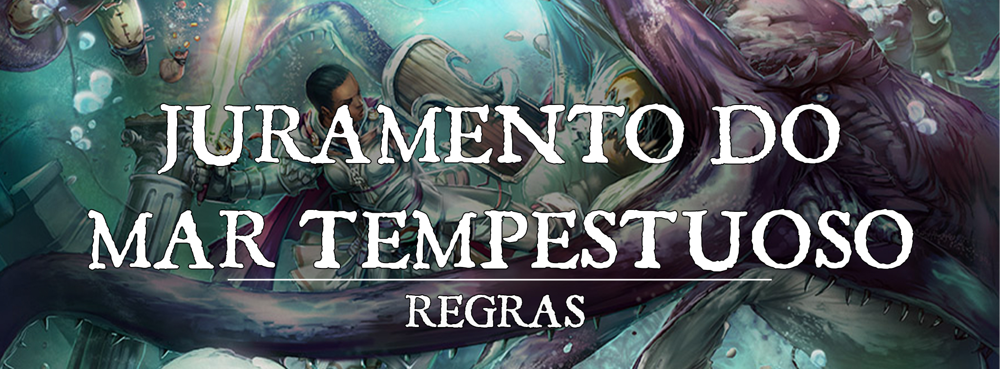

# Juramento de Paladino: Juramento do Mar Tempestuoso

O Juramento do Mar Tempestuoso atrai guerreiros navegadores, marinheiros audaciosos e guardiões viajantes que buscam a emoção de atravessar as tempestades do mar em busca de glória e aventura. Impulsionados a buscar e entender os mistérios através e abaixo de cada vasta extensão oceânica, paladinos que fazem esse juramento se colocam contra aqueles que negam as liberdades concedidas a viajantes de mente aberta, erradicando os tiranos e corruptos que reivindicam qualquer costa. Tais guardiões acreditam na beleza natural do mar, frequentemente fazendo oferendas e orações a entidades ou deidades como a Endring, Vessuna, Moira e Chantrea, que influenciam a passagem segura, enquanto muitas vezes sentem-se chamados a caçar as monstruosidades que buscam aterrorizar e poluir as águas com violência gratuita e más intenções.

## Dogmas:

---

**Não há vida maior do que uma vida vivida em liberdade.** Uma pessoa deve ser livre para traçar seu próprio caminho sem opressão. Aqueles que exercem seu poder para dominar os outros serão punidos.
 

**Confie nos Céus.** A orientação de uma brisa forte. Os avisos estrondosos de uma tempestade iminente. A natureza é uma fonte de presságios e conselhos que devem ser seguidos. 
 

**Adapte-se como a Água.** As águas do oceano podem contornar qualquer obstáculo ou se tornar um obstáculo intransponível. Elas podem esculpir e revelar os segredos do passado ou engolir a verdade e escondê-la para sempre. Abraçar essa fluidez é estar preparado para qualquer desafio.
 

**Explore o desconhecido.** O mundo está repleto de mistérios. Através da busca por esses fins enigmáticos, é possível tanto descobrir aqueles que escondem suas ações obscuras nas sombras para serem julgados, quanto encontrar o caminho para se tornar algo grandioso.

## Magias do Juramento do Mar Tempestuoso:

---

| Nível | Magias |
| --- | --- |
| 3 | Criar ou Destruir Agua (*create or destroy water*), Recuo Acelerado (*expeditious retreat*) |
| 5 | Augurio (*augury*), Passo Nebuloso(*misty step*) |
| 9 | Convocar Relampagos (*call lightning*), Maremoto (*tidal wave*) |
| 13 | Controlar Agua (*control water*), Liberdade de Movimento (*freedom of movement*) |
| 17 | Comunhão com a Natureza (*commune with nature*), Maelstrom |

 

## Canalizar Divindade

---

Quando você presta este juramento no 3º nível, você adquire as seguintes duas opções de Canalizar Divindade

#### Adaptação Marítima. 
Como uma ação, você usa suas preces para imbuir seus aliados com a benção das marés usando seu Canalizar Divindade. 

Você e um número de criaturas dispostas igual ao seu bônus de proficiência recebem velocidade de nado igual a velocidade terrestre e a capacidade de respirar debaixo d'água por 1 hora.

#### Empunhar a Tempestade. 
Como uma ação, você utiliza seu Canalizar Divindade para invocar um tridente sagrado imbuído com a essência das tempestades e das marés.

O tridente aparece em uma de suas mãos livres, ele possui as mesmas características de um tridente normal, porém seu alcance de arremesso se torna 30/120 pés, causa 1d8 de dano trovejante extra e pode ser arremessado até mesmo embaixo d'água sem causar desvantagem no ataque. Após ser arremessado, acertando ou errando o alvo, o tridente se desfaz em vento e ressurge na sua mão.

O tridente pode ser utilizado apenas por você e dura por 1 minuto ou até você dispensá-lo a qualquer momento sem necessidade de ação.

## Aura dos Ventos

---

A partir do 7º nível, você exala uma aura de ventos violentos quando ameaçado.

A área dentro de 10 pés de você é considerada terreno difícil para seus inimigos. Além disso, você pode converter qualquer dano de Radiante que causar nessa área em dano Trovejante ou Elétrico.

No 18º nível, o alcance dessa aura aumenta para 30 pés.

## Comandante das Tempestades

---

A partir do 15º nível, você se torna resistente a danos de raio e trovejantes, e de arma à distância contra você são feitos com Desvantagem, a não ser que esteja incapacitado.

## Tempestade Encarnada

---

No 20º nível, como uma ação, você incorpora a fúria de uma tempestade furiosa. Por 1 minuto:

* Você ganha velocidade de voo e nado de 60 pés.
* Aliados dentro de sua Aura dos Ventos recebem os bônus da sua característica de classe Comandante das Tempestades.
* Você pode ativar Empunhar a Tempestade como uma Ação Bônus à vontade. Além disso, quando você acerta um inimigo com sua arma concedida por Empunhar a Tempestade, você pode fazer com que até duas criaturas a até 15 pés do alvo original façam um teste de resistência de Constituição. Em caso de falha, elas sofrem 2d8 de dano de trovejante e metade disso em caso de sucesso, à medida que o tridente explode em uma onda trovejante.

Depois de usar essa característica, você não pode usá-la novamente até terminar um descanso longo.