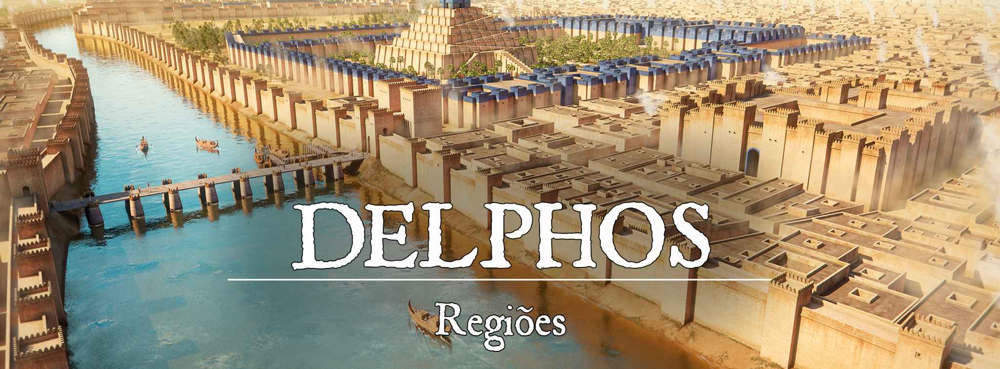

# Delphos

# Descrição
Delphos é um reino que se orgulha de sua história e sua capacidade de sobrevivência em um ambiente hostil. A cratera onde Delphos foi construído é uma terra de contrastes, com vegetação rasteira e solos vulcânicos, mas também é marcada por grandes lagos cristalinos e cachoeiras. Esses lagos são considerados sagrados pelos delphitas e são uma fonte importante de água e vida para o reino.

Delphos é famosa por seu poderio militar e seus mercenários altamente treinados e habilidosos em combate físico. Eles são conhecidos por seu sangue frio e sua capacidade de se adaptar a qualquer situação de combate. Esses mercenários são altamente procurados por outros reinos para proteger suas fronteiras e lutar em suas guerras.

O Oráculo de Delphos é uma fonte de sabedoria e previsão para muitos reinos. As previsões do oráculo são consideradas precisas e cobiçadas por muitos, e muitos líderes de reinos visitam Delphos para buscar conselhos e orientações. O Oráculo é um dos principais atrativos turísticos de Delphos e é considerado sagrado pelos delphitas .

No entanto, Delphos também é conhecida por seu rancor com magos e a magia arcana é muito controlada e regulamentada pela lei, ao contrário da magia divina, que é mais aceita. Isso se deve à história de Delphos, onde os magos foram considerados responsáveis por causar muitos dos problemas que o reino enfrentou no passado. Por isso, qualquer uso de magia arcana é rigorosamente monitorado e punido pelas autoridades de Delphos.

Devido a sua origem sofrida e a falta de aliados, Delphos é um reino egoísta e pouco solidário com outros reinos. Eles preferem se manter independentes e não se envolver em alianças. No entanto, eles estão sempre prontos para realizar acordos que garantam dinheiro e recursos ao reino.
 

### Descrição Visual:
[j-r-casals-babilonia-temples-v01-post02-artstation.jpg](../../../img/5ab566aed3fecc9216340eb8f07f16bd.jpg) |Delphos

O reino de Delphos é caracterizado por sua paisagem única, com vegetação rasteira e solos vulcânicos coexistindo com grandes lagos cristalinos e cachoeiras. As construções de Delphos são retangulares, baixas e feitas de pedras do deserto, com canais artificiais passando por todas as cidades. As cidades de Delphos são fortificadas, com muralhas e torres de vigia para protegê-las de invasores. As ruas são largas e bem planejadas, facilitando o transporte e a comunicação. Os edifícios públicos, como palácios e templos, são imponentes mas pouco adornados, mostrando o poder e a riqueza do reino. As casas dos cidadãos são menores e mais simples, mas ainda assim bem construídas e ornamentadas.
A sensação de quem vem de fora ao olhar para Delphos, é que pela sua localização geográfica cercado por montanhas e sua arquitetura robusta e pouco desenvolvida, parece um reino impenetrável.
 

### Geografia:
O reino de Delphos está localizado em uma cratera/clareira, rodeado por montanhas e colinas. O solo é predominantemente formado por rochas vulcânicas, mas há também áreas com vegetação rasteira e arbustos. Há grandes lagos cristalinos espalhados pela área, alimentados por cachoeiras e rios que descem das montanhas. Esses lagos são considerados sagrados pelos delphitas e são uma fonte importante de água e vida para o reino.
 

### Governo:
O governo de Delphos é liderado pelo Oráculo, que é considerado a autoridade máxima do reino e é visto como um líder espiritual e profético. Ele é o descendente direto de Sêneca, o fundador do reino, e é responsável por liderar as decisões políticas e espirituais de Delphos.

Ao lado do Oráculo, há três conselheiros conhecidos como os três pilares de Delphos: o militar, o comercial e o do povo. Eles são responsáveis por liderar as principais áreas do reino e ajudar o Oráculo a tomar decisões importantes.

O pilar militar é responsável por liderar as forças armadas de Delphos e garantir a segurança do reino. Ele é responsável por treinar e equipar os mercenários e assegurar que o reino esteja preparado para qualquer ameaça.

O pilar comercial é responsável por liderar o comércio e a economia de Delphos. Ele é responsável por assegurar que o reino tenha recursos suficientes e que suas relações comerciais sejam saudáveis.

O pilar do povo é responsável por liderar a administração interna do reino e assegurar que as necessidades do povo de Delphos sejam atendidas. Ele é responsável por garantir que os cidadãos tenham acesso à educação, saúde e outros serviços públicos.

Estes três pilares trabalham juntos para governar Delphos e garantir a estabilidade e o sucesso do reino.
 

### Caráter:
A população de Delfos é caracterizada por sua forte lealdade e orgulho nacionalista. Eles acreditam firmemente no Oráculo e em suas previsões e decisões, e veem seu líder como uma figura divina e sagrada. A história de Delfos, de como o reino se ergueu sozinho em um ambiente hostil, é ensinada desde cedo para os cidadãos, o que reforça essa crença na independência e auto-suficiência.

Os habitantes de Delfos também são conhecidos por serem trabalhadores e determinados, pois a sobrevivência em sua terra exige esforço constante e adaptabilidade.

No entanto, essa mentalidade de auto-suficiência pode levar a uma tendência de alheamento em relação aos outros reinos e povos. Os Delfianos podem ser vistos como arrogantes e desconfiados de estrangeiros, e podem ter dificuldade em estabelecer relações comerciais e políticas com outros reinos.
 

### População:
A população de Delphos é tomada em sua maioria por Humanos, Meio-Orcs, Draconatos, mas não é incomum encontrar no meio do povo, diversas outras raças diferentes.
Os humanos de Delphos passaram diversos anos isolados de outros povos, o que os fez ter traços bem característicos e distintos. Em sua maioria eles são bem altos, possuem corpos robustos e pele de coloração escura.
 

### Cultura:
A cultura de Delphos é marcada pela sua história de sobrevivência e sucesso. Como resultado, os delphitas se orgulham de sua independência e auto-suficiência, e isso é refletido em sua cultura. A arquitetura simples e funcional do reino contrasta com o excesso de luxo e riqueza que é valorizado na sociedade Delphita. Jóias, roupas de seda caras e tapeçarias são comuns entre os habitantes de Delfos, que gostam de se exibir e ostentar sua riqueza.

Até entre os locais mais pobres de Delphos, é possível ver seus habitantes ostentando jóias e roupas de seda, as riquezas materiais são muito valorizadas em Delphos.
 

### Economia:
A economia de Delphos é baseada principalmente no comércio de mercenários e no turismo. Os mercenários de Delphos são altamente treinados e habilidosos em combate físico, o que os torna muito procurados por outros reinos para proteger suas fronteiras e lutar em suas guerras. Isso gera uma grande renda para o reino, já que os mercenários são pagos por seus serviços.

Além disso, Delphos é conhecido por sua figura religiosa, o Oráculo, e muitas pessoas de outros reinos vêm de longe para buscar previsões e conselhos do arauto. Isso gera um grande fluxo de turistas e uma renda adicional para o reino. No entanto, somente uma pequena porcentagem de pessoas é capaz de obter uma previsão do Oráculo, já que o processo é rigoroso e seletivo.

Além disso, Delphos também tem uma economia de piscicultura, pois os lagos sagrados, além de serem uma fonte importante de água e vida para o reino, também são fonte de peixes.
 

### Poderio Militar
O poderio militar de Delphos é considerado um dos melhores do mundo, devido ao treinamento rigoroso e ao longo período de treinamento que os soldados recebem desde a infância. Eles são especialistas em combate armado, como combate de arco, combate com espadas e lutas corpo-a-corpo..

O exército de Delphos é conhecido por sua versatilidade e especialização, com diversas divisões treinadas em diferentes estilos de combate. Cada batalhão é formado por guerreiros altamente treinados e especializados em sua área de combate, tornando o exército de Delphos um dos mais temidos e respeitados do reino. Uma das divisões mais conhecidas e temidas é a divisão dos caçadores de magos, composto por guerreiros altamente treinados e especializados na luta contra magos. Eles são conhecidos por sua habilidade e precisão na captura e neutralização de magos inimigos, tornando-os uma arma poderosa na defesa de Delphos contra ameaças mágicas
 

### Conflito:
O reino de Delfos é constantemente ameaçado pelas tormentas lançadas pelo reino vizinho de Neth'hare. Essas tempestades são geralmente contidas pelas montanhas que cercam Delfos, mas às vezes elas são tão intensas que causam pequenos tremores nas cidades do reino. Isso tem causado preocupação entre a população de Delfos, já que essas tempestades podem causar danos significativos às construções e infraestrutura do reino.

Além das ameaças vindas de Neth'hare, Delfos também enfrenta problemas com os rebeldes do deserto a leste do reino. Esses rebeldes são liderados por líderes tribais que se opõem à governança de Delfos e buscam sua independência. Eles são conhecidos por realizar ataques surpresa e emboscadas contra as forças militares de Delfos e suas caravana de comércio. Isso tem causado preocupação entre o governo de Delfos, já que esses ataques podem afetar a economia do reino e a segurança de seus cidadãos.
 

# NPCs Presentes

**O Oráculo:**O atual oráculo de Delphos é uma figura misteriosa e enigmática, cuja identidade é cuidadosamente guardada pelo povo de Delphos. É um descendente direto de Sêneca, o primeiro oráculo de Delphos, e que possui poderes divinos que lhe permitem prever o futuro e aconselhar os líderes do reino. Sua aparência é desconhecida, e é raro que alguém o veja pessoalmente.

O oráculo é temido e respeitado pelos outros reinos, e é cobiçado por muitos líderes que buscam seu conselho e poder. Mesmo assim, ele é reservado e difícil de acessar, sempre enviando mensageiros em seu lugar quando necessário. Sua figura é envolta em mistério e lendas, e é dito que ele possui poderes além da compreensão dos mortais.
 

# Organizações Presentes
**Divisão dos Caçadores de Magos:** A divisão dos caçadores de magos é composta por guerreiros altamente treinados e especializados em combate contra usuários de magia. Eles são equipados com armaduras e armas feitas com um minério específico conhecido como "Finimagus", que tem propriedades que dificultam a concentração dos conjuradores e sua interação com a trama mágica.

Além disso, os caçadores de magos também possuem técnicas e estratégias específicas para lidar com os diferentes tipos de magia e seus usuários. Eles são treinados para identificar as fraquezas dos conjuradores e neutralizá-las rapidamente.

Este batalhão é considerado a elite do exército de Delphos, e é temido por magos de todos os reinos. Eles são enviados em missões especiais para combater ameaças mágicas e proteger o reino de Delphos de ataques de outros reinos que utilizam magia em sua guerra. Este batalhão foi criado para conter qualquer avanço em Neth’hare.

**Divisão dos Espelhos de Batalha:** Composta por pares de guerreiros, escolhidos desde cedo, que são treinados e criados juntos como irmãos de guerra. Eles formam uma unidade de combate altamente eficiente e versátil, pois cada par se complementa, cobrindo as fraquezas um do outro.

Os Espelhos de Batalha são treinados em diversos estilos de combate, desde o uso de armas de longo alcance como arcos e bestas até técnicas de combate corpo a corpo com espadas e escudos. Eles também são treinados em táticas de combate em equipe, o que os permite se adaptar rapidamente às situações de batalha e trabalhar como uma unidade coesa e mortal.

Além de serem especialistas em combate, os Espelhos de Batalha também são treinados em táticas de sobrevivência, orientação e rastreamento, o que os torna capazes de operar em qualquer tipo de terreno e clima.

O nome "Espelhos de Batalha" é uma referência à forma como os pares de guerreiros se refletem e se complementam, criando uma unidade de combate inquebrável. Eles são temidos por seus inimigos e respeitados por seus aliados por sua habilidade e lealdade.
 

# História de Origem

**Na Era das Trevas:**
**Anos de Desespero (25.005 - 25.020):**
Os Anos de Desespero marcaram uma época sombria na história de Neth'hare, quando as hordas de corruptores invadiram as terras dos elfos. Os guerreiros escravos foram enviados à linha de frente, suas vontades subjugadas pela marca arcana em seus pescoços (lançada por uma poderosa magia de encantamento), obrigando-os a lutar e morrer por ordem de seus senhores.

As batalhas foram sangrentas e intermináveis, as mortes se acumulando como uma nuvem escura sobre Neth'hare. Para os escravos guerreiros, esses 15 anos foram uma eternidade de guerra e morte. Eles não controlavam seus próprios corpos, e suas memórias desses anos foram quase que borrões. Eles lutavam sem pensar, sem questionar, sem sentir. Eles eram meramente instrumentos nas mãos de seus senhores.
Para eles, tudo o que restou foram borrões de batalhas e morte, um sonho distante de um tempo em que eles não controlavam seus próprios corpos. Eles lutaram, e morreram, sem saber por que ou para quê.

**O Dia da Destruição (25.020):**
Os escravos que batalhavam há anos contra as hordas dos corruptores, já não sabiam mais quem eram. Haviam perdido sua própria essência, e seus corpos e mentes eram controlados pelos magos de Neth'hare. Eles lutavam sem questionar, sem questionar as ordens que lhes eram dadas, sem questionar o propósito de sua existência.

Mas então, no dia da destruição de Draiotch, tudo mudou. A presença divina do deus da magia surgiu em um grande círculo mágico que tomou todo o território de Neth'hare, criando rachaduras que cobriram toda Éryon. Sua energia pura foi sentida por todos, e os escravos que estavam na linha de frente, lutando sem questionar, sentiram-na por todo seu corpo.

E então, ao sacrificar-se, o deus tornou-se a Trama da Magia, selando os vis feitiços que foram feitos pelos povos, restringindo seu poder para que isso nunca mais se repetisse e fechando as portas dos planos que ultrapassaram a tangência planar. Com isso, os escravos, que haviam perdido a própria identidade, sentiram a magia que os controlava se desfazer e, pela primeira vez em anos, sentiram sua mente e corpo serem deles novamente. Eles puderam sentir o pesar pelos companheiros caídos e a raiva pelos anos de escravidão, eles foram inundados por sentimentos guardados há tantos anos e ao mesmo tempo atordoados pela onda de energia e destruição que havia partido Neth’hare. A destruição foi tamanha, que Neth’hare foi despedaçada em diversas ilhas, permitindo a invasão do oceano que desagregou essas porções de terra do centro do reino. Por conta dessa desagregação, algumas regiões que antes formavam a costa de Neth’hare, agora se encontravam a milhas de distância de qualquer terra do reino.

**O Êxodo do Sul (25.020 - 20.050):**
Horas depois da noite de destruição, o sol se erguia sobre as ilhas, iluminando a devastação que se estendia à sua volta. Corpos de escravos e corruptores jaziam espalhados pelo chão, acompanhados pelo silêncio morto da batalha que havia acabado. Entre os corpos, um escravo de cabelos ruivos se movia lentamente, como se acordando de um longo sono. Ele havia se mantido resiliente durante os 15 anos de guerra, mas agora, recobrando sua consciência, ele se via em um mundo estranho e destruído. O céu acima brilhava em um azul intenso, a luz do sol se refletindo nas águas que agora separavam a ilha do continente. Era como se a própria natureza se acalmasse.

O escravo se encontrava em uma ilha isolada, rodeado pelos corpos de seus companheiros e dos inimigos que haviam caído. Entre os poucos escravos sobreviventes, estava seu senhor, um mago de Neth'hare que agora estava fraco e enfraquecido pela queda da magia.

Ele se levantou, cambaleando, com a espada ensanguentada ainda na mão, e caminhou lentamente até seu senhor. Ele não sabia ao certo o que o movia, mas sentia uma tempestade de emoções que o assolavam. O mago ordenou que ele parasse, mas o escravo não obedeceu. Ele não mais se curvava diante da vontade de seus senhores, não agora que havia recuperado sua consciência.

O mago, surpreso com a desobediência do escravo, perdeu a fala. Ele nunca havia visto um escravo desafiar a autoridade de um mago antes. O escravo então encarou seu senhor, olhando-o nos olhos pela primeira vez como um igual e não como um objeto. E com um golpe rápido, ele encerrou a vida do mago e selou sua liberdade.

Com a mente recém-liberta da magia que o controlava, o ex-escravo observou a cena que se desenrolava diante dele. O céu azul-intenso, iluminado pela destruição de Draiotch, contrastava com o campo de batalha que jazia aos seus pés. O centro de Neth'hare, antes uma fortaleza inexpugnável, agora se encontrava em ruínas, seus habitantes, tanto senhores quanto escravos, caídos no chão.
Mas mesmo em meio à destruição, ele podia ouvir os gritos de batalha ressoando novamente, os escravos agora livres se levantando contra seus antigos senhores, lutando pela liberdade. Era uma visão incerta, mas ao mesmo tempo, esperançosa.

Em meio aos diversos campos de batalha, o ruivo foi enfrentando diversos confrontos, e muitas vezes suas armas eram destruídas, quebradas, mas sua perseverança desumana o fazia continuar. Cada vez que uma arma era quebrada, ele buscava outra por entre os corpos, e de arma em arma, ele lutava com maestria, como se fosse mestre de cada uma delas. Não importa o quanto ele caísse, ele sempre se levantava, e aqueles que estavam ao seu lado começaram a admirá-lo, consideravam-no um herói. O povo ex-escravo então começou a chamar o ruivo pelo mesmo nome de um antigo herói dos contos, um homem com a força de um semi-deus, Hércules.

Hércules então decidiu seguir em frente, rumo ao continente desconhecido. Ele liderou um pequeno grupo de sobreviventes, aqueles que, assim como ele, haviam lutado pela liberdade e agora buscavam uma nova vida longe das sombras de Neth'hare. Juntos, eles partiram em busca de uma nova esperança, em um mundo agora transformado pela destruição de Draiotch.

Como esses, outros grupos de escravos também optaram por fugir para o continente, essa é a história desses escravos, agora livres.

**Os Anos Perdidos (25.050 - 31.999):**
Agora, libertos da mão severa dos magos de Neth’hare, os ex-escravos começaram a vagar por entre o continente, viajando de terra em terra tentando encontrar um lugar para chamar de lar. E de certa forma, esse lar foi sendo pouco a pouco construído. O povo começou a se aglomerar em diversas “tribos” diferentes, cada uma guiada por um guerreiro liberto que se destacava mais, e inicialmente, as tribos tinham uma boa relação entre si.

Então, depois de décadas vagando pelo continente, as tribos encontraram uma grande clareira cercada de montanhas. A terra daquela clareira era repleta de minérios e pedras vulcânicas, a riqueza mineral era tanta que andando por entre as cavernas superficiais já era possível encontrar metais preciosos como ouro e prata, e nas camadas mais profundas, até mesmo metais com alta concentração de magia eram vistos em abundância. E nesse vale, as tribos resolveram firmar moradia.

E durante milênios, as diversas tribos formadas do povo ex escravo de Neth’hare habitavam naquele vale, inicialmente, todas as tribos tinham um bom relacionamento entre si, e viviam em certa harmonia. Mas conforme o tempo foi se passando, os líderes de cada tribo foram mudando, e junto com eles, seus ideais, e conflitos entre tribos começaram a surgir, seja por conta de recursos minerais ou por conta de espaços de terras. Os conflitos foram escalando de tal forma, que a vida no vale estava ficando insustentável, e algumas tribos começaram a cogitar voltar a peregrinar sob terras desconhecidas.

**A Profecia (32.000):**
Enquanto os conflitos entre tribos e a luta pela sobrevivência continuava na clareira rica em minérios. Entre essas tribos, havia a tribo conhecida por explorar as cavernas do norte da cratera, minerando recursos preciosos para comercializar com o reino de Turgon.

Na tribo , havia um homem chamado Sêneca. Ele era conhecido por ter uma forte personalidade, sempre buscando novos desafios e aventuras. Certa vez, durante uma exploração nas cavernas, Sêneca decidiu se aventurar além das regiões conhecidas por sua tribo.

E assim, Sêneca decidiu se aventurar mais profundamente nas cavernas do norte. Ele sabia que os perigos eram muitos, mas a esperança de encontrar riquezas valiosas para sua tribo o impulsionava a seguir em frente.

Mas o destino o pregou uma peça cruel. Enquanto ele explorava os túneis escuros, o chão cedeu debaixo de seus pés e ele foi engolido pelas profundezas da terra. Ele desceu, despencando por uma escuridão sem fim, e a cada instante ele esperava o fim de sua vida. Sêneca foi arrastado para as profundezas da caverna, torcendo o tornozelo e sofrendo várias lesões ao longo do caminho.

Ele sabia que precisava sair dali, pois a luz de sua tocha estava se extinguindo rapidamente. Sêneca se esforçou para se levantar, mas sua perna dolorida o impedia de andar com facilidade. Ele cambaleou pelas profundezas da caverna, tropeçando em pedras e deslizando por corredores escuros, lutando para encontrar uma saída.

E então, no momento mais sombrio de sua jornada, Sêneca tropeçou e deslizou até bater a cabeça em algo. Quando ele abriu os olhos, a parede que ele esbarrou estava refletindo intensamente a luz de sua tocha. Era uma parede lisa de um material reluzente e escuro, como se fosse obsidiana. Sêneca piscou, e de repente ele estava de volta no início da caverna. Sua perna não doía mais e suas lesões haviam desaparecido. Ele sentiu como se tivesse tido um vislumbre do futuro, mas não podia explicar como isso era possível.

Sêneca extasiado com a visão e com o artefato, decidi refazer o caminho por escolha própria, ele pisa no mesmo local, ele cai e torce seu tornozelo assim como a visão mostrou, ele tropeça e bate a cabeça sujando a parede de sangue, e ali estava ele encarando mais uma vez a origem a visão. Tomado pela curiosidade, Sêneca se aproxima e encosta à parede, no mesmo local onde estava manchado de sangue. Ao tocá-la, ele foi transportado para um estado de transe. E quando ele soltou a pedra, ele sabia exatamente para onde ir. Ele seguiu exatamente para a saída da caverna, só para descobrir que o sol já havia se posto. Ele havia passado o dia inteiro ali, mas agora estava livre. Sêneca cambaleou de volta para sua tribo, mas a experiência havia mudado algo nele. Ele havia visto algo misterioso nas profundezas da caverna, e ele nunca mais seria o mesmo.

**A Unificação (32.000 - 40y):**
Sêneca partiu em sua jornada para unificar as tribos. Ele viajou pelos desertos e montanhas, falando com líderes de cada tribo e compartilhando sua visão de uma civilização unida. Algumas tribos ouviram suas palavras e se juntaram a ele voluntariamente, reconhecendo a sabedoria de suas palavras e a força de seu caráter. Outras, no entanto, se mostraram hostis e negaram a união, ameaçando Sêneca e sua missão.

Mas Sêneca não se deixou intimidar. Ele sabia que precisaria de todas as tribos para construir uma civilização forte e duradoura. Então, ele adotou uma medida radical. Ele ameaçou aquelas tribos hostis com a ira da terra e dos céus, dizendo que se eles se recusassem a se juntar a ele, ele faria a terra tremer, traria a tormenta, lançaria fogo aos céus e tornaria até mesmo o ar vil aos pulmões.

Dias depois, as previsões de Sêneca se concretizaram, quando o tarrasque acordou no norte, ele trouxe a fúria dos elementos e de uma por uma , as previsões de Sêneca foram se concretizando, a terra tremeu durante dias, florestas incendiaram deixando o céu da cratera constantemente avermelhado e o ar impuro, tempestades nunca antes presenciadas pelas tribos aconteceram por dias. Após o fim das catástrofes, até mesmo as tribos mais hostis sucumbiram e decidiram se unir a Sêneca, que assumiu uma figura praticamente divina na região. As tribos que ali viviam começam então a se unir em uma só, lideradas por Sêneca, que a partir desse momento passou a ser conhecido como O Oráculo, o grande fundador de Delphos.

É nesse ponto da história onde as primeiras escrituras de Delphos surgem, e por 40 anos Sêneca guiou Delphos a unificação e estruturação como um reino. Delphos desenvolveu a própria cultura, um misto de todas as diferentes culturas das tribos que por milênios se separaram e agora estavam unidas novamente, tornando-o um reino politeísta. Por 40 anos Sêneca guiou Delphos com suas visões, até que um dia quando já estava idoso e já tinha descendentes aptos a tomarem a liderança de Delphos, Sêneca parte em uma peregrinação até a “Mão de Deus”, local onde ele originalmente havia achado o artefato, Sêneca levou os últimos anos de sua vida como um eremita recluso na Mão de Deus, o que mais tarde se tornaria um ato comum para os seus descendentes diretos.

[left]**A Primeira Era (40 - 1.404):**[/left]
Após Sêneca abdicar de tudo para viver como um eremita, seu filho mais velho Dario assumiu o posto de Oráculo e liderança de Delphos, as visões de Sêneca estavam agora diretamente ligadas ao seu sangue, seus descendentes compartilhavam da mesma habilidade. O irmão mais novo de Dario, Hatussá, enciumado por não ter recebido o título de oráculo já que o mesmo também havia herdado o dom de seu pai, começa a se aprofundar em suas visões, forçando elas cada vez mais. Hatussá queria mais. Ele queria poder, queria controlar as previsões. Ele se afundou cada vez mais nas visões, mas sua ganância o consumiu. Ele se tornou soberbo e pagou um preço alto por isso. Poder tão grande não deveria ser abusado por um mortal. Mas Hatussá não podia parar. Ele ficou obcecado e enlouqueceu devido ao peso das visões. Após os eventos, Hatussá foi exilado de Delphos, e Dario lutou para recuperar o controle da tribo e evitar que a ambição de Hatussá destruísse tudo o que eles haviam construído. Dario conseguiu impedir que o pior acontecesse ao exilar Hatussá, e então consolidou Delphos.

Durante toda a primeira era Delphos se desenvolveu como um país rico pela quantidade de minerais valiosos em suas crateras, com cidadãos de porte físico invejável devido a seleção artificial que a escravidão em Neth’hare gerou, e acima de tudo conhecido pelo seu valioso Oráculo, posto passado de geração em geração aos descendentes de Sêneca. Apesar dos recursos, Delphos precisou lutar para manter seu lugar no mundo, cercado por um ambiente hostil de rebeldes ao leste e a tão odiada magocracia de Neth’hare ao sul, um dos poucos locais que Delphos podia comercializar sem perigo era Turgon, que não era de fato um aliado. Pela falta de aliados, Delphos se tornou um país egoísta, que preza somente pelo próprio crescimento, devido ao porte físico de seus cidadãos e seu intenso treinamento militar, Delphos começou a comercializar mercenários que logo tomaram fama por seu sangue frio e suas habilidades marciais excepcionais, esses mercenários eram comercializados para quem pagasse melhor, não existia lado certo na história para Delphos.

Só existia um lado errado, um lado que não podia ser perdoado,uma mágoa que perdurou até mesmo pelos milênios que as tribos ficaram perdidas, o ódio a Neth’hare. A ferida nunca cicatrizou, o que fez com que a magia arcana e os magos se tornasse extremamente mal vista em Delphos e até mesmo controlada por lei. As visões do Oráculo eram e são vistas até hoje como fruto divino e a magia divina é mais aceita em Delphos.

No final da primeira era ocorre a invasão do abismo, porém devido a sua localização e posicionamento geográfico, e seu intenso treinamento militar somado as previsões do Oráculo, fizeram com que Delphos fosse um dos reinos menos afetados pelas invasões.

[left]**Atualidade (1404 - dias atuais):**[/left]
Quando Delphos finalmente encontra dias mais pacíficos, as previsões do Oráculo não precisavam mais serem guardadas para a proteção do reino, então não demorou muito para o reino começar a comercializar essas previsões para a elite e realeza de outros reinos. Assim Delphos foi ganhando influência política e se consolidando como o reino que é hoje em dia. O artefato que deu as visões a Sêneca foi perdido no tempo, mas as suas habilidades permaneceram na sua linhagem.
 

# Relações com a Guilda
 

# Acontecimentos
 