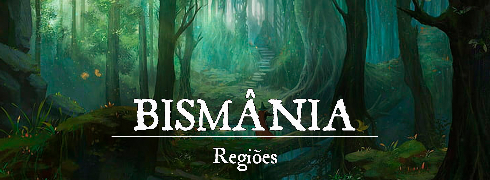

# Bismânia

**# Descrição:**

Situado na Região noroeste de Gronnemar, o Bismânia preside seu domínio como um velho leão devastado pela idade e por uma doença terminal.

Bismânia já cobriu a maior extensão de terra de qualquer nação em Gronnemar. Florestas temperadas abundam no norte, mais próximo de Ascalon, mas diminuem quanto mais se viaja para o sul, com campos de madeireiros que lutam para acompanhar a elevada demanda por madeira.

Uma vez um farol para grandes civilizações, são agora duas nações despedaçadas. Um ninho de nobres corruptos procurando reviver velhas glórias. À espreita, monstros que atacam os descuidados. E o povo comum, desesperado, tentando sobreviver a ambos. 

Embora ainda seja visto pela maioria de seus vizinhos como uma potência política, militar e econômica, aqueles dentro de Bismânia vivem cada dia com a sensação de que o fim está próximo. Quer esse fim venha pela guerra, cultos de deuses nefastos, rebelião, colapso econômico ou a ameaça sobrenatural do Rei sob as Estrelas. 

**# Origem:**
**Na Era das Trevas:**

O Começo de Faerall (por volta de 13.000)

Bismânia começou como um grupo de assentamentos élficos vizinhos, parte do imenso Império de Elselenor, que se estabeleceram na parte nordeste de Gronnemar após o fim da guerra entre os dragões.

Ao longo dos anos, alguns desses assentamentos cresceram em tamanho e estrutura, e ou acordaram união ou absorveram outros assentamentos. Assim, eles tornaram-se Faearall, que na língua antiga dos Elfos, significa “Um Acima de Tudo”.

As pessoas de Faearall eram criaturas de tradição, vivendo suas vidas em sintonia com a natureza, laços familiares, fidelidade à sua nação e leis.

Embora os elfos fossem uma única nação, o Império de Elselenor, Faearall era dividida em três grupos distintos, que se reuniram em províncias, cada uma dedicada a um propósito e a um deus.

Os sábios de Ehremyth se estabeleceram no norte, sobre o manto protetor de Leshay. Fundaram diversas academias de estudos da trama mágica, tanto divina quanto arcana e primordial, mas sobretudo arcana. As principais filosofias e descobertas mágicas eram oriundas de Ehremyth. 

A leste, mais próximo da Baía das Liras, e à beira-mar ficava a encantadora Avalis. Os Avalisianos seguiam os caminhos de Elros, deus guardião dos elfos, pai da poesia e da música. Avalis era uma cidade de muitas cores, onde a vida e a arte se misturavam tão intrinsecamente que muitos elfos não sabiam a diferença entre viver e atuar. Dramas, contos e canções eram o ápice dessa sociedade, que vivia verdadeiros êxtases em nome de seu deus.

Finalmente, a sudoeste fica Raulan, na região das colinas. Os elfos, agraciados pelo primordial amor de Arachne, viviam suas vidas de maneira mais simples, voltada à comunidade e o amor à Natureza. As colinas foram repletas de grandes árvores, cujas copas traziam a sombra e a brisa fresca para seus moradores. Arachne era adorada pelos seus agraciados e assim continuou após a sua traição e morte de Leshay.

**A Unificação dos Três (por volta de 16.000)**
Os Elfos se voltaram aos deuses em busca de um líder que representasse a união dos três. As Três Divindades concordaram que a florescente nação precisava de uma figura central em torno da qual pudessem recorrer. Foi então que os sacerdotes de cada região receberam visões sobre esse novo líder.

Os sacerdotes, conhecidos como os Guardiões, buscaram em toda parte por sinais de quem seria esse líder. Embora tenham encontrado muitos elfos dignos, nenhum foi considerado apto para o título.

Então suas visões os levaram para o oeste. Ali vislumbraram um jovem menino de nome Sihnion, que havia, sozinho, matado um gigante que guardava uma colina, para que ele pudesse construir uma ponte entre duas vilas élficas. Quando os Guardiões foram até ele, assistiram enquanto o jovem, inatamente, devolvia um cordeiro morto de volta à vida com o toque de suas mãos e uma graciosa melodia que emanava de sua boca. Como um, os sacerdotes prostraram-se de joelhos e nomearam-no Imperador Indorion, primeiro de sua linhagem.

Como presente para o novo imperador, os três deuses derramaram sua divindade em artefatos sagrados: uma coroa que irradiava autoridade (Elros), uma espada e escudo que aumentou seu poder e proteção (Arachne) e um orbe que deu-lhe visão distante (Leshay).

Com seu império florescendo, o imperador Indorion implementou mudanças ambiciosas em toda o terra. Ele padronizou o comércio e criou guildas para construção e infraestrutura. Patrono das artes, ele encorajou bardos e músicos a florescer em sua corte. Quando o Imperador Indorion finalmente entrou na vida após a morte, o império tornou-se uma nação de riqueza e esclarecimento.

**A Morte de Indorion (por volta de 24.000)**

O governo de Indorion perdurou por 8 mil anos, no entanto, os sábios previram que não seria eterno, e que o imperador eventualmente morreria. Então, eles deveriam elevar o descendente de Indorion, Theodre, ao trono de Faearall.

Como previsto, o Imperador Indorion foi morto, vítima de uma criatura tocada por M'nzog: seu próprio bobo da corte.

Faearall entrou em grande luto, pois amavam seu Imperador. Seu cortejo fúnebre durou dias e passou pelas três regiões. Líderes de toda Elselenor compareceram à despedida do Imperador para lhe desejar paz na morte e reconfortar a família e os súditos. Foi um dos maiores eventos de União de toda Elselenor.

Um túmulo foi erguido para ele em uma área equidistante de todas as três cidades de Faearall, representando sua igual responsabilidade e amor por todos. Os deuses agraciaram o lugar com um opulento jardim, digno da grandeza de Indorion, onde todos os elfos se sentiriam ligados à ele quando o visitasse.

**Ascensão de Theodre (por volta de 24.000)**

Com a morte destinada do Imperador Indorion, os Guardiões foram agraciados com uma nova visão, onde uma criança prometida iria governar por toda Faearall. Novamente, os sábios foram procurar, seguindo os sinais e eventualmente encontraram um bebê sem nome, chorando no nó de uma grande árvore.Todavia, na mesma árvore havia um casal de elfos pendurados, enforcados por corda. Embora temerosos, os Sábios não duvidaram da vontade dos deuses e levaram o bebê para o palácio, onde o nomearam Theodore, Imperador de Faearall.

Todavia, como Theodore não tinha ainda idade para governar, se estabeleceu uma Regência até seus 100 anos de idade, quando poderia, finalmente, assumir o trono. Desde tenra idade, ficou claro que Theodre estava verdadeiramente, irrevogavelmente louco. Muitas vezes ele falava com coisas que não existiam e tratava seus servos (principalmente os não-elfos) com escárnio. Seus oficiais sussurravam entre si que não podiam, em sã consciência, colocá-lo no poder. No entanto, não arriscaram colocar o Império em perigo, se essa era a vontade dos deuses.

Em um solstício de Verão, Theodre foi oficialmente coroado Imperador de Faearall, sob duvidosos olhares de seus súditos. Um de seus primeiros Éditos foi A Purificação. Theodre acreditava que apenas os elfos eram dignos do seu Império. As demais raças, portanto, foram expulsas de Faearall, incluindo os mestiços. Isso gerou um êxodo tremendo das cidades, fazendo com que muitos precisassem se estabelecer longe de Faearall.

**A Loucura de Theodre (por volta de 25.000)**

Theodre governou Faearall por mil anos, com decisões cruéis e violentas. Muitos tramaram contra a vida do Imperador, mas ninguém foi capaz de matá-lo. Os artefatos concedidos a Indorion tornaram-no invencível. Foi apenas quando a deusa Leshay foi morta por sua irmã, que Theodre foi enfraquecido. Contudo, sua fraqueza não pôde ser aproveitada, pois todos os elfos também foram enfraquecidos pelo luto.

Lentamente o Império de Elselenor começou a desmoronar. Os descendentes daqueles que foram expulsos de Faearall por Theodre invadiam as terras élficas em busca de riquezas, enfraquecendo ainda mais o Império. Ao se recuperar do luto, Theodre foi consumido pelo ódio, fazendo florescer o desejo de vingança. Theodre ordenou uma marcha contra Raulan, uma das principais cidades dedicadas a Arachne.

O plano de Theodre não era apenas matar os elfos de Raulan (que naquela altura já eram elfos sombrios), mas expurgá-los da história. O Imperador Theodre desenvolveu uma nova magia, algo extremamente poderoso criado a partir da loucura de sua mente. Raulan foi um dos palcos de uma das maiores catástrofes da história: o descontrole da magia. Theodre utilizou uma magia de poder inimaginável para destruir completamente Raulan. Esse ato, estranhamento, ocorreu no exato momento de uma outra catástrofe ao sul de Pheros. A consequência de tamanha destruição foi o descontrole total da magia, consumindo a alma de todo o conjurador em qualquer parte do mundo ao utilizar o mais simples feitiço.

O Imperador Theodre, ao lado de Raulan e de todos que marcharam com ele, foram mortos nesse dia. Os artefatos carregados por Theodre, que foram abençoados pelos deuses élficos há muito, se perderam em meio a destruição. A partir daquele ponto, um pântano sombrio se espalhou por quilômetros. Da junção das almas arrancadas, uma criatura, nascida da própria loucura e escuridão daquele ritual nasceu no âmago de Raulan. Uma criatura tão indescritível, que aqueles que a vêem, têm suas mentes devastadas pela insanidade. Os relatos nunca são iguais, mas são sempre aterradores. Poucos sobrevivem ao vislumbre desse ser. Mas os que sobrevivem, apenas o chamam de um título: O Rei sob as Estrelas.

Após o incidente de Raulan, apenas Avalis sobreviveu, ainda que entregue à tristeza e apatia. Nenhuma música era ouvida, nenhum festejo… apenas silêncio. Os ehremyths se entregaram ao ritual sombrio de Theodre. Os raulan sofreram o ritual. Assim, o Império de Elselenor caminhou seus últimos passos antes de desmoronar. A cultura élfica foi quase inteiramente perdida, e os sobreviventes precisaram fugir ou se refugiar com os novos governantes de suas terras.

**Na Primeira Era:**
A ausência dos elfos, ou a quase negativa resistência dos que ficaram, deu a possibilidade dos demais povos subjugados tomarem para si o controle de cidades e terras que antes eram do Império de Elselenor. Novas formas de governo foram estabelecidas, com cada província agora sendo independente uma das outras.

Os humanos, naturalmente mais curiosos e mesquinhos, foram desvendar os segredos de Ehremyth. Aprenderam muito com os estudos élficos e suas abandonadas academias e universidades. O Arcano se tornou comum às raças que não eram tão dispostas à magia. O contato com a trama fez com que gerações evoluíssem e dessem luz a criaturas tocadas pelas energias mágicas e extra-planares.

Outra linha de população foi para o litoral, popular e conquistar a cidade de Avalis. O berço da cultura élfica era apenas um caco de seu antigo esplendor. Todavia, mesmo que escondido, os novos habitantes conseguiam desvendar segredos artísticos, filosóficos e morais guardados pelos outrora moradores da cidade. Descobriram seus meios de comércio, sua engenharia naval, o que facilitou o reflorescimento da cidade como uma verdadeira potência econômica em Gronnemar.

**Na Segunda Era (Atual Era):**

Por séries de desventuras, fantasias e incompetências de seus novos gestores, as cidades vivem, hoje, apenas de aparência. A podridão moral está intrínseca dentro da sociedade. Sabotagens, conflitos e enganações são as principais engrenagens que movem as cidades de Bismânia

Todavia, é apresentado para Gronnemar e para o mundo a falsa imagem de prosperidade e poderio. Aqueles dentro de Bismânia vivem cada dia com a sensação de que o fim está próximo. Quer esse fim venha pela guerra, cultos de deuses nefastos, rebelião, colapso econômico ou a ameaça sobrenatural do Rei Sob as Estrelas.