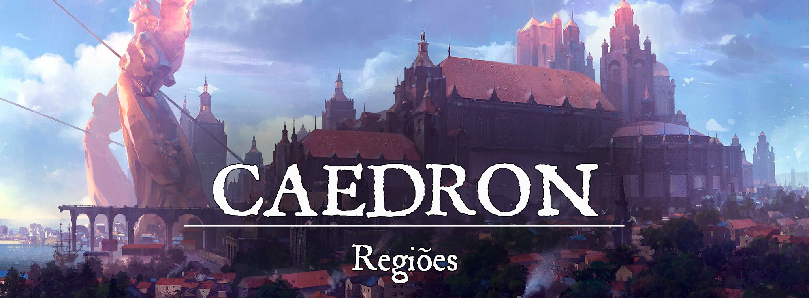

# Caedron

# Descrição
A cidade de Caedron, uma das mais antigas de Gronnemar, cresceu e sobreviveu a partir de sua magia e determinação ao longo da história. Conflitos ancestrais travados em Caedron transformaram seus magos em soldados, a magia tornou- se uma das principais armas dos caedronianos. Os magos formados na Academia Escarlate são parte da nobreza caedroniana e muitas vezes servem ao exército, leais ao rei.
 

### Descrição Visual:
[unknown (59).png](../../../../img/a714eaf7db304ec4cf508d036162421c.png) |Caedron

Caedron é uma cidade enorme, expandida quase sempre pelas bordas do Mar Astorio. Existem muitas áreas com acesso aos portos, que são movimentados por mercadores vindos de Ascalon, marinheiros e pescadores, e até pela própria nobreza, que adora navegar em seus elegantes navios.

A cidade também é muito arborizada, com ventos frescos que sopram com muita frequência. As noites costumam ser iluminadas pelas estrelas de Chantrea e pela luz mágica de lamparinas (um utensílio quase comum na cidade). O amanhecer é incrível em regiões próximas do porto da cidade, pois a luz do sol é refletida nas águas do lago, fazendo com que tenham um aspecto dourado. A verdade é que a cidade de Caedron foi trabalhada em magia, abençoada por seus deuses.

As construções mais antigas de Caedron tendem a ser exageradamente grandes, como é o caso da Fortaleza da Conquista e da Academia Escarlate.
 

# Sociedade
 

### População:
Os humanos são a raça mais numerosa de Caedron e dificilmente outras raças são vistas na região. Dentro da Academia Escarlate, no entanto, não é totalmente incomum encontrar membros de outras raças e culturas.
 

### Cultura:
A magia é, de longe, um dos aspectos culturais mais importantes de Caedron. Desde os seus primórdios, os caedronianos foram afeiçoados pela magia. Apesar de terem começado com recursos limitados, eles buscaram sempre aperfeiçoar seus feitiços ao longo da história, principalmente quando começaram a travar conflitos com Ehremyth.

Todos os conjuradores que estudam na Academia Escarlate são introduzidos na arte da guerra e desenvolvem enormemente seus poderes destrutivos ou de suporte. Quando se formam, tornam-se parte da nobreza, mas sem herdar terra alguma (na maioria dos casos). Muitos dos conjuradores formados na Academia Escarlate decidem servir no exército caedroniano, atuando nas fronteiras ou servindo pessoalmente ao rei.

É muito comum lidar com conjuradores arrogantes e com um povo comum que se sente inferior diante da força mágica de tais indivíduos.
 

### Caráter:
Os caedronianos não estranham a magia e nem o desconhecido, o que não significa que sejam amigáveis lidando com tais aspectos. Para o simples camponês, a magia é uma força poderosa que pode facilmente servir a mãos erradas. Um mago que libere uma destrutiva explosão de chamas pode matar com a mesma facilidade inimigos e aliados.

Os conjuradores caedronianos são muitas vezes arrogantes, homens e mulheres que se enxergam como superiores por conta da força mágica que controlam, gerando, em muitas situações, revoltas do povo comum.
 

### Datas e Festividades:

**O Festival das Estrelas (21/06)**

O Festival das Estrelas é uma celebração anual em Caedron que ocorre durante o início do verão. Os habitantes de Caedron se reúnem para honrar as estrelas e a magia celestial. O festival tem início ao anoitecer, quando as ruas e praças da cidade são decoradas com lanternas e símbolos astrológicos, criando uma atmosfera mística e encantadora. As pessoas se vestem com trajes brilhantes e máscaras elaboradas, representando as constelações e os astros celestiais.

Durante a noite, uma emocionante dança de máscaras é realizada no centro da cidade. Os dançarinos, trajando trajes exuberantes e máscaras com motivos estelares, executam movimentos graciosos e fluidos, retratando a dança das estrelas no céu. A música envolvente e as coreografias elaboradas criam um espetáculo visual e sensorial para os espectadores. O Festival das Estrelas também é marcado por banquetes e festividades gastronômicas. Nas tavernas e restaurantes da cidade, pratos especiais são preparados, inspirados nas constelações e nos elementos celestiais. Os sabores exóticos e as combinações únicas encantam os paladares dos participantes, proporcionando uma experiência culinária única.

Além disso, o festival conta com a presença de renomados magos e feiticeiros, que realizam demonstrações de suas habilidades mágicas e oferecem consultas e aconselhamentos aos interessados. É uma oportunidade para os aspirantes a conjuradores aprenderem com os melhores e obterem orientações valiosas sobre seu caminho na magia. No final do festival, ocorre um espetáculo pirotécnico grandioso, com fogos de artifício iluminando o céu noturno, criando um verdadeiro espetáculo de luzes estelares.

**A Noite das Ilusões (19/08)**

A Noite das Ilusões é uma festividade anual em Caedron que celebra a combinação única de magias de ilusão e teatro. Durante essa noite especial, os teatros da cidade se transformam em palcos encantados, onde ilusionistas e atores se unem para criar espetáculos fascinantes que desafiam a percepção da realidade. A Noite das Ilusões ocorre durante o verão.

Os teatros são decorados com cores vibrantes, cortinas brilhantes e elementos cênicos que evocam o mundo das magias de ilusão. As ruas adjacentes aos teatros são iluminadas por lanternas mágicas que projetam sombras misteriosas, criando uma atmosfera envolvente e cheia de encanto.

As peças de teatro apresentadas na Noite das Ilusões são cuidadosamente elaboradas para incorporar magias de ilusão em todas as suas formas. Os atores e ilusionistas trabalham juntos para criar performances que desafiam as leis da realidade, transportando o público para mundos fantásticos e cativando-os com narrativas cativantes.

As peças podem variar desde clássicos do teatro reinterpretados com magias de ilusão até histórias originais que exploram o potencial das magias para criar ilusões incríveis. Os conjuradores da Academia Escarlate são frequentemente convidados a participar, utilizando suas habilidades mágicas para criar truques surpreendentes, como desaparecimentos, transformações e teletransporte.

Durante a festividade, também é comum encontrar artistas de rua realizando performances mágicas em praças e esquinas, cativando o público com truques de prestidigitação, manipulação de objetos flutuantes e ilusões impactantes.
 

### Religião:
A fé em Chantrea e Sihir é a religião oficial de Caedron. 

Sihir é a matrona do arcano, a responsável por dar aos homens o poder da magia. A magia também é considerada vida em Caedron. Sihir é vista como uma mãe generosa, mas distante.

Chantrea é o mistério que acompanha a vida, uma luz distante que precisa ser explorada. O amanhã é um mistério, um destino incerto, mas que é vigiado por Chantrea e guardado em suas estrelas.

E além das duas principais deusas, vários outros deuses também são venerados pelos camponeses, como Caenis, Hebbame, Hoffe, Kartaros e Messorem. A veneração de alguns deuses é vista como profana e pode causar multas ou prisões. Os deuses malignos são os mais comumente rechaçados em Caedron.
 

# Economia
Durante sua história, Caedron enfrentou a pobreza e a fome incontáveis vezes, salvos principalmente pelas habilidades de seus magos e por acordos realizados com cidades-estados vizinhas. A cidade se recuperou com o passar do tempo, fortalecendo-se o suficiente para andar com as próprias pernas.

Caedron produz vastas quantidades de grãos, vinhos e, sua especialidade, materiais arcanos. A Academia Escarlate compete com a Academia Talasiana de Ehremyth, apesar de ambas possuírem algumas propostas distintas. Os conjuradores caedronianos frequentemente são contratados para atuar em outras nações, seja como conselheiros reais ou militares, soldados ou até mesmo como artesãos.
 

### Serviços:
Componentes para feitiços podem ser encontrados com relativa facilidade em Caedron. A produção de poções mágicas, antídotos e venenos também é vasta.
 

# Governo
Caedron é governada por um rei ou rainha que descende da linhagem de Lantsov. Os membros da linhagem real possuem um dom natural para a magia, frequentemente tornando-se conjuradores formidáveis. Caedron é atualmente governado pelo Rei Beric Lantsov, ao lado da Rainha Aelina Vasselot. O rei possui dois filhos, o príncipe herdeiro Deric Lantsov e a Rainha Aelinor Lantsov, que é casada com o Rei em Ouro de Ascalon. Caedron e Ascalon possuem fortes laços de amizade e a união de ambas as casas (Lantsov e Aureum) fortaleceu ainda mais esse elo.
 

### Poderio Militar:
Caedron divide seu exército em dois grupos: A Primeira Legião e a Segunda Legião. A Primeira Legião é composta por soldados comuns e mercenários, treinados na espada e lança. A Segunda Legião é constituída pelos conjuradores da Academia Escarlate a serviço do rei. Eles existem em um número muito menor do que a Primeira Legião, mas sua habilidade mágica garante que sejam muito mais eficientes e temidos.
 

# Conflito
Caedron e Ehremyth possuem uma rivalidade ancestral, uma guerra que nunca foi cessada ao longo da história. Frequentemente, ambas as cidades-estados se enfrentam em pequenas guerrilhas em suas fronteiras ou no Pâtano Vil de Raulan. As batalhas estão longe de serem tão sangrentas quanto foram anos atrás, pois nenhum dos lados está interessado em uma guerra de grandes proporções. No entanto, Caedron ou Ehremyth parecem não se importar em selar a paz.

Além das batalhas travadas na fronteira, Caedron também lida com a ameaça do Pântano Vil de Raulan. Há muito se sabe que o lugar é amaldiçoado, e que aqueles que vivem em seu domínio são perigosos. As vilas sob domínio de Caedron que estão próximas do pântano precisam ser protegidas de monstros ou de tribos selvagens que exploram além de seus territórios. Os conjuradores da Academia Escarlate frequentemente são enviados para o pântano ou para as fronteiras para lidar com essas ameaças.
 

# Organizações Relevantes

**[Academia Escarlate](402c7dd7-6782-4c55-99a5-dfe6e9174f51.md):**

É um refúgio para aqueles que buscam se desenvolver, estudar o arcano e os assuntos que o cercam, além de matérias como história, geografia, filosofia, matemática, linguagens e a arte da guerra. Todos os alunos da Academia Escarlate são introduzidos à arte da guerra, e aprendem a lutar para que consigam se virar sem sua magia.
 

# Locais Relevantes
**Fortaleza da Conquista**: É o lar da coroa e do sangue real de Lantsov, uma construção colossal vista de todos os pontos da cidade. As pedras da Fortaleza da Conquista são extremamente antigas, mas foram encantadas com runas arcanas para perdurarem eternamente. No flanco da fortaleza, é impossível não notar as duas enormes estátuas brancas que se erguem com suas asas angelicais. As estátuas são irmãs, uma representando Chantrea e a outra, Sihir.

**Academia Escarlate**: A história conta que Caedron surgiu a partir da Academia Escarlate, que foi a primeira construção da cidade. A academia cresceu muito desde a sua criação, reconstruída tanto pelos caedronianos quanto pelos ehremyths em sua época de ocupação na cidade. A academia é cercada por enormes jardins coloridos, áreas de treino e outros pequenos edifícios, como dormitórios, tavernas, lojas e armazéns, além de também ser separada do resto de Caedron por altos muros de pedra. Um aluno não tem motivos para andar fora dos muros da academia, pois encontra tudo que precisa dentro da própria.
 

# NPCs Relevantes
[old_king_by_hasschagaev_df4dhza-fullview.jpg](../../../../img/89d66507761c448249114763ae73fce0.jpg) |Rei Beric Lantsov de Caedron

**Beric Lantsov, o Rei de Caedron**: O Rei Beric Lantsov, também conhecido como o Velho Leão, é o soberano de sua casa e o governante de Caedron. No passado, Beric foi um dos mais formidáveis alunos que estudou na Academia Escarlate, mas tornou-se rei antes que pudesse se formar oficialmente. Seus cabelos ruivos foram consumidos por fios grisalhos e, apesar da idade obviamente tê-lo alcançado, Beric ainda é um mago e um guerreiro implacável.

[unknown (61).png](../../../../img/ac7b3032fed0f0600fc6fa55404666d2.png) |Príncipe Deric Lantsov de Caedron

**Deric Lantsov, o Príncipe Herdeiro**: O príncipe herdeiro busca seguir os passos do pai, estudando para se tornar um mago e um rei digno. Deric é jovem e possui a mesma cabeleira ruiva que o pai possuía em sua idade, mas está longe de ser o prodígio que Beric foi. O jovem vive cercado pela dúvida, acreditando que nunca será tão bom quanto seu pai foi, para sempre o filhote de um campeão.

[unknown (62).png](../../../../img/523724cde3acac0baaf4a4b2e0617e1a.png) |Rainha Aelinor Lantsov

**Aelinor Lantsov, a Rainha de Ascalon**: A filha caçula de Beric, Aelinor Lantsov, também estudava na Academia Escarlate para aprender a usar seus poderes, mas as obrigações da côrte obrigaram-na a largar o estudos em Caedron. Aelinor Lantsov é a esposa e rainha de Arthur Aureum, o Rei em Ouro de Ascalon. Apesar de estar longe de casa, Aelinor não desistiu de aprender sobre o arcano, e passou a frequentar a cidade de Aurora em Ascalon, onde se encontra a Academia Sol e Lua.

**O Conselho dos Cinco Arcanos**: A Academia Escarlate é governada por conselheiros conhecidos como os Arcanos. Os Arcanos são eleitos pelos professores da academia e servem como conselheiros a vida inteira. Os atuais conselheiros são:

[unknown (63).png](../../../../img/6a7a035f658b9913f193fafb97f9795c.png) |Wilhelm, o Antigo

**Wilhelm, o Antigo**: Wilhelm é o mais antigo dos cinco Arcanos, e possivelmente o homem humano mais velho de Caedron. O ancião está no conselho há mais de 500 anos e sua decisão costuma ser muito respeitada entre os outros membros. Wilhelm é um homem de poucas palavras, muito dedicado à magia e com uma forte ligação com a natureza.

[unknown (64).png](../../../../img/2701f024f704714f236e004c9f64eda2.png) |Nyana Balsalor, a Flor de Espinhos

**Nyana Balsalor, a Flor de Espinhos**: De cabelos brancos e sem vida, com sua pele de obsidiana e seus olhos vermelhos carmesim, a única vida que Nyana conheceu foi dentro da academia. Foi criada desde bebê na Academia Escarlate e seu dom para feitiços sagrados se desenvolveu com muita facilidade em sua estadia. Nyana é severa em suas palavras, mas sem nunca faltar com respeito. Ela exige bastante dos alunos e está sempre disposta a curá-los quando necessário. Nyana está no conselho há cerca de 200 anos.

[unknown (65).png](../../../../img/3dcc26549365e45f07089ff8ec129870.png) |Chromie, a Emissária

**Chromie, a Emissária**: Chronormu, ou como é melhor conhecida, Chromie, é a figura mais diminuta da Academia Escarlate, uma gnoma de cabelos dourados e de sorrisos fáceis. É uma maga excepcional com perícia em magias temporais e gravitacionais. Chromie frequentemente está viajando em missão, a serviço do rei. Ela está no conselho há quase 200 anos.

[unknown (66).png](../../../../img/f019880ca60d40305e5acfa0e1567f25.png) |Kothir Forjaruna, o Encantador

**Kothir Forjaruna, o Encantador**: Kothir é um velho anão exilado das terras de Mothrummöl, mas ninguém sabe exatamente o motivo. Seu conhecimento sobre runas é extenso e ele não se limita apenas às runas de seu povo. Um guerreiro admirável e um amigo leal do rei, Kothir dedica horas do seu dia ensinando os jovens alunos sobre o estudo das runas. Ele está no conselho há pelo menos 150 anos.

[unknown (67).png](../../../../img/1a7603a87861363b509f6d371226e630.png) |Eric Lantsov, o Cavaleiro das Estrelas

**Eric Lantsov, o Cavaleiro das Estrelas**: Primo do Rei Beric Lantsov, Eric passou a dedicar sua vida à busca dos mistérios da magia e das estrelas. É apenas alguns anos mais novo que seu primo, mas seu cabelo ruivo não apresenta fios grisalhos, como se estivesse se recusando a envelhecer. Eric ganhou renome na Academia Escarlate através de suas descobertas do arcano. Parte do dia de Eric é dedicado a auxiliar os mais jovens em suas pesquisas e, com o tempo restante, continuar as suas próprias. Ele está no conselho há apenas 10 anos, tendo substituído o último louco Arcano. Dizem que o último Arcano se transformou em um guaxinim por vontade própria e se recusava a voltar para sua forma original.
 

# Origem
A bandeira escarlate de Caedron carrega o sangue derramado da nação ao longo de sua história. Desde a Era das Trevas, os caedronianos lutaram com espada e magia, jamais submetendo-se à escravidão. Seus magos estão entre os primeiros a usar magia na guerra, uma arte que precisou ser desenvolvida para enfrentar Ehremyth nos campos de batalha. Por conta disso, nos dias atuais os conjuradores frequentemente estudam e treinam para se tornarem militares em Caedron. A serviço do rei, eles atuam na fronteira de Ehremyth e no Pântano Vil de Raulan, travando uma guerra que nunca foi esquecida.

Caedron surgiu inicialmente como um abrigo para magos e outros conjuradores estudarem longe das guerras que consumiam Gronnemar. A Academia Escarlate, portanto, é o mais antigo edifício de Caedron, e a cidade foi construída a partir dessa construção. O crescimento acelerado de Caedron chamou a atenção de cidades vizinhas que ansiavam por recursos, principalmente Ehremyth que buscava novos escravos. Os magos de Caedron eram poucos e ainda não tinham aperfeiçoado sua magia para a guerra (na verdade, a magia ainda estava sendo redescoberta nessa época), portanto, precisaram se defender dos invasores com espadas e lanças. Para a infelicidade dos caedronianos, Ehremyth aperfeiçoava rapidamente sua magia, sendo capaz de usá-la na guerra sem muitos problemas. Mesmo que os magos soldados de Ehremyth fossem pouco, as bolas de fogo que evocavam facilmente ultrapassam as defesas caedronianas. Os sobreviventes dos ataques eram levados como escravos para Ehremyth. Os soldados não tinham ânimo para enfrentar magia, e em pouco tempo a cidade e a academia de Caedron foram conquistadas por Ehremyth.

Não houve resistência para defender os portões da cidade. Os soldados sabiam que não seriam capazes de defendê-lo contra os feitiços Ehremyth, então decidiram recuar para fora da cidade, para algum lugar em que pudessem se organizar e resistir. A resistência perdurou por anos, tempo suficiente para que os magos caedronianos pudessem desenvolver sua magia e usá-la como arma. Os mesmos feitiços que foram usados para queimar as forças caedronianas, agora eram usados para expulsar Ehremyth de sua estadia em Caedron. Apesar da admirável força Ehremyth, a maioria dos soldados ainda eram homens e mulheres comuns, que possuíam dificuldade extrema para lidar com feitiços. Os Magos eram como máquinas de guerra ambulantes. Ehremyth recuou, mas não desistiu.

O primeiro Rei de Caedron após a conquista da cidade foi Reinfrey, o Rebelde, fundador da Casa Lantsov. Muitos anos tinham se passado desde o começo da resistência. Ao recuperar sua cidade, Reinfrey Lantsov rapidamente fortaleceu suas defesas e treinou o restante de seus magos, pois sabia que Ehremyth voltaria a atacar, e possivelmente com aliados. Posteriormente, como previsto por Reinfrey, os Ehremyth voltaram a atacar Caedron, e desta vez, contavam com o auxílio da recém formada União de Três. Reinfrey Lantsov não estava mais vivo, no entanto, tinha forjado alianças em sua época que foram mantidas por seus herdeiros. Os principais aliados de Caedron foram Kotka e Relva Dourada.

Caedron esteve na linha de frente na guerra contra a União de Três. Seus magos eram treinados para servir como soldados, a principal força contra os feitiços de Ehremyth. Muito sangue foi derramado por gerações, e a guerra só encontrou um fim quando Ascalon marchou contra a União de Três. A Guerra das Correntes havia finalmente encontrado um fim, mas a rivalidade ancestral entre Caedron e Ehremyth nunca foi esquecida. Mesmo nos dias de hoje, ambas as cidades ainda se encontram em guerra, travando pequenas batalhas em suas fronteiras e pelo Pântano Vil de Raulan.
 

# Acontecimentos
 