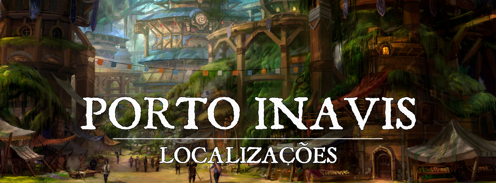

# Porto Inavis

[p]!!! info ""
    “Nosso espírito explorador nunca morrerá”

# Descrição
Porto Inavis é uma pequena cidade localizada na [Ilha dos Ecos](1217afee-678c-460b-bc3c-f0a9710f9d77.md), construída há cerca de 20 anos por um grupo diverso de exploradores que chegaram à Ilha visando a sua exploração. A cidade é construída na entrada da Ilha e é usada como base para os exploradores, permitindo-lhes ir e voltar da Ilha com facilidade.

Ao longo dos anos, Porto Inavis cresceu e se desenvolveu, com a construção de casas, comércios e outras infraestruturas para atender às necessidades da população crescente. A cidade é agora habitada por uma mistura de exploradores, comerciantes e outros que têm interesse na ilha, ou acabaram nascendo lá. A economia da cidade depende principalmente do comércio e do turismo, já que muitos visitantes vêm para a Ilha em busca de relíquias mágicas e para explorar o Abismo Amaldiçoado.
 

### Descrição Visual:

[image (6).png](../../../img/8f453eeaa0a86756f5336a37396129e2.png) |Porto Inavis

Porto Inavis é uma pequena cidade costeira cercada pela natureza exuberante da Ilha dos Ecos. As ruas são pavimentadas com pedras e cascalho, e as casas e edifícios são construídos com madeira e pedra, mantendo um estilo de construção tradicional. A cidade é cercada por uma muralha de pedra reforçada, que serve como proteção contra possíveis invasões das criaturas da selva e também como barreira contra a floresta.

As árvores crescem abundantes na cidade, e muitas vezes seus galhos e folhas podem ser vistos crescendo através dos telhados das casas. As ruas são decoradas com flores selvagens e plantas trepadeiras, criando um ambiente acolhedor. O porto é o ponto central da cidade, onde os navios chegam e partem, trazendo suprimentos e novos visitantes.
 

# Sociedade
 

### População:
A população da cidade de Porto Inavis é bastante diversificada, composta principalmente por exploradores, comerciantes e pesquisadores que vieram para a Ilha dos Ecos em busca de conhecimento e riquezas. Há também uma presença significativa de trabalhadores e artesãos que foram contratados para construir e manter o porto e as instalações da cidade. Além disso, há uma pequena comunidade de nativos da Ilha dos Ecos que se mudou para a cidade, muitos dos quais trabalham como guias e intérpretes para os exploradores. Em geral, a população é bastante cosmopolita, com pessoas vindo de todos os cantos do mundo para explorar a Ilha e seus tesouros escondidos.
 

### Cultura:
A cultura da cidade de Porto Inavis é uma mistura de várias influências, devido ao fato de que a cidade foi fundada por exploradores de vários reinos. É possível encontrar influências de Ascalon, Sankarr, Mystiria, entre outros. A cidade é um lugar onde as pessoas vêm para explorar a Ilha dos Ecos, e como tal, há uma forte cultura de aventura e descoberta. A culinária local é fortemente influenciada pela pesca. A cidade é um lugar onde as pessoas vêm de todos os lugares para explorar a Ilha dos Ecos e as relíquias mágicas ancestrais do Abismo Amaldiçoado, e é uma cidade vibrante e diversa, com pessoas de todas as raças e credos.
 

### Caráter:
Os moradores de Porto Inavis são conhecidos por serem independentes e corajosos, tendo enfrentado desafios para construir e manter a cidade em um lugar tão desafiador. Eles também são conhecidos por serem curiosos e sempre desejam descobrir novos horizontes, seja explorando a Ilha ou negociando com as tribos nativas.
 

### Datas e Festividades:
**O Dia de Novaluz, ou Festival Novaluz** acontece em todo último dia do ano, onde é montado um enorme festival na cidade, com banquetes enormes com a culinária que só existe na Ilha dos Ecos, diversas demonstrações de música e dança criam um ambiente inesquecível, e a sensação de calma entre aventuras que só pode ser sentido verdadeiramente por aqueles que diariamente são ameaçados pela selva hostil que os cerca. O foco principal do festival é celebrar o tempo que já passou, e ansiar pelas grandes aventuras que estão por vir.

No Festival Novaluz também existe o costume de oferecer sacrifícios para o Abismo Amaldiçoado em pequenas barcas de madeira, para pedir por proteção e boa sorte em suas jornadas. Entre os sacrifícios geralmente estão alguns artesanatos e comida.
 

### Religião:
A religião na cidade de Porto Inavis é muito diversificada e abrangente, pois é composta por diversas crenças e deuses de diferentes culturas e tradições. É comum encontrar templos dedicados a deuses de praticamente todos os panteões. Também é comum encontrar praticantes de costumes espiritualistas. A cidade é muito tolerante e aceita as diferentes crenças, e é comum ver as pessoas participando de rituais e cerimônias de diferentes religiões. 
 

# Economia
A economia de Porto Inavis é baseada principalmente no comércio marítimo e na pescaria. A cidade é um importante porto de escala para os navios que viajam para a Ilha dos Ecos. Os habitantes de Porto Inavis também se beneficiam das riquezas naturais da Ilha dos Ecos, como a madeira e os recursos minerais. Além disso, há também uma indústria turística em crescimento, com pessoas interessadas em conhecer as ruínas e ouvir os ecos misteriosos da ilha.

O comércio de Porto Inavis é controlado principalmente pelos investidores de Fortuna, uma grande cidade-estado próxima. Eles fornecem capital e recursos para as operações comerciais e de exploração da cidade, e esperam um retorno significativo sobre seus investimentos. 
 

### Serviços:
A cidade tem bastante a oferecer, desde serviços de hospedagem, viagens de barco para regiões mais internas da Ilha, e até mesmo guias para a floresta, ou até mesmo para o Abismo Amaldiçoado, mesmo sendo um lugar muito pouco explorado.
 

# Governo
A cidade de Porto Inavis é governada por um conselho de exploradores, composto por líderes experientes e respeitados da comunidade. Eles são responsáveis por tomar decisões importantes para o bem-estar da cidade e do seu povo. O conselho é composto por homens e mulheres de várias raças e origens étnicas, refletindo a diversidade da população de Porto Inavis.

Existem cinco membros do conselho, que são eleitos pelos cidadãos da cidade e servem mandatos de dois anos. Eles se reúnem regularmente para discutir assuntos importantes, tais como segurança, comércio, saúde pública, desenvolvimento econômico e acima de tudo, planos de exploração.
 

### Poderio Militar:
A cidade conta com a proteção da Guilda de Exploradores, uma organização composta por aventureiros treinados e equipados para lidar com os perigos da floresta e do abismo. Eles são contratados pela cidade para realizar missões de segurança e busca de recursos, além de fornecer proteção a grupos que entram e saem da cidade. A Guilda também fornece treinamento e equipamentos para os guardas da cidade, que são responsáveis por garantir a segurança interna do Porto Inavis.

Com seus investimentos, existem diversas armas de fogo sob a posse da guarda e da Guilda de Exploradores, que muitas vezes acabam sendo necessárias para criar a segurança que eles buscam na Ilha dos Ecos.
 

# Conflito
A cidade de Porto Inavis enfrenta vários problemas no dia-a-dia. Uma das principais preocupações é a segurança, já que a cidade é frequentemente ameaçada por feras perigosas vindas da floresta. Mesmo suas muralhas reforçadas não são o suficiente para deixar o povo totalmente calmo, tendo em vista os enormes dinossauros que vivem na Ilha. Além disso, a cidade também enfrenta problemas comerciais, já que depende muito dos investimentos de Fortuna para prosperar.
 

# Organizações Relevantes
**A Guilda de Exploradores** é uma organização formada por aventureiros experientes, que buscam explorar as terras desconhecidas da Ilha dos Ecos. Eles são responsáveis por cartografar e documentar as descobertas, além de proteger os habitantes de Porto Inavis de perigos que possam estar presentes na floresta ou no Abismo. Os membros da Guilda são treinados em combate, sobrevivência e primeiros socorros, e possuem equipamentos de alta qualidade para enfrentar as difíceis condições da Ilha. A Guilda é liderada por um Conselho de Exploradores, composto por veteranos da organização, e é financiada pelas doações de comerciantes e pelo governo de Porto Inavis. Além de sua função principal, a Guilda também oferece serviços para outros aventureiros, como guias, transporte e suprimentos.
 

# Locais Relevantes

**A Guilda dos Exploradores**: É a sede da guilda de exploradores da cidade, onde os membros se reúnem para planejar suas expedições e compartilhar informações sobre a floresta e o abismo. Também é onde os exploradores podem comprar equipamentos e contratar guias e outros profissionais.

[pub-by-j-line-7vvosu7dnc.jpg](../../../img/b36a3dd6cdde147fc930f7f6e3fe28a0.jpg) |Taverna Boca do Abismo

**A Taverna Boca do Abismo**: É uma enorme taverna popular entre os exploradores e marinheiros, onde eles contam suas histórias e compartilham suas descobertas. A taverna é decorada com mapas antigos, instrumentos e outros objetos relacionados às ruínas da selva e ao Abismo. Muitos dos exploradores que desejam ir ao abismo geralmente vão até a Taverna Boca do Abismo para uma última grande refeição, nunca sabendo se retornarão com vida. O dono é Heremon. 

**O Bazaar dos Anciões** é um grande mercado onde são comercializados diversos produtos, desde as coisas mais rotineiras e simples, até artefatos encontrados na selva e no abismo. O lugar é bem cheio, e é sempre bom tomar cuidado para não ser passado a perna.
 

# NPCs Relevantes

[a4f444e3a10c0fab5fc43f2bbaa0ed73.png](../../../img/48908dc4e2260ed95cc25003510860a3.png) |Marick Verster

**Marick Verster** é um membro do Conselho do Porto Inavis, chegou à Ilha dos Ecos junto à primeira embarcação de exploradores, e foi ele quem planejou o porto e a infraestrutura posterior. É um homem humano muito inteligente com um sotaque carregado do deserto. Ele tem sido reeleito todas às vezes nos últimos 20 anos por sua competência, sabedoria e carisma. Ele é muito amado e respeitado pelo povo. Marick também é responsável por muitas das relações diplomáticas que o Porto Inavis engaja.

[bff89e86bdd0ba774426a981d16ade07.png](../../../img/e905522d2dd6f9726cd0e96549fa0f8d.png) |Kymil Yllatris

**Kymil Yllatris** é um membro do Conselho do Porto Inavis, um estudioso que chegou à Ilha dos Ecos junto à primeira embarcação de exploradores, é um cartógrafo e arcanista, mas acima de tudo é um grande apreciador da história. Ele cuida da maior parte dos arquivos e relatórios que os exploradores trazem de volta, e tenta transcrever essa informação de uma forma fácil de ler para vender e distribuir na cidade.

[cd1321070e0cc7ca0630697c5996196b.png](../../../img/ae3f83f44822a90a4758834604482b54.png) |Kian Vuuren

**Kian Vuuren** é um poderoso guerreiro tabaxi que faz parte do Conselho do Porto Inavis, ele veio posteriormente para ajudar nas explorações. Por ser um poderoso caçador e sobrevivente, ele se destacou em meio aos outros, e rapidamente conseguiu se tornar um exemplo a ser seguido. É um dos líderes da Guilda de Exploradores e sempre dá a sua opinião pontual ao conselho quando o assunto se trata da exploração à selva.

[fbaf081873386fa1691ca6705b90fa28.png](../../../img/ed4a0a68fc0ba418efc25611ba48b970.png) |Myrtis Karn

**Myrtis Karn** é uma membra do Conselho do Porto Inavis, uma ex-pirata que tem um grande interesse na exploração das relíquias do Abismo Amaldiçoado. Ela é uma conjuradora que adora jogos. Geralmente não se envolve com muitos assuntos civis, e mesmo que não pareça muito amigável, os exploradores contam com sua astúcia para explorar o abismo.

[f87fe3eead7abe1639724241a90cf711.jpg](../../../img/0f851fee826f55478f2f44915e01739b.jpg) |Zelia Foy

**Zelia Foy** é uma membro do Conselho do Porto Inavis, praticamente cresceu na cidade, e tem um ótimo olho para o comércio. Ela cuida de muitas verbas e faz o que acredita ser melhor para os cidadãos.

[c5675805c5f228808521c715cbc84b87.png](../../../img/c371799eb6bd7c41b3dbe2d4d00c8238.png) |Llamiryl

**Llamiryl** é uma guia popular no Porto Inavis, mas muitos a evitam por ser relativamente estranha. É uma elfa druida dos esporos que consegue nomear cada planta que sequer aparece no seu alcance de visão. Sabe como navegar na selva de forma segura, evitando criaturas selvagens, e principalmente as plantas venenosas do lugar. Ela fala de forma lenta e avoada, como se estivesse prestando atenção em outra coisa, mas seu serviço no final é inquestionavelmente muito bom. Geralmente pode ser encontrada na Guilda dos Exploradores. No entanto seus preços são um pouco altos, cerca de 10PO por dia para cada pessoa que ela guiar.

[angevere-ona-kristensen-dancing-horse-barkeeper.png](../../../img/a357856a55d5cc75a3980f6083f21225.png) |Heremon

**Heremon** é o Taverneiro da Taverna Boca do Abismo, a maior taverna da cidade. É um homem brincalhão e gentil, e é muito respeitado por seu trabalho, e sua bebida e pratos de altíssima qualidade. Ele possui uma prótese em seu braço esquerdo, e adora contar aos outros a história de como ele perdeu seu braço para uma capivara gigante em Sankarr. A história é muito absurda, mas ninguém nunca pode provar que era mentira.
 

# Origem
A cidade de Porto Inavis foi fundada por um grupo de exploradores, que haviam se aventurado na Ilha dos Ecos e encontrado um local ideal para construir um porto. Com o passar do tempo, o porto cresceu e se transformou em uma pequena cidade, atraindo comerciantes, aventureiros e outros viajantes à procura de riquezas e aventuras na ilha. Investidores de diversos reinos decidiram que a exploração da Ilha dos Ecos valeria a pena, então o Porto Inavis se tornou o entreposto que conecta a civilização com a Ilha de forma segura.
 
# Acontecimentos
 [/p]