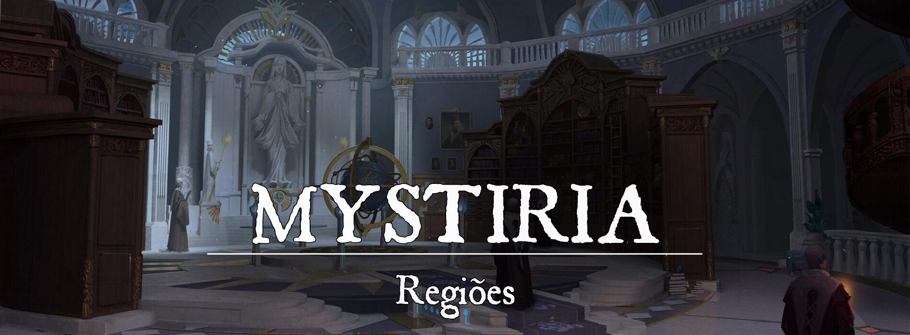

# Mystiria

# Descrição Geral
A Magocracia de Mystiria é um reino situado nas Ilhas Flutuantes ao norte, um lugar frio e abençoado pela Deusa da Magia [Sihir](../../panteao/panteao-Erio/efbb1a95-c739-4de9-b6ef-ca5679ac176e.md). É um reino voltado ao conhecimento e à magia, governado por magos habilidosos e dedicados ao equilíbrio da magia no mundo, sendo um dos maiores pólos arcanos de toda Pheros.

[Mystrallis](../../../img/193b02b801ec9a965b188d594324170d.png)|Mystrallis, a Capital

A capital do reino é a cidade de Mystrallis, que abriga a grande Academia de Mystiria, onde novos magos de todo o mundo podem começar sua jornada, desde que tenham o dinheiro para investir, e até mesmo para chegar até o reino. O reino é conhecido por suas invenções mágicas únicas, possíveis graças à presença abundante de cristais de magia condensada, que podem ser tanto usados como uma espécie de combustível renovável, mas sua presença também facilita a interação com a trama, de forma que é muito mais fácil utilizar a magia para dar suporte à infraestrutura do reino. Para chegar à Mystrallis, deve-se passar primeiro pela Cidadela Pálida para ser identificado e registrado.

As interações e o comércio com o mundo exterior são feitos através dos Faróis de Sihir, torres de teleporte regulamentadas pelos magos de Mystiria. Estes faróis alimentados pela magia oferecem uma rota segura para a interação com o mundo exterior, permitindo que a Magocracia de Mystiria preserve sua independência e cultura mágica.

Em resumo, a Magocracia de Mystiria é um reino único e fascinante, governado por magos dedicados e com uma cultura rica e diversificada de magia e conhecimento.
 

### Geografia

A geografia de Mystiria é composta por três grandes ilhas flutuantes, grandes massas de terra e rocha que se erguem aos céus. O clima é rigoroso, com longos invernos e verões curtos, a sobrevivência no lugar só é possível por causa das invenções arcanas que emitem calor para as cidades do reino. A presença da magia condensada no próprio ar é evidente, cristais de uma cor azulada flutuam assim como as Ilhas pelos seus arredores. Parece que não existe muita vida fora das cidades, onde todos se reúnem, e por isso existem muitas áreas não habitadas na região, como florestas escuras com criaturas mágicas e longos caminhos gélidos repletos de ruínas do antigo reino.

A Academia de Mystiria é o coração da comunidade mágica, onde uma enorme parte dos magos passa quase toda sua vida, e onde os arcanistas mais experientes conduzem pesquisas e experimentos mágicos. Além disso, há comunidades de artesãos e comerciantes que produzem e vendem bens e serviços para os habitantes da região e para o mundo exterior.

A vida nas cidades é segura e ordenada, com os magos governando e mantendo o equilíbrio da magia. O conhecimento mágico é valorizado acima de tudo, e a Academia é o principal lugar onde ele é preservado e transmitido. O comércio é importante para manter a economia e trazer riqueza ao reino, e os Faróis de Sihir permitem que os habitantes mantenham contato com o resto do mundo.
 

# Cidades e Lugares de Importância
 

### Mystrallis, a Capital
Mystrallis é localizada perto da costa da Ilha central, de frente a um grande foco de cristais arcanos. É a maior cidade de todo o reino, e onde uma parte esmagadora da população é localizada. A natureza do reino de Mystiria faz com que seja muito mais propício o povo se focar nessa única cidade, e manter as outras como assentamentos provisórios, ou com outras intenções. 

Repleta de construções em pedra branca, a cidade é muito bela e elegante, repleta de comércios e oficinas dos arcanistas. As ruas são bem pavimentadas e repletas de aparatos mágicos para ajudar no dia-a-dia, como postes de luz ajustados com magia, que também aquecem as ruas, vassouras que limpam as coisas sozinhas, e até mesmo um sistema de cisternas que renova a água potável magicamente.

A cidade é bem grande, e o povo é bastante educado, parece que a magia conseguiu prover uma qualidade de vida justa até mesmo para os menos afortunados, então é uma cidade bem tranquila.

Guardas preparados rondam a cidade e a Academia para garantir que tudo está em ordem, e reportam quaisquer problemas relevantes para a Academia.

### A Academia de Mystiria
[Academia de Mystiria](../../../img/0b1939c91a65f40ee8fae9a84a7a35ab.png)|Academia de Mystiria

A Academia de Mystiria é anexada à Mystrallis através de uma grande ponte que leva até essa construção colossal que é a Academia, ficando bem de frente para os cristais arcanos. É onde uma enorme parte da população vai constantemente passar seu tempo, seja estudando, pesquisando ou fazendo outros trabalhos administrativos, a Academia é definitivamente um dos maiores pontos de interesse de todo o reino.

[Academia de Mystiria - Interno](../../../img/801d83b6554c6746f7c4a0b85766bb6a.png)|Academia de Mystiria - Interno 

### A Catedral de Sihir
A Catedral de Sihir também é um lugar de grande importância para Mystiria, o povo do reino é muito fiel à Sihir, já que ela é o símbolo da magia e possui a mesma ideologia do reino. É muito comum que o povo passe na catedral para orar para Sihir, pedindo que ela os guie em seus estudos e práticas ou pesquisas, além de agradecê-la por ter abençoado a humanidade com a magia.

### Cidadela Pálida
[Cidadela Pálida](../../../img/5b54ca8ceb6c23fad5a578dceda61b52.png)|Cidadela Pálida

Uma vez já foi um lugar mais focado em proteger a entrada para Mystiria, mas já se passaram muitos anos desde a última vez que existiam tais ameaças, e aos poucos o lugar se suavizou. Ainda mantém seu propósito inicial, toda chegada em Mystiria chega primeiro à Cidadela Pálida, onde os visitantes devem primeiro ser registrados, e só então permitidos para ir até Mystrallis através de outro Farol de Sihir. 

Seu aspecto defensivo já se perdeu há muito tempo, e agora o lugar tem um aspecto muito mais aconchegante do que qualquer coisa. É uma pequena cidade que recebe os visitantes de fora, e também é um lugar bem frequentado pelos outros habitantes do reino para passar um tempo fora. Isso tudo moldou a Cidadela Pálida para esse modelo confortável, com diversas tavernas, estalagens, e outros lugares de lazer. O suporte econômico de Mystrallis dá um espaço ainda maior para o conforto da Cidadela Pálida, junto às constantes invenções que ajudam na vida das pessoas. 

As pessoas geralmente não são impedidas de entrar na Cidadela Pálida, mas são mais investigadas caso desejem entrar em Mystrallis, as intenções e precedentes são vistos de forma cuidadosa, e taxas são cobradas com facilidade. Tudo isso para manter a ordem de Mystiria, e não permitir que pessoas suspeitas tenham a possibilidade de interferir com a paz.

### População:
A população de Mystiria é principalmente composta por humanos, alto-elfos, meio-elfos e owlins, mas existem diversas outras raças presentes devido ao grande número de pessoas que vieram de fora e ficaram em Mystiria.
 

### Governo:
O Conselho de Mystiria é o corpo governante da Magocracia de Mystiria, encarregado de manter o equilíbrio e a harmonia da magia no reino. É composto por nove membros, um representando cada escola de magia: Abjuração, Conjuração, Adivinhação, Encantamento, Evocação, Ilusão, Necromancia e Transmutação, além de um Clérigo da Arcana de Sihir.

Cada membro é escolhido a partir de uma votação entre os magos da Academia de Mystiria, e serve por um mandato de dez anos. O Conselho de Mystiria tem o poder de decidir questões importantes para o reino, como leis e regulamentos sobre o uso da magia, além de lidar com questões externas e comércio com outros reinos. O Conselho é responsável por todas as grandes decisões do reino, e também é responsável por organizar os outros órgãos administrativos. 

O Conselho de Mystiria é também a direção da Academia de Mystiria, que tem o objetivo de manter a estabilidade da magia no reino e promover o conhecimento e a evolução da arte mágica. Ou seja, a Academia é também o maior poder político do reino, sendo responsável por ele.
 

### Cultura:
A cultura de Mystiria é muito voltada para a magia, aplicando ela em quase tudo que é possível. Geralmente as nuances sempre estão na forma em como as coisas são feitas, que pode gerar estranheza para forasteiros. Aspectos simples como a culinária e limpeza são auxiliados por truques simples, dando uma cara única para os procedimentos, anúncios públicos aparecem como grandes ilusões e a diversidade de aparatos arcanos e itens mágicos mudam todo o dia-a-dia.

Apesar de funcionar de forma um pouco diferente, também existe nobreza em Mystiria. Linhagens ricas que tiveram grande influência na história da magocracia, mas não possuem direitos acima dos outros, apenas influência. Alguns dos nomes mais antigos que tiveram influência na compreensão e desenvolvimento das escolas de magia ainda aparecem hoje em diversas referências dentro do reino, como os Cendrillion, os primeiros representantes da Escola da Evocação, a família Arcamany que foi muito influente na época da reconstrução de Mystiria, e ainda é muito presente hoje em dia, os Bayson, grandes pioneiros das artes da Conjuração, e Twilight, uma das maiores mestres da Adivinhação que recebeu o título de Oráculo de Mystiria no passado.
 

### Caráter:
O povo da Magocracia de Mystiria é conhecido por ser orgulhoso, ambicioso e apaixonado pelo conhecimento e poder mágico. Eles acreditam firmemente na importância do equilíbrio da magia no mundo e estão dispostos a fazer o que for preciso para preservá-lo.

A magia é uma parte integral da vida cotidiana das pessoas, e é usada para melhorar suas vidas em todos os aspectos, desde a cura de doenças até a criação de objetos mágicos.

Além disso, o povo da Magocracia de Mystiria é conhecido por sua hospitalidade e respeito pelas leis e regulamentos estabelecidos pelo Conselho de Mystiria. Eles são guardiões fiéis do equilíbrio da magia e esperam o mesmo dos visitantes em seu reino. É possível encontrar algumas pessoas que acreditam que forasteiros são ignorantes, geralmente nas classes mais altas.
 

# Economia
 Apesar de ser um reino bem abastado, Mystiria é praticamente auto suficiente por conta de sua magia, que pode conseguir recursos de forma muito mais prática. Mas é bem comum Mystiria investir em trabalhos externos, enviando sábios conselheiros para auxiliarem outros reinos e organizações, e as taxas impostas pela Academia de Mystiria também são uma boa parte do seu lucro. O comércio de aparatos e itens mágicos também é bem proeminente no reino, compondo uma boa parte de sua economia. 

 

### Poderio Militar:
O maior poder militar de Mystiria são seus magos, existem diversos destacamentos de guardas que são capazes de utilizar tanto armas quanto magia, guerreiros arcanos e magos da lâmina cantante, mas geralmente a proporção do poder está muito mais alocada na magia. Entre os que escolhem o uso da espada, a guilda das Lâminas Arcanas é a maior responsável pelo treinamento desses guardas.

Mas apesar de tudo, não há um grande exército em si, o grande poder de Mystiria está dividido dentro da própria Academia de Mystiria, mas não é um órgão militar.  
 

# Conflito
 Internamente, uma das maiores dificuldades é a rivalidade entre as famílias nobres. Embora o Conselho de Mystiria trabalhe para manter a harmonia e o equilíbrio no reino, as tensões ainda persistem. Muitas vezes essas tensões podem gerar inconveniências para a população, mas essas tensões nunca escalam para problemas violentos.

Fora de Mystiria, os magos buscam manter o equilíbrio arcano, e por isso fazem diversas operações diferente por toda Pheros, na maioria das vezes se opondo às influências de Neth’hare e outras organizações vis que abusam da magia, e usam ela para corromper.
 

# Organizações Relevantes

- **Lâminas Arcanas:** As Lâminas Arcanas são um grupo de especialistas da arte arcana focado em um combate não natural aos magos, o físico. São nos salões cujos estandartes de uma lâmina azul reinam em que inúmeros adeptos do arcano treinam algo que foge do estudo comum, e aprendem o controle da trama para o gládio do combate físico. 

- Escolástica do Espaço-Tempo: Tal como muitos arcanistas de Mystiria, a escolástica do Espaço-Tempo conta com a união de estudantes dar maestrias arcanas que surgiram com o passar das gerações, onde magos com a mente vazia se permitiram aprofundar pontos da trama nuncas antes almejados, reunindo assim aqueles que buscando o domínio da gravidade e da temporalidade. É dito que a escola partilha muitos conflitos internos, com seus arcanistas argumentando dia após dia que a mesma deveria ser dividida em duas vertentes e não sendo uma única escolástica, pois poucos, para não aclamar nenhum, mago até hoje conseguiu dominar ambas em simultâneo.
 
# NPCs Relevantes

**O Conselho de Mystiria:**

[Mystiria_-_Kituihmaz_a_Barreira_Mistica.jpg](../../../img/a3c81990caa9e096f387d913ff22749f.jpg)|Kitu'ih'maz 

**• Kitu’ih’maz, a Barreira Mística [Humano - 40 anos - Leal e Neutro - Mago da Abjuração 20]:** Kitu’ih’maz tem raízes bem distantes da terra fria de Mystiria, oriundo do sul, do reino de guerra, escravidão e repúdio à magia, Delphos. O conselheiro da abjuração se uniu a Mystiria ainda jovem, sendo um fugitivo de [Delphos](../delphos/a75683a3-f333-4d36-a9ee-d4df652b690b.md) que foi, por sorte ou destino, encontrado por magos de Mystiria em suas viagens buscando por boatos conflituosos de [Neth’hare](../nethE28099hare/fa1856f6-1144-499a-afe0-3df5af7e8c4e.md). Desde então, encontrado, acolhido e guiado, o mago conquistou as cadeiras da academia e revelou ser, se não o, um dos mais aptos arcanos de abjuração de sua década, mantendo seu cargo desde a última eleição. Um homem sério e de vala focada com sua voz grave, um sotaque pesado e uma aura que passa a mais conflituosa segurança, como se andar ao lado do conselheiro fosse como andar cercado por uma guarnição de elite de soldados em pesadas armaduras. Sua pele escura contrasta suas vestes claras, num tom de bege, e olhos que brilham num sútil azul, o qual se intensifica quando conjurando algo. Seu familiar, Quaksquiks, é um pequeno macaquinho alado.

[Mystiria_-_Terseth_Bayson_o_Nunca_So.jpg](../../../img/2854fff6473ce52445358473c4379bcb.jpg)|Terseth Bayson 

**• Terseth Bayson, o Nunca Só [Draconiano - 31 anos - Neutro - Mago da Conjuração 20]:**Terseth é membro da família Bayson, um forte nome que carrega a maestria na arte de conjuração, sendo um especialista em portais e passagens, principalmente para convocar outros seres. É dito que sua origem está no povo que nasceu para servir dragões, um kobold, mas com o passar das gerações próximas os Bayson começaram a acabar numa miscigenação de sangue que os deu apenas uma característica, uma variação de tamanhos, pois alguns nascendo ainda menores, enquanto outros, como Terseth, nasceu de tamanho normal. O conselheiro da conjuração atua como responsável pela manutenção dos Faróis de Sihir, sendo o mestre em estar em vários lugares em quase simultâneo, sumindo e surgindo com um baforar de seu cachimbo. Sua personalidade é muito mais animada, sendo alguém que gosta de chamar a atenção com seus truques e criaturas que guarda debaixo da manga. Suas escamas são do mais pálido branco, e uma aura de fumo o acompanha, parte dele gelado por sua natureza, outra parte com o perfume de ervas.

[Mystiria_-_Mersais_o_Pupilo_da_Oraculo.jpg](../../../img/bb6a44131c144e0d5b4d438897269611.jpg)|Mersais 

**• Mersais, o Pupilo da Oráculo [Humano - 80 anos - Leal e Neutro - Mago da Adivinhação 20]:** Mersais é tido como, um dos mais velhos magos vivos de Mystiria, tendo sido ele um dos discípulos da arte tão bem trabalhada pelo Oráculo, Twilight. Ele, junto do conselheiro da abjuração, se dão ao dever de manter o território de Mystiria seguro e vigiado. O velho homem carrega um semblante cansado, mas doce, sendo conhecido por ser um dos mais tenros e simpáticos membros do conselho, apesar de seu tão precioso cargo. Seus longos cabelos e barba branca já mostram sua idade avançada, mas ainda assim ele costuma trajar roupas leves e claras cujo alfaiate altera com os costumes dos jovens, gostando de estar minimamente próximo dos mais novos. Alguns poderiam dizer que Mersais é como uma avô que busca partilhar interesses e costumes com seus netos, o que às vezes sai diferente do planejado para o ancião. Ele está sempre acompanhado de sua fiel companheira, a coruja Crepúsculo.

[Mystiria_-_Ris_Valentine_a_Rosa_Estupenda.jpg](../../../img/c52fcb61c8fd6f6953c73b842789c75b.jpg)|Ris Valentine 

**• Ris Valentine, a Rosa Estupenda [Humano - 36 anos - Caótico e Bom - Mago do Encantamento 20]:** Ris vem de uma velha família de encantadores, mestres do medo e charme, mas que distoante do que os nascidos do sul fizeram, a família dos Valentine optou por evitar o uso da magia para a escravidão alheia, e sim para manter o perigo aprisionado em seus sonhos ou horrores. A escola do encantamento não é a mais forte de Mystiria, pois ainda há muita da crença que o poder está no puro arcano, mas mesmo assim o conselheiro do encantamento mantém-se firme em sua cadeira, com sua família mantenho uma parcial unanimidade no conselho com essa escola arcana. O mestre da Rosa Estupenda é um galã, adorando abusar de seus charmes naturais para seduzir novatos a suas obras, literárias ou físicas, mas nunca de maneira forçada. Para o conselheiro a magia de encanto não deve ser usada para dominar o livre arbítrio alheio a menos que enfrentando uma ameaça, e mesmo nesses casos, prefere-se o tormento do medo à prisão da mente em doces, e viciantes sonhos. Sua elegância está nas vestes, nunca usando mesmos trajes um dia sequer, mas sempre mantendo uma alta decoração e tecelões sob sua guarda, incentivando entre os arcanos a costura. Sua pele é corada, seus cabelos, em iuminação correta, causam a dúvida de um negro grafite ou belo grisalho, e toda sua estrutura física foi um presente de [Rangel](../../panteao/panteao-Erio/c1a50e30-f012-40c6-bb64-9d1c2c838910.md) para o conselheiro.

[Mystiria_-_Lissignea_Cendrillion_a_Chuva_de_Cometas.jpg](../../../img/e5104f4c018bbc7c61a4f73ee917ef6c.jpg)|Lissignea Cendrillion 

**• Lissignea Cendrillion, a Chuva de Cometas [Genasi (Fogo) - 28 anos - Caótica e Boa - Maga da Evocação 20]:** Lissignea faz parte da família Cendrillion, os famosos mestres da evocação, peritos na eletricidade, luz, mas acima de ambos, o fogo. Os Cendrillion geralmente competem a cada eleição para o conselho, com os Arcamany pelo título de conselheiro, e no caso da última década, foi Lissignea Cendrillion a vencedora. Lissignea é uma das maiores forças destrutivas de Mystiria e uma prodigio nata mesmo em sua família, algo que provado pela sua capacidade de ser uma das mais jovem a subir ao cargo de conselheira na história, ou com sua infâmia aparição num confronto contra arcanistas neth’arios, onde ela convocou o próprio céu em chamas para cair sobre seus inimigos. Ela é uma personalidade muito marcante e instável, apesar de seus ideais serem os melhores, e suas intenções almejam a criação de uma Pheros arcanamente equilibrada, a conselheira é muito emocional, sendo explosiva como uma chama, é quente em seus argumentos e discussões como o mesmo. Sua pele negra vive emanando um fumo, como que cinzas, e sua opção de cores é a mescla de latão e dourado com um alaranjado chamativo que sempre parece estar em constante combustão, pois mesmo que ela busque suprimir para não causar atenções errôneas, sua linhagem com o plano do fogo é inegável. 
A história conta que a família Cendrillon tem suas origens em Garmareia, a terra dos gênios, com sua primogênita sendo uma nobre fugitiva que escolheu diferente do que o governo das areias queria para ela.

[Mystiria_-_Sarah_Ludriciel_a_Artista_da_Trama.jpg](../../../img/3a53665b1c51479e82ad3f37ea6eb5b5.jpg)|Sarah Ludriciel 

**• Sarah Ludriciel, a Artista da Trama [Elfa (Alta) - 216 anos - Caótica e Boa - Maga da Ilusão 20]:** Sarah está em Mystiria já há algum tempo, tendo vislumbrado muita história ocorrer ao longo do tempo e, junto da família Valentine, foi em muito a responsável por fazer Mystiria bela. Ela incentiva inúmeros artistas, de todos os ramos, indo de arquitetura até a tecelagem, pois preza por um reino que volte à beleza do passado. É dito que, em tempos de dor, a conselheira, mesmo antes de seu cargo, tal como sua ascendência, foram responsáveis por inúmeros shows de ilusão e até mesmo cobrir a cidade com uma falsa, mas mais doce, aparência. Nas últimas décadas ela conseguiu se manter em seu cargo, conhecendo alguns conselhos antes do atual, e por isso muitas vezes os comparando com uma eterna pitada de humor. Sua pele é extremamente clara, como seus platinados cabelos e olhos, sempre prezando por uma palheta de cores em tons de rosa e negro. Sua presença é a mais doce e excêntrica, pois não raramente a artista costuma brincar com disfarces entre seus íntimos, ou com aqueles que lhe chamem a atenção.

[Mystiria_-_Yilaktrair_Escamas-Palidas_a_Incansavel_Guardia.jpg](../../../img/aad4e19a96fbac57bf1658c996414339.jpg)|Yilak'trair 

**• Yilak’trair Escamas-Pálidas, a Incansável Guardiã [Reborn (Draconiana) - 1.522 anos - Leal e Neutra - Maga da Necromancia 20]:** A mais conflituosa e, realmente, uma das mais velhas magias de todas Mystiria, mas que não pode ser chamada de viva. Yilak’trair esteve junto da formação da academia arcana, e desde então dedicou-se à conflituosa arte da necromancia, tomando para si a tarefa que crê ter-lhe sido dada por [Sihir](../../panteao/panteao-Erio/efbb1a95-c739-4de9-b6ef-ca5679ac176e.md) e [Mystrandr](../../panteao/panteao-dovahoss/9a362f1e-61d6-4d0e-ab4c-542e90cc4106.md) de defender seu conhecimento de mãos malignas e ser capaz de instruir aos outros como a arte funciona, para a respeitem e saibam como lidar com a mesma. Como a conselheira de necromancia, a Incansável Guardiã segue como a ossada de seu corpo draconiano, ainda assim buscando trajar-se bela e não ser uma decadente visão do quanto a necromancia é má, mas sim que apesar do uso manipulado que conjuradores malignos fazem, a arte carrega sua beleza e bom uso para a vida dos mortais. Ela é doce e carinhosa, mas mórbida em aparência, é dito que a conselheira adora visitas e um bom chá, apesar de não mais ser capaz de beber, é um rito para ela e aqueles que a seguem.

[Mystiria_-_Zertran_Matriterra_a_Essencia_Polimorfe.jpg](../../../img/bd4b449609de5da8724981047f9f9c2c.jpg)|Zertran Matriterra 

**• Zertran Matriterra, a Essência Polimorfe [Humano - 47 anos - Leal e Neutro - Mago da Transmutação 20]:** Zertran faz parte dos Matriterra, uma família jovem, mas que ganhou lugar entre os acadêmicos, mesmo com suas raízes ligadas a [Stylia](../stylia/0605540a-5a55-4ae7-ac6b-c4504c0c6b69.md), o reino do progresso e sem uma base previamente arcana como os restantes acadêmicos de Mystiria. Boatos contam, contudo, que o conhecimento dos Matriterra era invejável, tendo tido como um antigo pupilo aqueles que hoje fariam parte da alta cúpula de Fortuna, os D’Astere. Zertran, apesar de suas raízes, abandonou um pouco as regras da básica e escolheu fazer de si mesmo sua tese, ascendendo dentre os acadêmicos por sua pesquisa insana, mas que obteve grandes resultados, tornando-se um com a transmutação, alcançando não só o conceito desejo da pedra filosofal, mas fazendo-na seu próprio coração. Zertran recebeu seu lugar no conselho com isso, e claro, com o incentivo aos pesquisadores, mas diferente deles, sendo extremamente rigoroso com cumprimento de regras bases da alquimia. Sua pele é clara, com cabelos castanhos e a idade bem visível em sua face, com exceção da parte de seu corpo que é formada da mais pura pedra e energia arcana, acompanhando-o em qualquer forma que tome, sendo parte imutável de sua existência.

[Mystiria_-_Siliria_Vizaciel_a_Vontade_de_Sihir.jpg](../../../img/5086930a85470001b3da64c063eb5615.jpg)|Siliria Vizaciel 

**• Siliria Vizaciel, a Vontade de Sihir [Meia-Elfa - 41 anos - Leal e Neutra - Clériga da Arcana 20]:**Siliria é a atual alta sacerdotisa de Sihir em Mystiria, sendo a voz e vontade da divindade arcana. Sua função é, no conselho, exercer uma neutralidade geral, até que a deusa escolha que deve-se intervir, mas mesmo assim ela mantém, entre os conselheiros, uma voz de sabedoria divina, falando em charadas, como é a essência da Deusa Esfinge. Muito sábia, mas mais que isso, misteriosa, essa é a Alta-Sacerdotisa do arcano, cujo tempo livre é focado em longas caminhadas pela vastas bibliotecas da Magocracia. Sua bele é bronzeada e suas vestes carregam o tom índigo, com uma tiara que lhe dá chifres como ornamentos, buscando com que sua aparência física seja semelhante à deusa, criando até mesmo a dúvida entre os conselheiros desde muito tempo, do quanto o Alto-Sacerdote que, a cada década costuma mudar, não são sempre avatares da mesma.

**Outras Figuras de Importância:**

[Mystiria_-_Zanara_Tecela-das-Laminas.jpg](../../../img/68a63ef5b4f3c4bbc18fbec13bfe72db.jpg)|Zanara Tecelã-das-Lâminas 

 **• Zanara Tecelã-das-Lâminas [Golias - 30 anos - Leal e Neutra - Cavaleira Arcana 20]:** A líder das Lâminas Arcanas é uma Goliath esguia e cujas marcas de nascença são brancas no lugar de negras, uma personalidade forte e capacidades mágicas invejáveis. Zanara Tecelã-das-Lâminas, é uma poderosa ambidestra que evoca o poder da magia para invocar armas e armaduras de puro poder para se garantir em combate, negligenciando a dependência de grimório, mas nunca desencorajando seus seguidores a usá-los. Ela é uma mente formidável e que vê no mais sútil balanço de uma espada o estado emocional de duelistas, sendo dito que ela é capaz de sentir a trama com uma sensibilidade que poucos são capazes. 

 
# Origem

### **Na Era das Trevas:** 

**#### O Presente da Magia (12.000)**

Desde os primórdios houveram aqueles que foram presenteados com os dons da magia, mas nunca de forma definitiva. Pequenas bênçãos e ensinamentos dos deuses auxiliavam os mortais a seguir em frente em meio àquele mundo cheio de criaturas extremamente poderosas. No entanto, houve uma deusa que acreditava que os mortais também mereciam desfrutar dos esplendores da magia, Sihir. Esse foi o momento em que ela decidiu dar tal oportunidade aos mortais. 

Sussurros esclarecedores percorreram a mente de diversos mortais, quase como se fosse um chamado. Não necessariamente aos mais poderosos e influentes, mas até mesmo pessoas comuns, aqueles que os ouviram sabiam que algo ao norte os esperava. Algo revolucionário. 

Aqueles que ouviram aos sussurros e foram ao norte encontraram uma enorme terra, um platô erguido sob as águas do oceano, uma vasta terra repleta de cristais azulados que emanava a mais pura magia, mas lá não haviam árvores e nem outras formas de vida, não era um lugar no qual era possível sobreviver… E esse foi o teste que Sihir impôs a esse primeiro povo, que apenas com a magia, eles pudessem sobreviver e prosperar.

**#### 50 Anos de Inovação (12.001 - 12.050)**

O teste havia sido imposto aos mortais, eles deveriam ser capazes de sobreviver naquela terra gélida e seca ao norte, apenas usando sua magia como ferramenta. Os primeiros dias foram árduos, mas rapidamente os mais talentosos conseguiram começar a dominar a magia naquele lugar, os cristais de magia condensada pareciam ajudar bastante no controle arcano, e permitiam uma versatilidade e praticidade que as runas nunca poderiam alcançar. Era como se a humanidade tivesse ganhado o poder de “Brincar de Deus”. 

Foi uma questão de poucos anos até que uma pequena civilização começasse a se formar. A partir da magia, muros foram erguidos, o clima frio foi suavizado e a comida se tornou fácil de ser adquirida, bastando um estalar de dedos. O avanço que fizeram a partir do nada foi muitas vezes mais rápido do que qualquer outro povo da época seria capaz de fazer. Os conjuradores constantemente buscavam entender mais como a magia realmente funciona, e também seguiram criando coisas novas com sua magia, buscando pelos limites do arcano.

50 anos depois de chegarem ao platô, os conjuradores foram capazes de construir uma sociedade organizada e saudável, nem o ambiente frio e nem as guerras conseguiram abalar a paz e sucesso dessa civilização. Invenções geniais utilizando a magia nesse lugar permitia que a qualidade de vida de todos fosse muito alta, e quase nunca ocorriam conflitos internos sérios. Aos olhos de Sihir, os escolhidos haviam sido bem sucedidos no teste, e eram merecedores dessas terras abençoadas, e capazes de lidarem com a magia livremente.

**#### A Busca pelo Conhecimento (12.050 - 15.000)**

Conforme o tempo passou, os conjuradores adotaram o nome de Mystiria para a região abençoada onde eles lentamente criavam sua civilização. Houve uma época onde todos eles entraram em um consenso: Eles não seriam capazes de entender a totalidade da magia apenas criando sem parar, as respostas que buscavam não estavam apenas nas terras abençoadas por Sihir, mas sim no resto do mundo, e como toda a vida interage com o arcano. 

Os conjuradores de Mystiria descobriram nuances da magia que geralmente não importariam para os outros usuários do resto do mundo, mas fizeram questão de catalogar e compreender cada ponta solta que a magia os proporciona. Eles acreditavam que o poder ilimitado deveria ser compreendido antes de ser abusado, e então passaram a enviar diversos diplomatas e exploradores pelo mundo para descobrir sobre o conhecimento arcano dos outros povos.

De forma persistente, Mystiria continuou a adquirir esse conhecimento e aplicá-lo para compreendê-lo cada vez mais, se tornando uma das maiores potências mágicas em Pheros. No entanto, nessa época todos os seus esforços ainda eram direcionados a adquirir o conhecimento e evoluir sua civilização com ele. A essa altura, Mystiria já havia um vasto conhecimento das 8 escolas de magia originais: Abjuração, Conjuração, Adivinhação, Encantamento, Evocação, Ilusão, Necromancia e Transmutação, e agia com responsabilidade e bom senso para que esse conhecimento não causasse desequilíbrio, pois é a última coisa que Sihir desejaria.

**#### Conflito de Ideologias (15.000-16.000)**

Milhares de anos haviam se passado desde o início de Mystiria, e o mundo ficava cada vez mais caótico, civilizações de índole questionável se tornavam cada vez mais fortes, e o próprio Império Élfico tinha sua boa dose de corrupção. Era como se lentamente um veneno sutil se instaurasse na terra, gerando descontentamento que muitas vezes se tornavam pequenas rebeliões, e como o poder mágico da época não era coisa para se brincar, muitas vezes haviam grandes perdas. 

Os magos de Mystiria então começaram a atuar de forma diferente, agora além de adquirir cada vez mais conhecimento e guardá-lo, eles também tentavam agir como intermediário ao redor de toda Pheros, tentando garantir que as coisas não saíssem do controle, e que os grandes poderes que os deuses conferiram aos mortais fossem usados de forma responsável, mas não demorou que esse veneno chegasse até mesmo em Mystiria. O contato com essas outras civilizações, e a exposição à má índole despertou questionamentos em alguns magos, será que realmente eles estavam fazendo o ideal?

Muitos pequenos conflitos aconteceram, principalmente entre Mystiria e Neth’hare, que também possuía vasto conhecimento arcano, mas ao contrário de Mystiria, pouco se importava para o equilíbrio da magia, e apenas buscavam poder. 

Alguns magos começavam a questionar os métodos de Mystiria, e até mesmo a adoração à Sihir, eles poderiam ser muito mais poderosos, com o conhecimento e poder arcano que tinham, talvez pudessem até mesmo bater de frente com diversos reinos se fizessem os movimentos certos. No entanto, haviam outros que sabiam que isso só geraria mais guerra, e no final das contas todos seriam mais infelizes do que são hoje.
  
  **#### Revolução e Stasis (16.000 - 24.999)**
  
  Cada vez mais alguns magos de Mystiria seguem insatisfeitos, na busca da prosperidade máxima, muitos se tornaram gananciosos. E não tardou até que isso passasse a ser um risco para a estabilidade de Mystiria. Conflitos internos aos poucos se inflamaram, conforme os magos tentavam decidir como Mystiria iria se portar nos anos seguintes. O que causou uma guerra civil que durou pouco, mas serviu para mostrar aos magos de Mystiria que nem toda vontade é inabalável. Os revoltosos saíram perdendo, e muitos foram exilados.

A partir dali, Mystiria passou a se tornar mais reclusa em sua busca por conhecimento, e evitando interagir diretamente com o mundo afora a menos que fosse necessário. Os magos acreditavam que seria necessário uma ideologia mais alinhada para que pudessem lidar direito com o poder que possuíam. Foi então que muitos anos se passaram, e o tempo erodiu Mystiria. Alguns magos tinham medo de tentar engajar novamente com o mundo diretamente, e assim causar mais conflitos desnecessários, e por isso eles ficaram parados por muito tempo. Alguns diriam até mesmo que esse medo fez com que eles perdessem o que já tinham. 
    **####  (A Catástrofe Arcana (25.000)**

  A magia havia se descontrolado, rituais nefastos faziam com que a magia se tornasse extremamente perigosa para todos, muitos dos aparatos e utilidades arcanas que existiam em Mystiria foram destruídos, e milhares de vidas perdidas.

No momento que Draíotch desceu à terra e criou a trama com sua essência, algo catastrófico ocorreu no platô que Sihir havia erguido e abençoado com sua vasta magia. Os pedaços da terra se partiram e foram erguidos aos céus, criando uma enorme instabilidade também nas estruturas já existentes da magocracia, e levando Mystiria a algo muito próximo da extinção. Os conjuradores mais poderosos tentavam usar seu poder para impedir a destruição e o decaimento, mas era inútil. Muito conteúdo de suas grandes bibliotecas foi perdido, e não restava esperança para Mystiria naquele momento. Agora incapazes de usar magia, os magos teriam que aprender novamente.

**#### A Reconstrução de Mystiria (25.001 -27.000)**
    
Após os eventos catastróficos não era só Mystiria que estava em cacos, mas uma enorme porção do mundo havia se afundado em problemas e conflitos, no entanto, a busca por conhecimento de Mystiria em todos os últimos anos valeu a pena. Apesar de muito ter sido perdido, ainda existia um vasto conhecimento que apenas Mystiria havia guardado. A partir do conhecimento prévio, os magos conseguiram entender muito mais rápido as leis e funcionamentos da magia, deixando quase todos os outros reinos para trás nesse quesito. 

Agora estavam extremamente limitados, mas ainda tinham a magia que era o maior pilar que mantinha essa civilização viva. E com as bênçãos de Sihir sobre as agora ilhas flutuantes, eles conseguiram sobreviver e começaram a reconstruir. Foi um período muito demorado, eram poucas pessoas, e muito para recuperar e construir novamente, mas depois de muito tempo, a sociedade se tornou capaz de se organizar novamente.

    **#### Os Mandamentos Arcanos e o Conselho de Mystiria. (27.000 - 28.999)**
    
    A sociedade novamente se estabeleceu, e os magos de Mystiria oficializaram mais uma vez o seu governo, a Magocracia possui um conselho composto por 9 figuras, um representante para cada escola de magia, e o Alto-sacerdote de Sihir, um Clérigo da Arcana. Junto a isso, o conselho determinou o que eles chamam de “Os Mandamentos Arcanos”, uma série de regras para manter os magos de Mystiria na linha:

A Magia foi concedida aos mortais para que eles pudessem sobreviver e inovar em meio a uma realidade esmagadora, não para oprimir.
Conhecimento perigoso deve ser mantido seguro em Mystiria, não devem ser vendidos e muito menos abusados.
Qualquer ato que possa ferir a trama mágica é absolutamente repudiado.

    **#### A Academia de Mystiria (29.000 - 32.000)**
    
    Após muitos anos depois dos magos de Mystiria se reerguerem, era perceptível que eles ficaram estagnados agora que sua magia era muito mais limitada, e faltavam conexões diretas com o mundo. Então finalmente Mystiria começou a se abrir, pelo menos um pouco.

Foi decidido que o poder político e o conhecimento de Mystiria seria centralizado numa grande Academia, e que eles aceitariam até mesmo estrangeiros que pudessem pagar seus preços. Então foi fundada a Grande Academia de Mystiria em sua nova capital, Mystrallis.

Por muitos anos se seguiu esse ciclo de alunos na academia, criando muitos conjuradores bem capacitados. Mystiria foi um lugar que teve paz nos anos de guerra que assolavam o mundo.  

### **Na Primeira Era:** 

    **#### Os Faróis de Sihir (853-1.306)**

Uma grande invenção foi criada pelos magos de Mystiria, que permitiria uma facilidade muito maior em suas interações com outros reinos: Os Faróis de Sihir, que permitiam criar vias de teleporte para vários lugares no mundo, sem depender de muito esforço.
Os faróis ainda eram regulamentados e vigiados pelos magos de Mystiria, e tinham suas medidas de proteção para garantir que tudo estivesse sob controle, e sem grandes chances de essa tecnologia se virar contra o próprio reino. Essa inovação fez com que muitas outras pessoas agora pudessem chegar à Mystiria, e isso aumentou bastante o fluxo acadêmico do reino.

    **#### 100 Anos de Tormenta (1.307 - 1404)**

Na maior parte da Primeira Era Mystiria não teve muitas novidades além dos faróis de Sihir, que abriram muitas possibilidades. Eles seguiram calmamente seu ciclo de aprendizado e inovação. O lugar era um modelo a se seguir para os outros reinos, e muitos buscavam alianças com Mystiria, para adquirir um pouco de sua sabedoria para seus reinos.
No entanto, quando o abismo invadiu, Mystiria teve um papel muito importante para proteger as pessoas, e até mesmo para combater os demônios. Muitos países foram salvos pelos magos. Mesmo que eles não estivessem sendo altamente ameaçados por conta de sua posição, foram eles que fizeram algumas das primeiras mobilizações para proteger Pheros.
Mystiria se tornou um grande refúgio e arma contra as invasões abissais, e ganhou muito renome em quase todo o mundo a partir disso, muitos reconheciam os Arcanistas de Mystiria como figuras muito poderosas e influentes, e respeitam bastante o reino.

### **Na Segunda Era(Atual):** 

**#### A Rede Arcana (1.505 - 1.523 época atual)**
    
[Rede Arcana - Academia de Mystiria](../../../img/24fcac768b9a9bf3198c5e218f722c5b.png)|A Rede Arcana da Academia 

Mystiria novamente foi capaz de inovar com sua magia, a mais recente invenção foi chamada de “Rede Arcana”. Uma magia que é capaz de armazenar e repassar informações na Academia de Mystiria, as informações contidas são em sua maioria seguras, sem conteúdos perigosos acessíveis. A magia só funciona dentro da Academia, e precisa de manutenção constante feita pelos magos.

Ela trabalha a partir de assinaturas arcanas que são marcadas na trama, como se fosse um livro, no entanto essas informações podem se apresentar facilmente para os magos sem a necessidade de buscar por grimórios antigos e toneladas de papéis. Essa magia não possui uma capacidade de armazenamento para superar as bibliotecas de Mystiria, mas sua funcionalidade principal é o acesso rápido à informação, e onde adquiri-la.

É muito utilizada para verificar os registros de alunos, onde é possível encontrar seus nomes, e outros detalhes acadêmicos. Para ter acesso é necessário que primeiro o usuário seja registrado na Academia para ter acesso à Rede. No registro, a assinatura arcana do conjurador é associada a sua ficha acadêmica, então esses podem ser identificados sem muita dificuldade pelos guardas e professores da Academia. A totalidade das informações não é disponível para qualquer pessoa, diversas informações sobre os registros acadêmicos dos alunos e professores só podem ser acessadas por pessoas com autorização especial. 
 