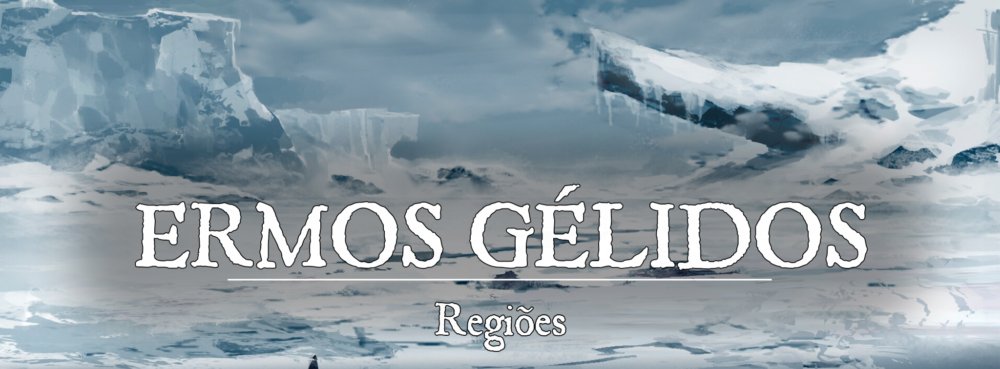

# Os Ermos Gélidos

# Descrição
Apelidado de “Terra de Sempre Inverno”, os Ermos Gélidos é uma região fria e severa, onde é necessário ser forte para sequer existir. As cidades existem apenas ao sul, onde o frio é menos severo e a vida, menos difícil. O povo dos Ermos Gélidos, que se refere a si mesmo como “os nortenhos”, se apoia nas atividades cotidianas para sobreviver em uma região tão hostil. Nenhum lobo é capaz de sobreviver sem uma alcateia
 

### Geografia:
Os Ermos Gélidos são divididos por uma extensa cordilheira. Ao sul, o clima é frio e severo, e existem apenas três principais cidades (Nystadir, Karstaoir e Holmlond). Ao norte, o clima é devastador e não apenas o frio é brutal, mas também as tempestades de neve, deslizamentos e grandes lagos congelados com diversas partes finas o suficiente para ceder com o peso de um homem. O além das montanhas é sobrenaturalmente frio, ao ponto que até mesmo criaturas resistentes têm dificuldades de suportá-lo por longos períodos de tempo sem abrigo. Os nortenhos frequentemente afirmam que as terras para além das montanhas são amaldiçoadas.

Em um ponto na cordilheira há um desfiladeiro conhecido como a “Boca de Kalthenmyr”, onde o vento sopra intensamente, produzindo sons que lembram grunhidos, palavras guturais. A Boca de Kalthemnyr é a única passagem entre o norte e o sul dos Ermos Gélidos, contudo, é um caminho perigoso. Há frequentes desmoronamentos e avalanches. De tempos em tempos, os horrores do norte emergem do desfiladeiro. Entre eles, estão os gigantes de gelo que são acompanhados por uma névoa gélida capaz de congelar um homem até os ossos.

Os Ermos Gélidos nunca foram completamente catalogados. É incerto o que pode haver tão ao norte do continente.
 

### Governo:
Ninguém governa os Ermos Gélidos (até onde se sabe). A região é dividida em diversas tribos selvagens e pequenas comunidades que cuidam de si mesmos com seus próprios líderes.
 

### Caráter:
O povo nortenho colabora entre si para sobreviver, mas são desconfiados de forasteiros. Para eles, os sulistas vivem em terras ensolaradas onde a vida é muito fácil, e por isso eles são moles e nada confiáveis. A palavra de um sulista é tão duradoura quanto o calor de uma cuia de sopa.

Apesar da desconfiança com os sulistas, os nortenhos reconhecem quem trabalha duro ou quem se sacrifica pelo bem coletivo. Artesãos e comerciantes são bem vistos nos Ermos Gélidos, principalmente aqueles que se assentam na região.
 

### População:
Existem muitas tribos espalhadas nos Ermos Gélidos, cada uma com suas linhagens e ancestralidades. As raças mais comuns encontradas nos Ermos Gélidos são humanos, orcs, anões, golias e mestiços (de orcs ou gigantes). Além das tribos, também são encontrados seres inteligentes, contudo, mais selvagens e perigosos, como gigantes de gelo, yetis e lobos invernais.
 

### Cultura:
As pessoas nos Ermos Gélidos são unidas e tendem a trabalhar juntas para sobreviver às condições climáticas extremas e aos horrores da região. Os pescadores e caçadores são comuns em quase todas as tribos. O povo nortenho se orgulha de sua habilidade em caçar e em sobreviver nos Ermos Gélidos.
 

### Economia
As cidades ao sul dos Ermos Gélidos são os únicos assentamentos da região que fazem comércio com outras nações. Fora isso, o povo nortenho é auto suficiente, mas muito pobre.
 

### Poderio Militar
Cada tribo tem seus guerreiros, que são responsáveis por proteger o resto da comunidade. As cidades possuem milícias mais organizadas, mas nada realmente poderoso. A maioria dos nortenhos têm pavor de magia, pois a única que conheceram foi a magia conjurada por gigantes de gelo. Os guerreiros lutam normalmente com machados e lanças, sempre equipados com escudos. Arcos e flechas são valorizados por caçadores
 

### Conflito:
Os Ermos Gélidos são marcados por conflitos cotidianos que fortalecem seu povo. Para os nortenhos, quanto mais ao sul se vive, mais mole a pessoa se torna (e esse vale para eles mesmos). Alguns dos perigos mais comuns encontrados nos Ermos Gélidos:

**Clima:** Extremamente frio e inóspito, os Ermos Gélidos são tundras congeladas com invernos diários. Quanto mais ao norte, mais frio o clima fica.

**Fome:** Encontrar comida não é simples nos Ermos Gélidos, pois a própria comida é capaz de matar um caçador para se alimentar.

**Feras Selvagens**: Os nortenhos enfrentam criaturas grandes e esfomeadas, desprovidas de medo ao enfrentar um bando de homens armados. Lobos e ursos enormes, mamutes, gigantes de gelo e até mesmo dragões brancos estão entre as ameaças que assolam os Ermos Gélidos.

**Tribos Rivais**: Os membros de uma tribo se ajudam para sobreviver, e apenas eles importam. Tribos rivais são concorrência e não há comida para todo mundo. Algumas tribos também recorrem ao canibalismo.

**A Maldição de Kalthenmyr**: Os nortenhos acreditam que as terras além da cordilheiras foram amaldiçoadas por Kalthenmyr, o deus dos gigantes de gelo. O frio da região é sobrenatural, e nem mesmo os seres mais resistentes ao frio parecem ser capazes de suportá-lo por muito tempo. Os gigantes de gelo, no entanto, vivem nessas regiões mais remotas.
 

# NPCs Presentes
 

# Organizações Presentes
 

# História de Origem
A origem dos Ermos Gélidos é um mistério. Os exploradores só foram descobrir que existiam tribos selvagens (além de gigantes de gelo) nos Ermos Gélidos na metade da Primeira Era. Aparentemente, as tribos locais viviam naquela região há séculos, completamente isoladas do resto da civilização de Pheros. Manter contato com os nortenhos é uma tarefa difícil, pois eles são desconfiados (e até mesmo hostis) a forasteiros sulistas.

É sabido, no entanto, que os gigantes de gelo viviam nos Ermos Gélidos há muito tempo. Ao lado deles, dragões de gelo e outras criaturas perigosas e gigantescas. Nunca houve qualquer interesse em explorar os Ermos Gélidos e a maioria dos exploradores que entram na região são aventureiros sem muito a perder.
 

# Relações com a Guilda
 

# Acontecimentos
 