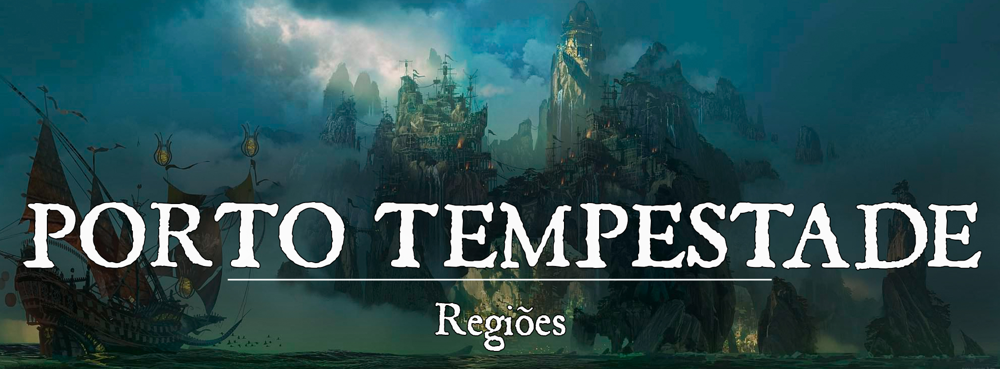

# Porto Tempestade

!!! info ""
    “A pirataria compensa.”
# Descrição
Porto Tempestade é uma cidade isolada por uma tormenta permanente no Mar do Ouro. Lar de pescadores, piratas e aventureiros, chegar (ou sair) de Porto Tempestade pode ser um desafio, mas muitos marinheiros agradecem esse obstáculo que afasta os olhos curiosos da lei. A maioria enxerga Porto Tempestade como um covil para criminosos, e sequer cogitam que há um povo resiliente lutando diariamente para sobreviver em um lugar tão isolado.
 
### Descrição Visual:

[SangraDosReis.png](../../../img/bdad3c63a4f6681aa05dcd0babfe6850.png) |Porto Tempestade

Porto Tempestade foi construído na costa de duas pequenas e isoladas ilhas no Mar do Ouro. Uma parte considerável da cidade se estende pelo mar em superfícies feitas de madeiras, como se fosse um enorme porto. As casas são feitas majoritariamente de madeira, com algumas exceções construídas em terra firme (normalmente igrejas ou mercados).

Existe uma tempestade eterna cercando a cidade, soprando ventos poderosos contra qualquer viajante que ouse adentrá-la. Dentro da tempestade (onde Porto Tempestade está localizado), os ventos se tornam suaves e refrescantes, mas a chuva é uma realidade constante para os habitantes locais. A tempestade atende pelo nome de Cólera de Endring, mas alguns marinheiros juram que tal fenômeno é uma “barreira” criada pela própria deusa dos mares para protegê-los.

Apesar de uma poderosa barreira natural servir de muralha para a cidade, muitos navios atracam diariamente em Porto Tempestade. Existem maneiras quase seguras de viajar pela tormenta, fazendo de Porto Tempestade um verdadeiro abrigo para aqueles que sabem contornar a Cólera de Endring.
 
# Sociedade
 
### População:
Há uma variedade muito grande de pessoas e culturas em Porto Tempestade. Navios de todos os cantos do mundo, com as mais diversas tripulações, atracam na cidade e trazem seus próprios modos a Porto Tempestade. Fora os viajantes, a população local é majoritariamente de humanos.
 
### Cultura:
Todo bom marinheiro entende os ritos do mar e segue firmemente as lendas de boa sorte de Endring. Os rituais que os seguidores da deusa do oceano costumam praticar são muito comuns de se ver pelo porto, por exemplo, os capitães de todos os navios sempre comem uma lasca da madeira de seus barcos junto com um copo de água do mar antes de saírem em suas viagens. Além disso, os marinheiros sempre levam consigo objetos de valor emocional grande para trazer sorte em meio ao mar.
 
### Caráter:
Porto Tempestade é uma cidade caótica e seus habitantes podem ser imprevisíveis. Eles lidam diariamente com homens do mar que ganham a vida pilhando, portanto, confiança não é algo adquirido com facilidade em Porto Tempestade. Ainda assim, há um certo grau de camaradagem entre os marinheiros. Afinal, Porto Tempestade é um abrigo para todos, um lugar onde um marinheiro pode descansar após uma longa viagem.
 
### Datas e Festividades:
**Dia do Choro de Endring**: O dia do Choro de Endring é caracterizado por um aumento súbito de tempestades no mundo inteiro. Apenas os tolos ou desavisados navegam neste dia.
 
### Religião:
A fé em Endring, Vesunna e Chantrea é predominante em Porto Tempestade, pois são suas bênçãos que protegem os marinheiros em alto mar. Cultistas de Yhasthur são temidos mesmo entre os piratas.
 
# Economia
Os habitantes de Porto Tempestade sobrevivem basicamente da pesca e dos produtos trazidos pelos navios mercantes. No geral, a população é pobre devido ao isolamento, mas conseguem sobreviver sem muitas dificuldades. Além disso, muitos marinheiros se preocupam com o bem-estar da população de Porto Tempestade, e por isso dedicam parte dos seus ganhos para alimentar a cidade.
 
### Serviços:
Porto Tempestade é lar de um grande mercado negro onde todo tipo de mercadoria considerada ilegal pode ser encontrada. Escravos, materiais mágicos e valiosos e até mesmo informações podem ser compradas no mercado, claro, pagando o preço “justo” pela mercadoria. (Este preço nem sempre precisa ser em moedas.)
 
# Governo
Porto Tempestade é governado por um grupo de capitães piratas intitulado “O Conselho Pirata”. Eles se reúnem de tempos em tempos para discutir as políticas de Porto Tempestade, mas sempre há pelo menos um capitão na cidade para resolver intrigas mais calorosas.
 
### Poderio Militar:
De certa forma, quase 80% da população de Porto Tempestade pode ser considerada parte do poder militar da cidade. Já que a mesma é composta de marinheiros e piratas que velejam em diversas embarcações diferentes. Ao mesmo tempo, não existe algo como uma guarda ou polícia no porto, muito por conta do fato de que é quase impossível alguém se esconder dos olhos do Conselho dos Piratas enquanto estiver na cidade, e fugir da mesma também não é uma tarefa fácil.
 
# Conflito
Não são poucos os conflitos que assolam Porto Tempestade, o embate contra monstros marinhos dos mais diversos tipos é quase rotineiro para os marinheiros que entram e saem do porto. Ao mesmo tempo, o porto vem recebendo ataques de cultistas de Yhasthur que parecem procurar por algo, alguns dizem que eles buscam por fragmentos de um tesouro antigo.

E claro, uma cidade de piratas claramente tem problemas com as marinhas dos reinos que velejam pelo Mar do Ouro. Principalmente a marinha de Fortuna e Topázio que ativamente tentam derrubar o Conselho dos Piratas, colocando diversas recompensas em suas cabeças e nas cabeças de seus principais capitães.
 
# Organizações Relevantes
O Conselho dos Piratas foi uma organização criada após a morte de Bartolomeu Thatch, o fundador de Porto Tempestade, e inicialmente ela era formada por seus homens de confiança que ficaram com a tarefa de proteger os tesouros de Thatch e sua base. Mas com o tempo, Porto Tempestade foi deixando de ser a base de Bartolomeu e se tornando algo mais abrangente, e os próprios marujos de Thatch decidiram tocar suas vidas de formas diferentes, gerando uma pluralidade muito grande na cidade que havia nascido da antiga base. 

Com o passar do tempo, as cadeiras do conselho foram sendo tomadas pelos piratas mais temidos que passavam pelo porto mas, talvez em respeito a história de Thatch, nenhum deles tentou tomar o porto para si, e sim pelo contrário construindo cada vez mais um repouso tranquilo para aqueles que viviam do mar e de suas pilhagens.

Hoje o conselho é formado por Henry Morgan, capitão do Raposa da Tempestade; Edward Pyke, capitão do Pássaro Fúnebre; Morrayan “Coral” Mors, capitã do Bruxa do Mar; Almirante Hermes, capitão do Flor de Elpis; Sarah Flor’Argentea, capitã do Lamento da Sereia e Matthias Tune, capitão do Arpeggio. Eles não podem ser considerados grandes “amigos” entre si mas, com o objetivo de manter o porto seguro, eles trabalham de certa forma juntos para manter a vida no porto.
 
# Locais Relevantes
**A Taverna do Barril de Pólvora** é um dos lugares mais famosos de todo Porto Tempestade, a taverna é comandada por Januário, um pirata de meia idade que é respeitado por todos do porto. A taverna vende diversos tipos de bebidas, aperitivos e armamentos pesados, já que além de um ótimo taverneiro, Januário é um armeiro de ponta, conhecido principalmente por sua pólvora especial personalizada.

A taverna é frequentada por grande parte das tripulações que passam por Porto Tempestade, incluindo até mesmo tripulações rivais. Mas mesmo com suas diferenças, nenhum homem é louco o suficiente para arrumar briga na taverna de Januário. Uma única vez alguns marinheiros insanos arrumaram briga na taverna… Que os deuses os tenham.

Por ser considerado um dos lugares mais seguros de Porto Tempestade, a Taverna do Barril de Pólvora também é o lar das reuniões do Conselho dos Piratas. Nos fundos da taverna existe uma sala especial separada onde acontecem essas reuniões.

**O Mercado de Porto Tempestade** é um dos pontos mais peculiares da cidade, já que nele é possível comprar desde ingredientes para sua janta até escravos para trabalhar em suas lavouras. Normalmente os marinheiros voltam de suas pilhagens e vão direto para o mercado para tentar algum lucro com o que foi pilhado.

**A Igreja das Marés** é localizada na parte central da primeira ilha de Porto Tempestade. Esta igreja é dedicada às deusas Endring, Vesunna e Chantrea e os devotos do porto normalmente vão até os clérigos para pedir às divindades uma viagem segura e boa sorte em suas pilhagens. O principal sacerdote da Igreja é um ex-marinheiro conhecido como Padre Ramon.
 
# NPCs Relevantes

[7a7b45fe02c845d48710e719dda662d7.png](../../../img/fd64ab4dbc96016af5207e233f9b7c54.png) |Américo Januário

**Américo Januário** é o dono da Taverna do Barril de Pólvora. No passado, Januário foi o capitão do navio Terror das Doze Marés e membro do Conselho dos Piratas. Mas após seu navio ter sido afundado pela marinha de Topázio, Januário se aposentou da vida no mar e abriu sua taverna no porto.

Januário é um exímio taverneiro e um excelente armeiro. Sua pólvora especial personalizada é a chave essencial para grande parte dos canhões dos melhores navios das tripulações do porto. A bebida mais famosa de sua taverna é conhecida como Barril Explosivo, e alguns dizem que ele usa os mesmos ingredientes na bebida e em sua pólvora.

[856e46cd40961efc28821bb4efc3dc7c.png](../../../img/a6b2d608c70f1fe72bfcf5a4da2d27e3.png) |Capitão Falange

**Capitão Falange** é um velho marinheiro senil que vive no porto. Falange é o típico marinheiro contador de histórias que diz todo tipo de absurdo e jura de pés juntos que é verdade. Falange está sempre acompanhado de seu fiel marujo Flapjack, um jovem ingênuo que acredita em tudo que Falange fala e aspira um dia ser como ele.

[b2c943cbe5beb90eafe3f9c1f3ad46fd.png](../../../img/4a8f011abe76f426b6266dd8fef62f3a.png) |Marujo Flapjack

Falange pode ser facilmente encontrado bebendo seu hidromel na Taverna do Barril de Pólvora enquanto conta suas fábulas para quem quiser ouvir. Em seus contos, Falange fazia parte da tripulação de Bartolomeu Thatch, e era um de seus homens de confiança e diz ter feito parte de aventuras lendárias.

Falange inclusive diz ter sido treinado por um marinheiro lendário, mais lendário do que Bartolomeu. Quando perguntam a Falange o nome desse marinheiro lendário ele sempre desconversa. Mas ele se orgulha em descrevê-lo sempre como o gigante cinza com o desenho de uma lua em seu peito.

[a75d84f605471c3434a6fb67f1cde14b.png](../../../img/214ed772f658bc8be347bcbc9031cba7.png) |O Padre Ramon

**O Padre Ramon** é um velho devoto de Endring que trabalha como sacerdote na Igreja das Marés, apesar de ser bem mau humorado e ranzinza, Ramon sempre atende aqueles que vêm a igreja buscando uma benção para viajar pelos mares.

[commission___sindar_pelt_by_getsugadante_dasckut-fullview.png](../../../img/e005c874d829bdafd2de8c0cca168757.png) |Henry Morgan, capitão do Raposa da Tempestade

**Henry Morgan, capitão do Raposa da Tempestade**: O capitão do Raposa da Tempestade é, em poucas palavras, um gênio. É o mais jovem dos capitães do conselho, mas um dos mais dedicados a seu trabalho. Henry também é o capitão do Liberdade, um estranho navio voador que poucos sabem como funciona.

[2h9m1dislmy71.png](../../../img/a9fb4c222c262ed369da00196c6ac74e.png) |Edward Pyke

**Edward Pyke, capitão do Pássaro Fúnebre**: O cruel capitão do Pássaro Fúnebre é conhecido como um dos contrabandistas de escravos mais temidos do mundo. Sua tripulação é conhecida por seu silêncio mortal (alguns acreditam que Pyke arranca a língua dos tripulantes que falam demais) e seu navio é uma figura melancólica, sombria e iluminado por velas vermelhas. 

[30e82790a8f38b9eaf4cb59f62d21760.png](../../../img/78a5a08e7f38fefc65ab54f57a25b260.png) |Morrayan “Coral” Mors, capitã do Bruxa do Mar

**Morrayan “Coral” Mors, capitã do Bruxa do Mar**: A capitã do Bruxa do Mar faz jus ao nome do navio, e muitos acreditam que ela não esteja sequer viva. Sua tripulação é composta por feiticeiros e bruxos que animam os mortos para lutar a seu favor. Morrayan é a mais reservada de todos os capitães e muitas das reuniões do conselho são feitas sem ela. Um detalhe importante sobre Morrayan, é que ela é completamente cega, seus olhos consumidos por vários corais.

[08ade90c6b784dd973391b5b8a08f485.png](../../../img/2253834898f90482d0e812184813302b.png) |Almirante Hermes, capitão do Flor de Elpis

**Almirante Hermes, capitão do Flor de Elpis**: O Grande Almirante da Frota do Flor de Elpis é um domador de bestas experiente conhecido pelo contrabando de quimeras e outras bestas raras. Sua tripulação é formada por diversos domadores de feras poderosas, e é impossível encontrar Hermes sem estar acompanhado de sua temida companheira Harpia Meteon.

[c0cdc6a0790626f3f8ddaef5105b2b98.png](../../../img/9a4fc9d0fe0b00e0b1679c248d92fdd2.png) |Harpia Meteon

Dentre os outros capitães do conselho, Hermes é o possuidor da maior frota de navios, muito por conta do fato de que sua tripulação precisa de bastante espaço para levar suas feras domadas. 

[ba017232e396bc6056197e450c331872.png](../../../img/8ea36c62eb459759e0890e872c1bc03b.png) |Sarah Flor’Argentea, capitã do Lamento da Sereia

**Sarah Flor’Argentea, capitã do Lamento da Sereia**: A amável capitã do Lamento da Sereia esconde por trás da doçura de suas palavras uma ambição sem medidas. Conhecida entre os piratas como a jóia do porto, Sarah é uma mulher que sabe como levar qualquer um no seu papo e conseguir o que quer com suas palavras. Sua tripulação é tomada por outras mulheres tão encantadoras quanto Sarah, mas não se deve deixar enganar, elas são perigosas quanto são cativantes. Passar uma noite com qualquer uma delas é o sonho de qualquer pirata, mesmo sabendo do fato de que quando acordar no dia seguinte ele provavelmente estará jogado nú em algum canto do mar, sem nenhuma de suas moedas ou itens valiosos.

[58a6cd048eedf4121fcdfacc87b67c46.png](../../../img/b7e330fc275ee1f52a16fa8ab641730b.png) |Matthias Tune, capitão do Arpeggio

**Matthias Tune, capitão do Arpeggio**: O capitão do Arpeggio é um amante da música e de um bom embate, já que como ele mesmo diz “ As melhores melodias sempre começam com um bom brandir de espadas”. Matthias é conhecido por grande parte das cidades costeiras de Gronnemar e Rubria, e costuma organizar algumas apresentações clandestinas nas cidades onde passa. Suas apresentações comumente se iniciam com um dedilhar de seu violão e terminam com o tilintar de sua espada contra a guarda local. Visivelmente é o mais alegre dos capitães.
 
# Origem
Em comparação com as cidades-estado de Gronnemar, Porto Tempestade é uma cidade razoavelmente nova já que o porto foi construído na metade final da primeira era por Bartolomeu Thatch, o homem considerado por muitos como o pirata mais perigoso que já velejou nos mares de Pheros. 

Na época de Thatch, as ilhas onde se localizaria o porto já eram utilizadas como base para alguns piratas, mas a barreira de tempestade não estava lá desde o início. Existem diversas histórias diferentes que contam sobre a origem da Cólera de Endring, mas a mais famosa entre os piratas do porto é que quando Thatch estava retornando de uma de suas pilhagens, ele viu uma gigantesca criatura marinha, diferente de qualquer outra que já havia visto. A criatura trazia consigo uma enorme tempestade que transformava o mar num verdadeiro caos, com ondas gigantescas e diversos tsunamis. Quando Bartolomeu e seus piratas começaram a se preparar para se defender da fera, eles dizem terem visto uma figura humanoide se colocar à frente das ondas e, com seu tridente, aquele ser partia as ondas ao meio, e lutava ferozmente com a besta.

A batalha foi terrível, a cada golpe que a figura desferia contra a besta, a tempestade se intensificava cada vez mais. Até o ponto em que finalmente o ser misterioso empalou a besta marinha com seu tridente, gerando uma onda de choque tão grande que afastou aquela tempestade, criando um gigantesco furacão cujo centro eram as ilhas onde os piratas habitavam. Todos acreditavam que aquela tempestade iria cessar aos poucos, mas mesmo após a figura misteriosa desaparecer, a tempestade perdurava, mas estranhamente nunca tocava as ilhas.

Os piratas contam que Bartolomeu então quebrou o silêncio que havia tomado aquele lugar com uma grande risada, e rindo ele disse “A própria Cólera de Endring veio ao nosso favor”. Então, vendo que as ilhas haviam se tornado um lugar praticamente isolado do mundo exterior, Thatch decidiu construir ligações entre as ilhas, formando pontes, que foram crescendo e crescendo conforme ele e seus marujos iam fortificando aquela que seria sua base. Thatch e sua tripulação passaram bons anos presos dentro da Cólera sem saber como atravessar a tempestade, e nesse tempo o Porto Tempestade foi tomando sua forma.

Bartolomeu e seus marinheiros conseguiram sobreviver aos anos de isolamento dentro da tempestade graças aos saques que haviam acumulado durante seus anos de pirataria e aos navios à deriva que constantemente vinham parar na costa do porto. Eles diziam que era como se a própria Endring estivesse os entregando o mantimento a eles.

Um dia, alguns navegadores da tripulação de Thatch finalmente conseguiram descobrir uma forma de atravessar a tempestade de forma quase segura, o que fez com que o pirata e seus marinheiros finalmente pudessem alcançar o mar de novo, mas agora com uma base muito bem protegida, quase impenetrável.
 
# Acontecimentos
 