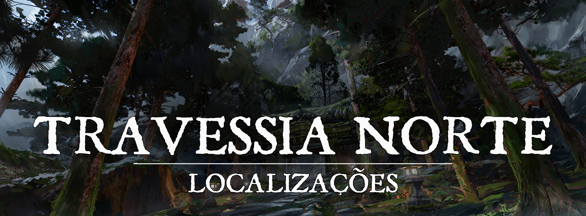

# Travessia Norte

# Descrição
Entre as montanhas ao norte das cordilheiras, foi criada uma passagem entre as montanhas, uma trilha firme para garantir que a passagem de um lado ao outro seja feito de forma segura. Existem algumas estruturas e grandes portões por toda sua extensão, e patrulhas guardam o lugar, em algumas guaritas.
 

### Descrição Visual:
[victor-wong-cj-03.jpg](../../../img/10c94542784496a9c641fa5c82337cae.jpg) |Travessia Norte

Por toda sua extensão, um caminho de pedra e vigas de madeira se forma, e guaritas estão presentes para manter a vigilância dessa passagem, apesar de nem sempre a guarda estar na região. Não é uma das estruturas mais cuidadas, mas existem algumas construções onde pode-se passar uma noite de viagem. 
 

### Função:
Uma passagem que serve como um pequeno entreposto para ligar uma parte das cordilheiras das nuvens até a costa, liberando mais estradas para conectar-se a vilas e cidades mais distantes.
 

### Regras:
Não há, mas quando patrulhas estão presentes, elas podem investigar casos suspeitos, principalmente de pessoas vindo da parte de fora da Cordilheira.
 

### Recursos:
Há alguns lugares para dormir, alguns recursos simples de viagem, mas nada de muito valor pode ser encontrado.
 

### Conflito:
Apesar de sua estrutura ser relativamente firme, a fúria da natureza de vez em quando aparece e causa algumas destruições que fazem com que não seja possível atravessar a região, mas fora isso, não há conflitos específicos.
 

# História de Origem
Com o surgimento de cidades mais distantes ao norte de [Turgon, o Império das Nuvens](1c609a45-4466-4e05-be89-f71b3665d84f.md), foi necessário fazer alguns caminhos extras para maior acessibilidade.
 

# Acontecimentos
 