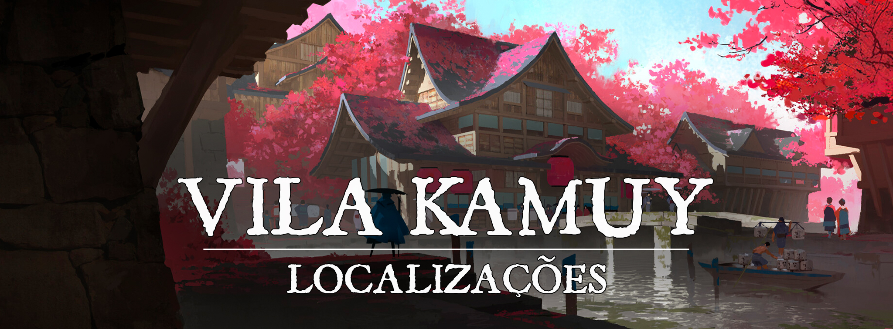

# Vila Kamuy

!!! info ""
    “Que aqueles que se sentem ameaçados possam viver seu cotidiano calmamente, e possam se focar em suas vontades sem problemas.”
# Descrição
Os espíritos da natureza geralmente têm perspectivas muito diferentes dos homens, e nem sempre é simples para ambos coexistirem. A Vila Kamuy é onde diversos youkais se reuniram para criar uma sociedade mais segura. Apesar de existir uma certa segurança em [Turgon](1c609a45-4466-4e05-be89-f71b3665d84f.md), também existem os riscos. Preconceito, e até mesmo ódio direcionado a eles a partir da ignorância é bem comum. Alguns são até mesmo caçados, sendo vendidos como escravos ou matéria prima mítica. 

Escondida na floresta se localiza essa vila, bem semelhante a uma vila comum à primeira vista, mas a atmosfera e os costumes acabam sendo bem diferentes. O lugar é cercado de natureza, e parece muito mais aberto do que uma vila normal. No entanto, apenas aqueles que desejam chegar à vila conseguem atravessar a névoa mágica da floresta sem se perder.
 

### Descrição Visual:
[unknown (36).png](../../../img/c97723b8507c9c22c110cb55dc9b2584.png) |Vila Kamuy

Entre as densas névoas da floresta, se encontra essa vila. A natureza está sempre presente com seus tons vibrantes, e pequenos riachos cruzam o lugar. Apesar disso, as estruturas são bem feitas, e sempre existe uma atmosfera calma no lugar. Talvez seja por conta da perspectiva de tempo dos espíritos, mas diferente do dia-a-dia comum, parece que eles não têm pressa para as coisas.

As figuras que se encontram por aí são muito diferentes do comum, algumas com características muito exageradas para serem humanos, outras com costumes e vestes excêntricas. Muitos vivem uma vida tranquila, sem se preocupar com a corrida contra o tempo do dia-a-dia.
 

# Sociedade
A sociedade é muito diferente de outros lugares, muitas vezes os youkais não compreendem valores que aparentam ser óbvios para os humanos, como o valor do dinheiro, relações interpessoais, e principalmente a finitude das coisas.

Pode-se dizer que os espíritos da natureza não são presos pela maioria das regras do bom senso humano. E também não compreendem totalmente o estilo de vida deles, sendo criaturas que vivem muito mais pelo “agora”. No entanto, pelo menos na vila, apesar da diferença de valores e compreensões, é um lugar intencionalmente tranquilo onde a coexistência é possível, mas não necessariamente a mais agradável.
 

### População:
A maioria da população é composta por youkais, e descendentes de youkais. Geralmente não sendo youkais malignos, mas existem exceções. É possível ver outras raças humanóides, mas são bem incomuns devido às grandes diferenças culturais
 

### Cultura:
Os youkais são muito desvinculados dos conceitos de dinheiro e trabalho em geral, sendo uma das diferenças cruciais para alguém se adaptar a sua sociedade. Ao invés disso, eles são muito mais focados em suas necessidades básicas e suas aspirações. Por exemplo, um youkai geralmente não vai trabalhar para simplesmente ganhar seu salário e sobreviver, ele vai focar em suas aspirações, por exemplo, um youkai pode ter uma grande aspiração para ser um ferreiro, e essa aspiração é mais importante para ele do que até mesmo ser capaz de comer e beber. Quando é necessária alimentação, provavelmente um youkai vai caçar, ou trocar favores e bens para obter o que deseja. Apesar de todo youkai ser bem diferente um do outro, é bem comum que eles tenham muito menos necessidades básicas em comparação a humanoides normais.

A maioria dos youkais que decidiram ficar na vila sabem falar comum, mas também existem os que só falam Seishin, dialeto de Sylvan falado pelos youkais.

Entre os habitantes, existem também aqueles que compreendem os valores humanos de dinheiro e suas necessidades, então alguns aceitam trocas em dinheiro também. Principalmente em grandes hospedarias do lugar.
 

### Caráter:
A maioria dos youkais da vila são receptivos, mas cautelosos. Muitos não confiam em pessoas de fora, então tomam cuidado com suas interações. Mas muitos outros também não se incomodam, ou são confiantes o suficiente para se abrirem para estrangeiros. 
 

### Datas e Festividades:
Festival do Verão: 21 de Junho; Festival do Outono: 22 de Setembro; Festival de Inverno: 21 de Dezembro; Festival de Primavera: 21 de Março. Em cada uma das estações, Turgon tem um grande festival em honra a [Inari](../../panteao/panteao-Erio/858c7e35-095b-4805-b058-65af37e9b691.md), e a um dos [Quatro Lordes](turgon-1/55335815-5aec-4f93-81b0-62b662ea1f6a.md).

**Festival do Verão.** No dia 21 de Junho ocorre o Festival do Verão, dedicado a [Suzaku](turgon-1/0ab39346-0286-4a6c-a6de-0bffbea262f9.md) e Inari. Por tradição, uma grande festa ocorre, e à meia-noite os turgonitas preparam lanternas de papel, escrevem desejos dentro delas, e as jogam aos céus, preenchendo-os com luzes e desejos que podem ser vistos de muito longe. O festival também é conhecido como “Festival das Lanternas”

**Festival do Outono.** No dia 22 de Setembro ocorre o Festival do Outono, dedicado a [Byakko](turgon-1/47fd52b8-9390-40b5-aecd-3160c4f914c3.md) e Inari. É uma época onde as últimas colheitas antes do inverno são feitas, e por isso o festival de outono é cheio de diversas comidas. Geralmente passado na cidade, em seus centros comerciais, as pessoas passeiam e festejam, bebendo e comendo o quanto podem.

**Festival de Inverno**. No dia 21 de Dezembro ocorre o festival de inverno, dedicado a [Genbu](turgon-1/cda84df3-0c32-4cb5-9e06-43fa716451b3.md) e Inari. Diferente dos outros festivais, esse dia é um pouco mais calmo. Conforme a neve cai, as pessoas se dedicam a fazer uma visita ao templo de Inari, e passam um tempo com seus familiares e amigos. 

**Festival da Primavera**. No dia 21 de Março ocorre o Festival da Primavera, dedicado a [Seiryuu](turgon-1/56c7d107-3bca-4412-a5d0-8fea3bc09d94.md) e Inari. Durante o dia o festival ocorre perto dos rios, lagos, e em outros lugares onde a natureza floresce. É a data onde as cerejeiras desabrocham, se despedindo do inverno. O festival também é conhecido como “Festival da Lótus”
 

### Religião:
Assim como todas as cidades de [Turgon](1c609a45-4466-4e05-be89-f71b3665d84f.md), o povo da Vila Kamuy adora a [Inari](../../panteao/panteao-Erio/858c7e35-095b-4805-b058-65af37e9b691.md), a deusa raposa da prosperidade, dos andarilhos e dos espíritos da natureza. O povo é muito religioso, mas sua cultura não exalta a adoração como outros povos. Especialmente na vila Kamuy, seus costumes e rituais são mais expressivos do que no resto de Turgon.
 

# Economia
A economia da vila Kamuy é muito fraca, mas por conta de seus habitantes, a vila é praticamente independente. Devido a grande aptidão com magia dos espíritos da natureza, eles conseguem se abastecer bem e seguir suas aspirações. Não investem em grandes projetos, e buscam muito mais ter um bom cotidiano.
 

### Serviços:
Existem algumas manufaturas praticadas de forma bem incomum, além da venda de alguns recursos bem incomuns, geralmente encontrados muito mais nos [Domínios espirituais de Turgon](08314742-6006-4c88-8e3e-743fbd532d0d.md) , no entanto, raramente são trocados por dinheiro, apesar de existirem suas exceções.

Além disso, existe uma enorme hospedaria no lugar, onde diversos youkais, e até mesmo alguns humanos de passagem descansam alguns dias. O serviço é de qualidade, e também é o mais próximo de um cotidiano humano que se pode encontrar nessa vila.
 

# Governo
A Vila Kamuy foi fundada por uma kitsune chamada Tsuru Nakahara, e é governada por ela até hoje. Não há nenhum sistema complexo de governo ou lei no lugar, injustiças são levadas até Tsuru, ou seus guardiões, e ela dá um veredito. Ela é a mesma pessoa que também é dona da Hospedaria Nakahara, a maior construção de toda a vila.
 

### Poderio Militar:
Existe uma guarda especial de criaturas parecidas com lobos que vestem máscaras cobrindo seus olhos. Esses lobos são capazes de falar, e geralmente apenas patrulham o lugar, são conhecidos como “Observadores”. Eles conseguem usar um pouco de magia, e geralmente só lutam em conjunto.

Apesar de não existir uma guarda bem definida além dos Observadores, a natureza dos habitantes os faz mais poderosos do que pessoas comuns, cada um se virando de um jeito.
 

# Conflito
A vila segue a centenas de anos sem conflitos internos sérios, mas a floresta aos arredores da vila é muito perigosa. Youkais malignos espreitam, aguardando que suas presas se percam na floresta para serem devoradas, ou simplesmente mortas. As névoas mágicas protegem a vila de criaturas com intenções hostis, mas apenas dentro da vila. Muitos youkais têm medo de sair da vila, sendo que eles são o maior interesse daqueles que espreitam pela floresta. 
 

# Locais Relevantes
**Hospedaria Nakahara**, é uma enorme hospedaria localizada no ponto mais alto da Vila Kamuy, seus tons vibrantes a tornam muito fácil de ver no meio da floresta. A hospedaria aceita dinheiro, e tem serviços que lembram muito uma hospedaria comum. O lugar tem vários andares e diversos luxos que são dificilmente encontrados em simples vilas.

**Travessia** é como chamam um corredor de portões torii da vila, próxima do meio. Ao atravessar esses portões, qualquer criatura é levada aos [Domínios Espirituais de Turgon](08314742-6006-4c88-8e3e-743fbd532d0d.md), num domínio específico conhecido como Shoji no Machi. Esse domínio cheio de passagens para outros domínios, onde muitos convergem. Kitsunes podem ir e vir facilmente por todos os caminhos, enquanto não é tão simples assim para todos.

A Vila Kamuy age como guardiã da principal passagem para a Shoji no Machi. Baseado nesse costume, os Youkais da vila desenvolveram uma pratica para testar os corações daqueles estrangeiros ao mundo espiritual.
A pratica possui duas etapas:

A primeira parte exige que os voluntários participem de um ritual espiritual para expor todas suas malicias, duvidas, arrependimentos e medos, no formato de uma criatura feita de sombras. Se a criatura invocada for muito poderosa, os Youkais responsáveis por realizar o ritual cessam a pratica, e a passagem para a Cidade é negada aos participantes. 

Caso o peso da alma dos participantes seja aceito pelos Youkais, a segunda parte acontece em meio a um combate, onde os participantes devem enfrentar o lado sombrio de sua alma, e vencer em um combate justo.

Após a conclusão com sucesso das duas etapas, os habitantes da Vila Kamuy recebem os participantes uma segunda vez em sua vila, agora com uma recepção bem mais calorosa com um grande baquete em comemoração ao ritual completo, e ao final disso tudo a passagem é cedida
 

# NPCs Relevantes
[unknown (37).png](../../../img/9adb169ae414f5e952c256a0a3ded9e8.png) |Tsuru Nakahara

**Tsuru Nakahara** é uma Kitsune de nove caudas, fundadora e governante da Vila Kamuy até os dias de hoje. Também é dona da Hospedaria Nakahara, que é o lugar onde ela passa seu tempo. É uma poderosa conjuradora, e possui dois lobos guardiões shikigami, Migi e Hidari. Ambos são Observadores, e provavelmente os mais fortes entre eles, tomando as decisões em caso da ausência de Tsuru. 

Tsuru se veste de forma extravagante, e tem uma personalidade calma, geralmente agindo com seus próprios interesses em como ela deseja que as coisas aconteçam, mas ainda assim, tentando fazer com que todos fiquem satisfeitos ao mesmo tempo.
 

# Origem
A época em que a vila foi fundada é incerta, mas acredita-se que existe desde antes da unificação de [Turgon](1c609a45-4466-4e05-be89-f71b3665d84f.md). Tsuru Nahakara, fundou a vila com o propósito de criar um lugar seguro para que os youkais pudessem viver tranquilamente, e desde então, nunca se perguntou muito. A própria Kitsune nunca fala muito sobre o assunto, mas sua intenção original permanece até hoje. 
 

# Acontecimentos
 