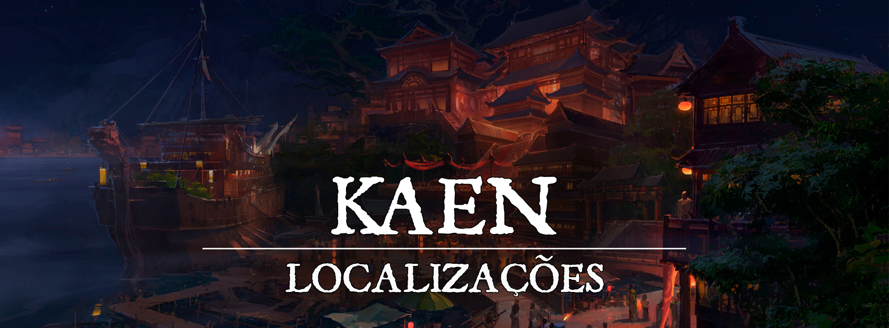

# Kaen

!!! info ""
    “Seja a chama que aquece os necessitados, e a que queima os injustos. Nunca deixe de arder, pois aqueles que apagam não mais podem fazer o que acreditam ser o certo.”
# Descrição
Nascidos das chamas de [Suzaku](turgon-1/0ab39346-0286-4a6c-a6de-0bffbea262f9.md), os muros de Kaen lentamente foram erguidos pelos seguidores da Kami, com o intuito de reunir o Clã da Fênix e firmar os limites do [Domínio Espiritual de Turgon](08314742-6006-4c88-8e3e-743fbd532d0d.md). Kaen é uma cidade calorosa, sendo cercada por algumas outras pequenas vilas, sempre há movimento pelas estradas da região. Sendo uma das cidades mais antigas do reino, suas estruturas já passaram por muita elaboração e mudança, e é possível encontrar pontos de interesse muito antigos, como o Templo de Suzaku, as estruturas do Clã da Fênix, e diversos dojos que cultivam sua técnica há gerações. 

Seus guerreiros mais fortes são imponentes e virtuosos, e constantemente travam batalhas contra a corrupção, seja a ameaça do sul monstruosas de [Neth’hare](../nethE28099hare/fa1856f6-1144-499a-afe0-3df5af7e8c4e.md), ou os próprios youkais malignos que caminham pelas terras de [Turgon](1c609a45-4466-4e05-be89-f71b3665d84f.md). Preparando incursões ao sul, ou outros pontos de Turgon, Kaen é uma das cidades mais militarizadas do Império. Já recebeu inclusive o apelido de “Bastião de Suzaku”.
 

### Descrição Visual:
[unknown (29).png](../../../img/9579949369b0a98be1fd5689174a602b.png) |Kaen

Na costa sul de Turgon, uma cidade se acomoda. As ruas de Kaen são tomadas por cores quentes, desde as casas até os detalhes de madeira vermelha e as lanternas com símbolos de Suzaku que são encontradas por toda parte. Laranjas e vermelhos são muito presentes, e trazem o tom caloroso e confiante do lugar. O comércio não parece tão proeminente, mas a estrutura ainda é bem trabalhada, e é possível encontrar algumas iguarias únicas que vêm das explorações ao Sul. Diversas torres de guarda são visíveis e sempre presentes, com adornos de Suzaku. Os portos parecem servir mais para viagens curtas e pescaria, mas não parece que o comércio de fato cresce por essa parte da cidade.
 

# Sociedade
 

### População:
Principalmente composta por humanos e meio-elfos, Kaen não é uma cidade muito diversa, mas possui outros descendentes de youkais e próprios youkais vivendo na cidade.
 

### Cultura:
A cultura de Kaen é muito voltada para a personalidade justiceira e veemente de [Suzaku](turgon-1/0ab39346-0286-4a6c-a6de-0bffbea262f9.md). A maioria de suas tradições é mais voltada ao conhecimento da magia, ou até mesmo da proeza marcial, e por isso são vistos tantos lugares peculiares onde combatentes são formados. Mas a justiça é um dos ideais mais evidentes do lugar. Muitas famílias influenciam seus herdeiros a seguir o caminho do combate e magia. Pequenos rituais e tradições também reverenciam outros Kami, mas [Suzaku](turgon-1/0ab39346-0286-4a6c-a6de-0bffbea262f9.md) e [Inari](../../panteao/panteao-Erio/858c7e35-095b-4805-b058-65af37e9b691.md) são seus principais focos.
 

### Caráter:
Com um grande senso de justiça, o povo de Kaen muitas vezes decide fazer o que acredita que é certo. Não irão ficar parados esperando ajuda de longe caso possam lutar, mas também não irão simplesmente jogar suas vidas fora. São receptivos com forasteiros, mas ao mesmo tempo não gostam de depender muito deles.
 

### Datas e Festividades:
Festival do Verão: 21 de Junho; Festival do Outono: 22 de Setembro; Festival de Inverno: 21 de Dezembro; Festival de Primavera: 21 de Março. Em cada uma das estações, Turgon tem um grande festival em honra a Inari, e a um dos Quatro Lordes.

**Festival do Verão.** No dia 21 de Junho ocorre o Festival do Verão, dedicado a [Suzaku](turgon-1/0ab39346-0286-4a6c-a6de-0bffbea262f9.md) e Inari. Por tradição, uma grande festa ocorre, e à meia-noite os turgonitas preparam lanternas de papel, escrevem desejos dentro delas, e as jogam aos céus, preenchendo-os com luzes e desejos que podem ser vistos de muito longe. O festival também é conhecido como “Festival das Lanternas”. Em Kaen, é muito exaltado em comparação aos outros, e depois do festival é quando os residentes acreditam que estão com as bênçãos de Suzaku no ápice, e é quando decidem fazer mais coisas no ano.

**Festival do Outono.** No dia 22 de Setembro ocorre o Festival do Outono, dedicado a [Byakko](turgon-1/47fd52b8-9390-40b5-aecd-3160c4f914c3.md) e Inari. É uma época onde as últimas colheitas antes do inverno são feitas, e por isso o festival de outono é cheio de diversas comidas. Geralmente passado na cidade, em seus centros comerciais as pessoas passeiam e festejam, bebendo e comendo o quanto podem.

**Festival de Inverno.** No dia 21 de Dezembro ocorre o festival de inverno, dedicado a [Genbu](turgon-1/cda84df3-0c32-4cb5-9e06-43fa716451b3.md) e Inari. Diferente dos outros festivais, esse dia é um pouco mais calmo. Conforme a neve cai, as pessoas se dedicam a fazer uma visita ao templo de Inari, e passam um tempo com seus familiares e amigos. 

**Festival da Primavera.** No dia 21 de Março ocorre o Festival da Primavera, dedicado a [Seiryuu](turgon-1/56c7d107-3bca-4412-a5d0-8fea3bc09d94.md) e Inari. Durante o dia o festival ocorre perto dos rios, lagos, e em outros lugares onde a natureza floresce. É a data onde as cerejeiras desabrocham, se despedindo do inverno. O festival também é conhecido como “Festival da Lótus”
 

### Religião:
Assim como todas as cidades de Turgon, o povo de Kaen adora a [Inari](../../panteao/panteao-Erio/858c7e35-095b-4805-b058-65af37e9b691.md), a deusa raposa da prosperidade, dos andarilhos e dos espíritos da natureza e a [Suzaku](turgon-1/0ab39346-0286-4a6c-a6de-0bffbea262f9.md), entidade dos Quatro Lordes matrona do clã da Fênix, e consequentemente, de Kaen também. O povo é muito religioso, mas sua cultura não exalta a adoração como outros povos. É comum em Kaen que as pessoas de vez em quando visitem templos, santuários, ou simplesmente façam artesanato e pequenas preces para os Kami. Raramente é encontrada opressão religiosa pelo local. 
 

# Economia
Um dos pontos fracos de Kaen é a sua economia, muitas vezes dependendo de auxílio do Império de Turgon devido a sua posição “desavantajada”, mas necessária para seu propósito. Não se vê muito comércio na cidade além do que surge da metalurgia e pescaria, os produtos de caça e agricultura são providos pelas vilas mais próximas que contam com a proteção de Kaen.
 

### Serviços:
Geralmente não tem muitos serviços a oferecer além de viagens de barco e possíveis encomendas mercenárias. Treinamento e alguns materiais mais raros que são extraídos do Sul são encontrados por Kaen.
 

# Governo
Kaen é uma cidade dedicada a [Suzaku](turgon-1/0ab39346-0286-4a6c-a6de-0bffbea262f9.md), a Kami fênix. A cidade é governada pelo próprio clã da fênix, e sua atual líder é Minori Akatori. Os principais cargos administrativos e burocráticos são ocupados pelos Akatori, assim como os maiores postos da guarda. Mesmo respondendo ao Imperador, e pagando seus impostos para a capital, é quase como se Kaen fosse uma cidade independente, e diversas das grandes decisões caem sobre as mãos de Minori. 

Os samurais Akatori gostam de garantir que a ordem está sendo mantida, e são rigorosos em seus julgamentos e patrulhas. A eficiência marcial e mágica está enraizada nos combatentes de Kaen desde que a cidade se estabeleceu, onde perigos mágicos surgiram com muita facilidade, e a necessidade de combatê-los era alta.
 

### Poderio Militar:
Com as bênçãos de [Suzaku](turgon-1/0ab39346-0286-4a6c-a6de-0bffbea262f9.md), muitos já nascem aptidão mágica, e somado a ideologia do lugar, muitos pegaram em armas e formaram uma base militar poderosa. Esses guerreiros e conjuradores provavelmente são uma das maiores forças de [Turgon, o Império das Nuvens](1c609a45-4466-4e05-be89-f71b3665d84f.md), e por isso alguns grupos agem mesmo fora da cidade sob o símbolo de Suzaku. Sua proeza marcial e poder de fogo fazem com que sejam adversários assustadores, mesmo que sozinhos.

Geralmente grupos são destacados para patrulhar as redondezas, suprimir youkais malignos, e principalmente ir para incursões ao sul para abater monstruosidades, aberrações e extrair alguns recursos tanto das criaturas e da terra, Kaen tenta manter a fronteira sob total controle para evitar que qualquer corrupção indesejada chegue ás suas terras.
 

# Conflito
Mesmo o lugar sendo bem justiceiro e idealista, aqueles que seguem o caminho do poder muitas vezes divergem, e isso causa alguns problemas internos na cidade. Não tem como negar que existe corrupção, mesmo que não seja algo muito característico do lugar. Mas os principais conflitos de Kaen estão ligados a suas incursões ao sul, em [Neth’hare](../nethE28099hare/fa1856f6-1144-499a-afe0-3df5af7e8c4e.md), onde atuam diversas monstruosidades perigosas, que devem ser suprimidas antes que possam se espalhar ainda mais. Muitos desses confrontos ocorrem no mar, ou contra criaturas que por ventura conseguem rastejar até perto dos limites do Domínio de Turgon.
 

# Organizações Relevantes

**O Clã da Fênix** é um dos quatro grandes clãs de [Turgon, o Império das Nuvens](1c609a45-4466-4e05-be89-f71b3665d84f.md) e é dedicado a Kami [Suzaku](turgon-1/0ab39346-0286-4a6c-a6de-0bffbea262f9.md) e foi fundado pela família Akatori logo após a chegada da Kami a cordilheira e é liderado pela mesma família até então. 

Por conta da proximidade do santuário da fênix com o ponto inicial do cataclisma mágico, e da necessidade de proteger a cordilheira de qualquer perigo que viesse da região da catástrofe, o clã da fênix se especializou principalmente em combate mágico, usando principalmente o elemento característico de Suzaku, o fogo.

Tradicionalmente o clã usa de uma hierarquia matriarcal, colocando sempre a filha mais velha da atual líder como sua herdeira, já que a benção da fênix Kami normalmente se manifesta de forma mais poderosa em mulheres.

**Os Lâminas Vermelhas** são a guarda da cidade, a principal força da cidade e suas incursões. Respondem diretamente ao Clã da Fênix, e são compostos por conjuradores e lutadores, muitas vezes usando o elemento do fogo a seu favor. São eles que são destacados para as incursões ao sul, junto dos [Exorcistas de Inari](../organizacoes/2e7dc2d0-39f6-440d-953c-a8dc310f2381.md).

**Os [Exorcistas de Inari](../organizacoes/2e7dc2d0-39f6-440d-953c-a8dc310f2381.md)** são uma organização majoritariamente formada por usuários de magia. A organização tem um grande foco nos youkais, buscando manter o seu equilíbrio e purificar ou banir youkais corrompidos que constantemente assolam a região do império das nuvens. A organização tem uma base em Kaen vista a necessidade de auxílio com os problemas do sul.
 
# Locais Relevantes

**Templo de Suzaku** é um dos lugares mais importantes da cidade, localizado na subida da montanha ao norte da cidade, uma grande estrada conecta o templo com a cidade, também conhecido como Templo do Verão. Apesar de Suzaku não residir fisicamente por lá, o templo é a entrada de seus [domínios](08314742-6006-4c88-8e3e-743fbd532d0d.md), e com a permissão de Suzaku, os mortais podem acessá-los. Diversas estruturas compõem o lugar na encosta da montanha, diversos monges e outros sacerdotes tomam conta do lugar, e para os que não conhecem, parece mais um castelo do que um simples templo. A região do templo é o lugar escolhido para hospedar muitos eventos que acontecem na cidade, como festivais e outros pronunciamentos especiais. 

**Arena Hinotsubasa**é uma grande arena onde são organizados torneios e duelos amistosos, já que muito da cultura de Kaen é voltada para o combate, a presença da Arena é bem importante, sendo um ponto de atração, ao mesmo tempo que impulsiona a força de seu povo. Com essa finalidade, diversos torneios não letais são organizados, e o clã da Fênix está sempre presente. As recompensas atraem até mesmo forasteiros a participarem, desde ouro, até glória, e outros itens mágicos únicos oferecidos.

**Porto da Última Viagem** é majoritariamente reservado para navios militares, já que não tem conexão com rotas comerciais favoráveis, o porto geralmente é utilizado apenas para viagens ao Sul. Por conta disso, não há tanto movimento pela região, e é um porto quase que totalmente militar, com guarnições e depósitos de armas e recursos para as expedições para o sul.

**Distrito do Aço Escuro** fica logo ao lado do porto, um lugar com sua estrutura mais reforçada, com a finalidade de explorar os recursos que são trazidos do Sul. Carcaças de monstruosidades nefastas e metais instáveis e poderosos são trazidos de tempos em tempos, e é no Distrito do Aço Escuro que os ferreiros mais capacitados se juntam para transformar esses materiais em obras primas. Capazes de produzir até mesmo itens mágicos reforçados com os materiais que são trazidos.

**Termas Kitsunebi** é um conhecidíssimo ponto turístico de Kaen. Por conta de sua proximidade com áreas vulcânicas, Kaen possui diversos poços de águas termais, e as Termas Kitsunebi são consideradas as melhores termas de Turgon. Dizem que as águas de Kitsunebi possuem capacidades medicinais elevadas e são capazes de renovar o corpo e a alma de quem as visita.

**O Palácio Akatori** é a moradia do clã da Fênix e sede do governo de Kaen. Localizado bem ao centro de Kaen de forma que de qualquer lugar da cidade seja possível ver a formosura de sua construção. Sendo a sede do governo, o Palácio Akatori se mantém sempre sob a vigilância dos Lâminas Vermelhas, e não pode ser acessado por pessoas comuns sem um convite vindo de dentro. O Palácio possui diversas alas separadas para lidar com cada uma das áreas da gestão da cidade, mas toda vez que um assunto importante precisa ser discutido, os ministros se reúnem na torre principal do Palácio para tomarem suas decisões em conjunto com o Líder do Clã.

**O Salão Akaiha** é a sede dos Lâminas Vermelhas e principal centro militar de Kaen. Localizado ao sul do Palácio Akatori, sua construção foi feita especificamente nesta localização como forma de representar o trabalho dos Lâminas Vermelhas de proteger o clã da Fênix das ameaças e inimigos que vem do sul. 
 
# NPCs Relevantes
[Azeyma](../../../img/e9949157d0dff7013335286ad832190a.jpg) |Minori Akatori

**Minori Akatori** é a atual líder do clã da fênix e governante de Kaen. É uma mulher poderosa, de pulso firme e uma grande controladora de chamas e, por conta disso, Minori recebeu diversos títulos, dentre eles o título que ela mais se orgulha é o de Princesa Fênix.

[unknown (30).png](../../../img/aa20e06aee593b7b7a341ffeb0a8862c.png) |Katsuki Hotori

**Katsuki Hotori** é a comandante dos Lâminas Vermelhas e braço direito de Minori. Katsuki é conhecido por sua maestria com armas de haste e sua capacidade de combinar o fogo ardente de Suzaku com os movimentos graciosos de sua glaive. Dizem que sua arma foi forjada utilizando uma das penas da Kami Suzaku.

**Hiroto** é um velho monge que cuida do Monastério da Fênix. Apesar de sua aparência idosa, Hiroto é bem habilidoso e também é extremamente rigoroso com suas crenças e tradições, sendo muitas vezes inflexível e difícil de lidar.
 

# Origem
A cidade de Kaen, junto com as outras cidades dedicadas aos [Quatro Lordes](turgon-1/55335815-5aec-4f93-81b0-62b662ea1f6a.md), é uma cidade mais antiga do que o próprio Império das Nuvens, a cidade foi fundada pelo clã da fênix pouco tempo depois da vinda dos Kamis de [Inari](../../panteao/panteao-Erio/858c7e35-095b-4805-b058-65af37e9b691.md) para o plano material.

Inicialmente Kaen era apenas um assentamento onde o Clã da Fênix repousava mas, com o nascimento do [Império das Nuvens](1c609a45-4466-4e05-be89-f71b3665d84f.md), o assentamento foi lentamente aumentando em tamanho e gradualmente se transformando na cidade que é hoje. Se tornando quase que um bastião para tentar repelir a corrupção que há no sul. 
 

# Acontecimentos
 