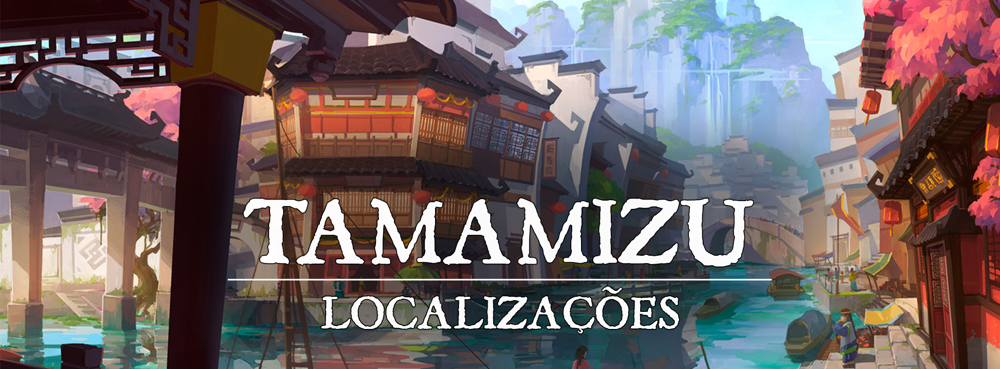

# Tamamizu

!!! info ""
    “Nunca tenha pressa de alcançar seus objetivos, vá com calma, persevere, é melhor avançar a passos de tartaruga e chegar ao seu objetivo do que correr como uma lebre e tropeçar no meio do caminho.”
# Descrição
Na calmaria de um ambiente híbrido entre as águas e a terra firme, protegida pelo Kami [Genbu](turgon-1/cda84df3-0c32-4cb5-9e06-43fa716451b3.md), Tamamizu cresceu se fortalecendo como um dos principais centros de conhecimento de Turgon, sendo considerada a capital da sabedoria do [Império das Nuvens](1c609a45-4466-4e05-be89-f71b3665d84f.md). Tamamizu é uma cidade calma, onde a cada esquina é possível encontrar um bom conselho e uma boa xícara de chá. Sua localização peculiar entre as águas e a terra é algo místico, possível somente por conta da grande bolha mágica que envolve a parte submersa da cidade, bolha essa conhecida como o Casco de Genbu.

Sua natureza pacífica é algo que pode enganar aquele que pensa que o povo de Tamamizu é frágil e desprotegido, mas com a magia e sabedoria dos Cascos Eruditos aliado a perseverança e impenetrável defesa dos Cascos Inabaláveis, os seguidores de Genbu conseguiram construir uma cidade próspera e livre das ameaças dos youkais malignos.
 
### Descrição Visual:
[unknown_10.png](../../../img/13b3d10ef6587000d568af2346b78d9e.png) |Tamamizu Superfície

Na costa norte de [Turgon](1c609a45-4466-4e05-be89-f71b3665d84f.md), a cidade de Tamamizu tem sua forma em dois pólos: O primeiro, de forma semelhante a um porto, funciona como a “recepção” da cidade, habitado principalmente por humanos e outras raças mais “terrestres”. Enquanto o segundo polo é totalmente submerso na água, envolvido pela mística bolha mágica que torna a cidade acessível até mesmo para aqueles que não respiram debaixo d'água, onde habitam os tritões, elfos do mar e tortles pertencentes ao Clã da Tartaruga.

A cidade da superfície de Tamamizu é razoavelmente pequena, mas bem ornada, com suas construções que lembram uma cidade pesqueira, tomada principalmente por residências e pelo Quartel do Jabuti, que é casa para guarda da cidade e para os Cascos Inabaláveis.

As duas partes da cidade são conectadas pelo Túnel do Mergulho, uma grande caverna que serve tanto de passagem para aqueles que desejam viajar de uma extremidade a outra da cidade, como de centro comercial onde os pescadores vendem suas pescas e os coletores marítimos revelam os materiais escondidos sob as águas.

Já o polo submerso é dono de uma paisagem mágica, a cidade é circundada pelo Casco de Genbu, uma bolha mágica que permite que qualquer um dentro dela se sinta como se estivesse na superfície, não apenas podendo respirar como também não se molhando e podendo até mesmo falar. Mas a beleza da cidade não pára apenas nas suas construções subaquáticas e na magia que a envolve, mas também nos diversos animais marinhos que “sobrevoam” Tamamizu, mostrando a visão única dos mais diversos tipos de criaturas marinhas nadando nos “ares” da cidade. Além disso, a cidade submersa também conta com uma grande construção central visível de todos os lados, conhecida como a Biblioteca da Tartaruga, local onde os Cascos Eruditos fazem sua morada.

[unknown (33).png](../../../img/d0cfb942dd7859d564a6963592bb0c7b.png) |Tamamizu Subaquática
 

# Sociedade
 

### População:
Tamamizu tem uma população bem diversa, sua superfície é lar para diversos humanos e descendentes de youkais. Enquanto sua parte submersa é casa de muitos tortles, tritões e elfos do mar.
 

### Cultura:
A cultura de Tamamizu é muito voltada para a paz e a calma, refletindo diretamente na figura de [Genbu](turgon-1/cda84df3-0c32-4cb5-9e06-43fa716451b3.md). Além disso, o povo de Tamamizu valoriza muito o saber, de diversas áreas possíveis, qualquer tipo de conhecimento é válido e valorizado, desde magia e ciência até as artes e conhecimentos do dia a dia.

Em Tamamizu, as pessoas são ensinadas no caminho do conhecimento desde pequenas, sendo muito comum os pais levarem seus filhos semanalmente na grande Biblioteca da Tartaruga, onde eles mesmos ensinam suas crianças e as incentivam a despertar seus próprios interesses.

Além disso, as pessoas em Tamamizu costumam ter um respeito muito elevado por aqueles de idade avançada, pois eles são vistos como aqueles que acumularam mais conhecimento. Para o povo desta cidade, envelhecer é o mesmo que conhecer mais, e aquele que possui mais conhecimento deve ser sempre mais respeitado.
 

### Caráter:
Dada a sua natureza pacífica, o povo de Tamamizu tenta evitar ao máximo o conflito e optam por ele apenas quando é considerado extremamente necessário, muitas vezes demorando para agir por conta disso. Mas, ao mesmo tempo, são extremamente rápidos em receber novos conhecimentos, sendo super abertos a mercadores e viajantes que estejam dispostos a compartilharem seus saberes com eles.
 

### Datas e Festividades:
Festival do Verão: 21 de Junho; Festival do Outono: 22 de Setembro; Festival de Inverno: 21 de Dezembro; Festival de Primavera: 21 de Março. Em cada uma das estações, Turgon tem um grande festival em honra a [Inari](../../panteao/panteao-Erio/858c7e35-095b-4805-b058-65af37e9b691.md), e a um dos [Quatro Lordes](turgon-1/55335815-5aec-4f93-81b0-62b662ea1f6a.md) .

**Festival do Verão**. No dia 21 de Junho ocorre o Festival do Verão, dedicado a [Suzaku](turgon-1/0ab39346-0286-4a6c-a6de-0bffbea262f9.md) e Inari. Por tradição, uma grande festa ocorre, e à meia-noite os turgonitas preparam lanternas de papel, escrevem desejos dentro delas, e as jogam aos céus, preenchendo-os com luzes e desejos que podem ser vistos de muito longe. O festival também é conhecido como “Festival das Lanternas”.

**Festival do Outono**. No dia 22 de Setembro ocorre o Festival do Outono, dedicado a [Byakko](turgon-1/47fd52b8-9390-40b5-aecd-3160c4f914c3.md) e Inari. É uma época onde as últimas colheitas antes do inverno são feitas, e por isso o festival de outono é cheio de diversas comidas. Geralmente passado na cidade, em seus centros comerciais as pessoas passeiam e festejam, bebendo e comendo o quanto podem.

**Festival de Inverno.** No dia 21 de Dezembro ocorre o festival de inverno, dedicado a [Genbu](turgon-1/cda84df3-0c32-4cb5-9e06-43fa716451b3.md) e Inari. Diferente dos outros festivais, esse dia é um pouco mais calmo. Conforme a neve cai, as pessoas se dedicam a fazer uma visita ao templo de Inari, e passam um tempo com seus familiares e amigos. Em Tamamizu, o Festival de Inverno é tratado como um dia ”sabático” onde nenhum comércio se abre e todos se reúnem no Templo de Genbu para confraternizar e agradecer a proteção do grande Kami Tartaruga.

**Festival da Primavera.** No dia 21 de Março ocorre o Festival da Primavera, dedicado a [Seiryuu](turgon-1/56c7d107-3bca-4412-a5d0-8fea3bc09d94.md) e Inari. Durante o dia o festival ocorre perto dos rios, lagos, e em outros lugares onde a natureza floresce. É a data onde as cerejeiras desabrocham, se despedindo do inverno. O festival também é conhecido como “Festival da Lótus”
 

### Religião:
Assim como todo o [Império das Nuvens](1c609a45-4466-4e05-be89-f71b3665d84f.md), Tamamizu adora a [Inari](../../panteao/panteao-Erio/858c7e35-095b-4805-b058-65af37e9b691.md), a deusa da prosperidade, dos andarilhos e dos espíritos da natureza, junto a adoração do Kami [Genbu](turgon-1/cda84df3-0c32-4cb5-9e06-43fa716451b3.md), a Tartaruga Negra. Porém, não é comum o povo se reunir em templos para adorar seus deuses, mas sim terem, em diversos lugares da cidade e de suas casas, figuras, formas e desenhos que remetem a suas divindades, como estátuas, pinturas e pequenos templos entre uma casa e outra.
 

# Economia
A economia em Tamamizu é bem estável, não é uma grande potência econômica como [Aozora](c948c2df-c3a0-4ad0-a780-5055c49a164f.md) mas consegue se manter bem por ser uma cidade costeira. O Porto da Serpente que é bem utilizado como uma rota de comerciantes e o Túnel do Mergulho onde os coletores e pescadores da cidade vendem seus produtos são suas maiores forças econômicas.
 

### Serviços:
Não são muitos os serviços a serem disponibilizados na cidade além do porto e de possíveis viagens turísticas ao fundo do mar. Mas, um dos principais pontos que atraem as pessoas para Tamamizu é a Biblioteca da Tartaruga que mantém suas portas abertas para qualquer um que a deseje visitar, sem cobrar nada por isso. Porém, mesmo que o acesso a mesma seja gratuito, nem todos os andares da biblioteca são acessíveis para qualquer um, se você deseja subir nos andares mais altos da biblioteca, você deve primeiro receber uma permissão especial do Clã da Tartaruga, feito esse que pode demorar um certo tempo para ser concluído.
 

# Governo
Tamamizu é governada pelo Clã da Tartaruga, seu líder atual é Soroban Kame, um ancião tortle que guarda muito conhecimento em seus cascos. Junto a Soroban, existe um conselho formado entre os membros mais antigos dos Cascos Eruditos e dos Cascos Inabaláveis, chamado de Conselho dos Cascos onde são feitas as decisões mais relevantes para a administração da cidade propriamente dita.
 

### Poderio Militar:
Tamamizu não possui diretamente um exército, mas sim uma “força de autodefesa" formada pelos Cascos Inabaláveis. Porém, devido as bênçãos protetivas do Kami Tartaruga, o povo de Tamamizu sempre foi bem resistente, tendo entre seus guerreiros, grandes ”protetores” capazes de invocar as forças de seus ancestrais e do próprio Kami [Genbu](turgon-1/cda84df3-0c32-4cb5-9e06-43fa716451b3.md) para ficarem mais resilientes e protegerem seus aliados.

Além disso, os Cascos Eruditos possuem grande conhecimento mágico, sendo capazes de restringir e neutralizar seus adversários facilmente utilizando principalmente de magia da natureza e de magia divina, sempre preferindo neutralizá-los do que de fato eliminá-los.
 
# Conflito
De todas as cidades de Turgon, Tamamizu é a que possui menos conflitos diretos, pois mesmo que eles sejam relativamente pacíficos, suas forças são bem respeitadas entre aqueles que estão próximos a eles. Os únicos embates que Tamamizu eventualmente participa são os conflitos que envolvem youkais malignos e corrompidos, mas nunca com o intuito de eliminá-los, mas sim com uma mentalidade de restringi-los para convertê-los e purificá-los, mas infelizmente nem todos aceitam essa conversão.
 

# Organizações Relevantes

O Clã da Tartaruga é o clã fundador de Tamamizu que existe desde a época onde os [Quatro Lordes](turgon-1/55335815-5aec-4f93-81b0-62b662ea1f6a.md) chegaram ao material, como o nome sugere, o Clã da Tartaruga serve a [Genbu](turgon-1/cda84df3-0c32-4cb5-9e06-43fa716451b3.md), a Tartaruga Negra que os consegue algumas bênçãos especiais e a sua proteção. Atualmente o Clã da Tartaruga é comandado por Soroban Kame, um ancião tortle repleto de conhecimento e sabedoria. Normalmente seus membros têm um título atribuído aos seus nomes, como forma de identificar seus feitos, mas apenas o líder do Clã da Tartaruga é aquele que possui o título de ”O Sábio”.

**Os Cascos Eruditos** são um grupo de sábios pesquisadores que mantém a Biblioteca da Tartaruga, seu principal objetivo é reunir o máximo de conhecimento possível dentro da biblioteca, e normalmente, são bem versados nas artes místicas, já que para conhecê-las eles acabaram as estudando. Eles respondem diretamente ao Clã da Tartaruga, e três de seus membros fazem parte do Conselho dos Cascos e auxiliam Soroban no governo da cidade.

**Os Cascos Inabaláveis** são um grupo de guerreiros poderosos que protegem a cidade de Tamamizu, geralmente eles se destacam por sua resistência e por seus corpos de aço. Sua base de operações é o Quartel do Jabuti, e seu principal foco é manter a cidade segura e longe de problemas, sendo bem rigorosos em seus julgamentos, mas, tentam sempre ao máximo não ferir nem matar aqueles que os desafiam. Eles respondem diretamente ao Clã da Tartaruga, e três de seus membros fazem parte do Conselho dos Cascos e auxiliam Soroban no governo da cidade.

**O Conselho dos Cascos** é um conselho de anciãos do Palácio do Casco formado por sete anciões que administram e governam a cidade de Tamamizu. São liderados por Soroban Kame, o líder do Clã da Tartaruga e possuem sete membros no total. Seus membros são: Soroban, o Sábio; Haru, o Resoluto; Ashi, do Casco de Aço; Tamashi, o Espiritualista; Hiraku, o Curioso; Kokoro, a Naturalista e Chisei, o Devoto.

**A Liga de Jade** é uma organização comerciante que busca estreitar os laços econômicos entre as cidades de Turgon, auxiliando comerciantes e buscando a prosperidade do reino. A Organização tem uma base em Tamamizu, mas sua base central se localiza em [Nari](eeb29133-6119-4ca5-a018-4b39acc26553.md).
 

# Locais Relevantes

**A Biblioteca da Tartaruga** é uma das principais construções da parte subaquática da cidade. A biblioteca é dividida em diversos andares, alguns abertos a todos e outros mais restritos onde apenas alguns reconhecidos pelos Cascos Eruditos podem entrar. A biblioteca possui diversos livros dos mais diversos assuntos, concentrando um pouco de tudo em seu acervo, desde livros de culinária e agricultura até grimórios e escrituras santas que claramente possuem capacidades mágicas.

Para se conseguir o acesso aos andares superiores da biblioteca é necessário que o requerente seja avaliado por todos os conselheiros dos Cascos Eruditos, seus testes são diversos, e sempre variam de acordo com a vontade dos mesmos, podendo demorar até mesmo anos para se conseguir a permissão de um dos três. Mas ao conseguir a permissão, o requerente pode escolher se tornar parte dos Cascos Eruditos e tem acesso aos inúmeros grimórios, pergaminhos e escrituras de conhecimento mágico que existem na biblioteca.

**O Quartel do Jabuti** é o centro militar de Tamamizu e se localiza bem ao centro da parte da superfície da cidade. É lá onde os Cascos Inabaláveis estabeleceram sua base e lá onde eles treinam seus membros. Sua construção é consideravelmente mais alta do que o resto da cidade para ser facilmente identificada e sua hierarquia é baseada diretamente na meritocracia, onde os três conselheiros avaliam de perto os membros do Quartel e os recompensam pelos seus feitos e suas habilidades.

**O Templo de Genbu** é um grande templo localizado na ao norte da Biblioteca da Tartaruga no polo subaquático de Tamamizu. É muito bem cuidado por Chisei e seus aprendizes e é costumeiramente visitado pelo povo da cidade em épocas de festivais. Sua arquitetura é bela e muito bem adornada com conchas e corais raros que podem ser encontrados nas profundezas do mar.

**O Palácio do Casco**é o lar do Clã da Tartaruga e principal gabinete de governo da cidade, é nele que o Conselho dos Cascos se reúne para tomar suas decisões e fazer seus julgamentos.

**O Túnel do Mergulho** é uma profunda caverna que conecta a superfície de Tamamizu a sua contraparte subaquática. Além de servir de passagem, o túnel é utilizado como principal centro comercial da cidade, onde é possível encontrar os diversos frutos e materiais que as águas podem conceder. A Liga de Jade possui uma base no túnel

**O Porto da Serpente** é o porto localizado na costa da superfície de Tamamizu, o porto é administrado pelo Clã da Tartaruga e alguns mercadores o utilizam como caminho em suas rotas comerciais.

 
# NPCs Relevantes
[unknown_8.png](../../../img/17247da2b334ae818f2786a4c39984e2.png) |Soroban Kame

**Soroban Kame**, também conhecido como Soroban, o Sábio, é o atual líder do Clã da Tartaruga e conselheiro chefe do Conselho dos Cascos. Soroban é um homem simples, gentil e humilde, já viveu por muito tempo nas terras do Império de Turgon e sempre foi capaz de entregar uma palavra de conselho para aquele que o pedir. Porém, como líder do Clã da Tartaruga e governante de Tamamizu, Soroban é um homem muito ocupado, sendo bem difícil conseguir uma reunião direta com ele.

Apesar da aparência idosa, Soroban não deve ser subestimado, o homem-tartaruga possui um grande conhecimento das artes místicas e é um exímio controlador da natureza, sobretudo da própria terra, sendo capaz de levantar pedregulhos e rochedos para usar como armas e até fazer com a própria terra se molde ao redor de um alvo para restringí-lo.

[unknown_5.png](../../../img/d0c41dcd915fad9f23853842db61646f.png)|Haru, o Resoluto

**Haru, o Resoluto** é um dos conselheiros dos Cascos Inabaláveis e membro do Conselho dos Cascos. Ele adquiriu seu título de “Resoluto” por conta de seu grande foco em seus objetivos, o que acaba muitas vezes sendo confundido com uma teimosia estranha que contrasta com o modo calmo de agir dos outros membros do conselho, porém, também é um homem com muita sabedoria, digno do cargo de conselheiro que possui.

Haru também é um poderoso combatente, sendo lembrado por alguns como “aquele que não para até salvar uma vida” por conta de ter conseguido correr incessantemente cerca de 45 milhas a pé da costa de Turgon até Tamamizu levando em seus ombros um companheiro que se feriu num embate contra youkais corrompidos.

[fac6be00f5c4b2daeaa0cf791028608b.jpg](../../../img/3bc9249428604e72fa4162c156179c21.jpg)|Ashi, do Casco de Aço

**Ashi, do Casco de Aço**, é um dos conselheiros dos Cascos Inabaláveis e membro do Conselho dos Cascos. Ele é possuidor do título de “Casco de Aço” por conta de sua força defensiva quase sobrenatural, ele é tido como o tortle mais resistente de toda Tamamizu e seu casco é tão duro que é capaz de parar até mesmo as lâminas mais potentes. Seu corpo de aço é um reflexo de sua personalidade forte e disciplinada, mas ao mesmo tempo calma e perseverante.

Ashi tem vários discípulos sob sua tutela e não vacila em seus treinamentos e é muito respeitado pelos mesmos. Ele está sempre disposto a ensinar aquele que estiver disponível a aprender os caminhos do casco de aço.

[unknown_4.png](../../../img/546c356229e4143e024cb473d439065d.png)|Tamashi, o Espiritualista

**Tamashi, o Espiritualista**, é um dos conselheiros dos Cascos Inabaláveis e membro do Conselho dos Cascos. Seu título de “Espiritualista” se dá pelo modo em que o mesmo enfrenta seus adversários, utilizando os chamados "Espíritos Ancestrais” para o auxiliar a proteger seus aliados em combate.

Tamashi tem uma fala que transparece sua calma e sempre tem a palavra certa para fazer com que aqueles que estão ao seu lado sejam mantidos longes do medo. Assim como Ashi, ele também possui discípulos que almejam aprender os seus caminhos, mas seus treinamentos e lições são considerados mais difíceis do que os do outro conselheiro.

[unknown_7.png](../../../img/94e334a7f79604212e8794a94922b774.png)|Hiraku, o Curioso

**Hiraku, o Curioso**, é um dos conselheiros dos Cascos Eruditos e membro do Conselho dos Cascos. Muitos veriam seu título de “Curioso” como uma ofensa, mas para Hiraku, a curiosidade é uma das maiores virtudes que um estudioso possui. Ele é um grande controlador da magia arcana e um dos principais pesquisadores da Biblioteca da Tartaruga.

Hiraku costuma dar aulas abertas a quem quiser vir à biblioteca, porém, não são todos que conseguem acompanhar sua forma de pensar e entender seus ensinamentos, sendo considerado um gênio peculiar dentre os estudiosos da biblioteca.

[unknown_3.png](../../../img/9c26d5b9f5cb943aef162870e93ca4d9.png)|Kokoro

**Kokoro**, a Naturalista, é uma conselheira dos Cascos Eruditos e membro do Conselho dos Cascos. Kokoro é filha de Soroban e, como seu pai, ela possui uma grande ligação com a natureza, considerada uma prodígio entre os seus. É a mais nova dentre os membros do conselho, mas ao mesmo tempo se fez ser respeitada tanto quanto os outros conselheiros por conta de seus esforços e feitos pela biblioteca.

Kokoro é tida como principal candidata à liderança de Tamamizu quando Soroban renunciar do mesmo, não apenas por ser sua filha, mas também por conta de sua facilidade de ensinar e de sua natural capacidade de liderança. Ela também é dedicada a ensinar os mais jovens, sendo bem paciente com aqueles que desejam aprender a partir do básico.

[unknown_6.png](../../../img/6aea614a5ddfb6c6d7e7e474f082ddc4.png)|Chisei, o Devoto

**Chisei, o Devoto**, é um dos conselheiros dos Cascos Eruditos e membro do Conselho dos Cascos. O título de “Devoto” serve muito bem a Chisei por conta de sua grande ligação tanto com Genbu quanto com Inari, ele é o principal responsável pelo Templo de Genbu e um grande sacerdote de Inari.

Chisei sempre está disposto a espalhar os ensinamentos de [Inari](../../panteao/panteao-Erio/858c7e35-095b-4805-b058-65af37e9b691.md)  e [Genbu](turgon-1/cda84df3-0c32-4cb5-9e06-43fa716451b3.md) e é autor de diversos livros que exemplificam estes ensinamentos. Sua personalidade amorosa é o que o torna um dos mais queridos membros do conselho e sua simpatia é conhecida por toda Tamamizu.
 

# Origem
Da mesma forma que as [Kaen](4de1dfa5-9367-4c13-8a73-ac682eed42d6.md), [Aozora](c948c2df-c3a0-4ad0-a780-5055c49a164f.md) e [Inazuma](6fd7c3c3-49ea-4757-b63c-b24c5198e288.md), Tamamizu é uma das cidades mais antigas do Império de Turgon, mais antiga que o próprio império. A cidade foi fundada logo após a chegada dos [Quatro Lordes](turgon-1/55335815-5aec-4f93-81b0-62b662ea1f6a.md) de [Inari](../../panteao/panteao-Erio/858c7e35-095b-4805-b058-65af37e9b691.md) no plano material e inicialmente era apenas a cidade submersa dos seguidores de Genbu, mas com o tempo, a cidade foi se expandindo e se tornando a cidade híbrida de terra e água que é hoje.
 

# Acontecimentos
 