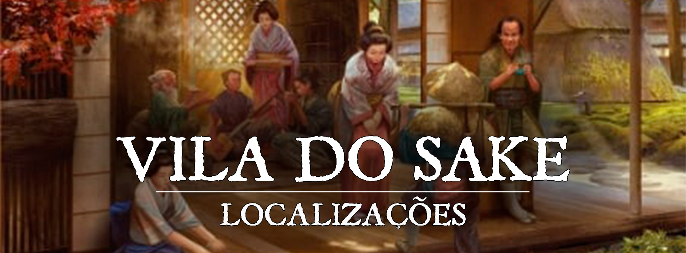

# Vila do Sake

!!! info ""
    É melhor beber saquê com alguém uma vez do que encontrá-lo cem vezes sem beber saquê
# Descrição
A vila do sake é uma pequena comunidade situada no coração da floresta Shiju em [Turgon](1c609a45-4466-4e05-be89-f71b3665d84f.md). Os moradores são conhecidos por sua habilidade em produzir sake de alta qualidade, utilizando ingredientes locais e técnicas tradicionais. A vila é cercada por extensos campos de arroz, onde os moradores cultivam a planta que é usada na produção do sake.

A produção de sake é a base da economia da vila, e a maioria dos moradores trabalha em algum aspecto da produção, seja cultivando o arroz, fermentando ou engarrafando o sake. A vila possui várias destilarias, onde os moradores trabalham juntos para produzir diferentes variedades de sake.
 

### Descrição Visual:

[2548747-bigthumbnail.jpg](../../../img/b1f996115c1a61ae176a0b8fd3eb71d7.jpg) |Vila do Sake

A vila do sake é rodeada por florestas densas e montanhas. As casas e edifícios são construídos com madeira escura e pedra, dando a impressão de um lugar antigo e tradicional. As ruas são estreitas e sinuosas, com pequenos canais de água correndo ao longo delas. As casas de sake são fácilmente reconhecíveis pelos tijolos vermelhos e telhados de palha, e os arrozais circundam a vila. Os moradores são vistos vestindo roupas tradicionais e carregando cestos de arroz e outros produtos agrícolas. Durante o festival anual de sake, a vila é decorada com lanternas coloridas e bandeiras, e as ruas são repletas de alegria e animação.
 

# Sociedade
 

### População:
Composto em sua maioria por Humanos, Elfos, Meio-elfos e Shifters.
 

### Cultura:
A cultura da vila do sake é profundamente enraizada na produção de sake de alta qualidade. Os moradores da vila são muito orgulhosos de sua tradição de produção de sake e passam anos aprendendo as técnicas e segredos para produzir o melhor sake possível. Além disso, eles valorizam muito a hospitalidade e o compartilhamento, e é comum que os moradores convidem os visitantes para degustar o sake produzido na vila.

**Método da fermentação lenta**: A vila do sake é conhecida por seu método especial de produção de sake, chamado "Método de Fermentação Lenta". Este método envolve o uso de arroz especialmente cultivado e selecionado, que é preparado e fermentado lentamente em grandes tanques de madeira. Este processo leva mais tempo do que os métodos convencionais de produção de sake, mas dá ao sake produzido na vila uma complexidade de sabores única e um aroma distinto. Além disso, a água utilizada na produção é capturada de fontes naturais nas montanhas próximas, dando ao sake uma qualidade única. Esse método é guardado como segredo pelos moradores da vila e é passado de geração 
 

### Caráter:
Os moradores da Vila do Sake são conhecidos por serem trabalhadores e dedicados. Eles são muito orgulhosos de sua produção de sake e trabalham duro para mantê-la de alta qualidade. Eles também valorizam a tradição e a herança da vila, passando de geração para geração as técnicas e segredos para a produção perfeita do sake. Além disso, eles são muito hospitaleiros e acolhedores com os visitantes, sempre dispostos a compartilhar sua paixão pelo sake e mostrar sua vila. Eles também são muito unidos e solidários, trabalhando juntos para manter a vila próspera e forte.
 

### Datas e Festividades:
**O Festival do Sake(Verão)**: é uma celebração anual realizada na vila do Sake, onde os visitantes podem degustar as diferentes variedades de sake produzidas na cidade. Durante o festival, os moradores se vestem com trajes típicos e realizam danças e músicas tradicionais. Além disso, há competições de degustação de sake, onde os participantes são avaliados por especialistas no assunto. O festival também conta com barracas de comida e artesanato, onde os visitantes podem adquirir produtos relacionados ao sake e à cultura da vila. O evento é realizado durante o verão e atrai visitantes de toda a região de Turgon e até mesmo de outros impérios para degustar e apreciar o delicioso sake produzido na vila.
 
### Religião:
Assim como todas as cidades de Turgon, o povo da Vila do Sake adora a [Inari](../../panteao/panteao-Erio/858c7e35-095b-4805-b058-65af37e9b691.md), a deusa raposa da prosperidade, dos andarilhos e dos espíritos da natureza.
 

# Economia
A economia da vila do Sake gira principalmente em torno da produção e venda de sake de alta qualidade. A vila é conhecida por seus métodos tradicionais de produção, que incluem o uso de água de alta qualidade e arroz cultivado localmente. Além disso, os moradores também cultivam outros produtos agrícolas como arroz, trigo e cevada, que são usados na produção de sake.

A vila também atrai muitos turistas durante o ano inteiro, graças ao seu famoso festival de sake, onde os visitantes podem degustar as diferentes variedades de sake produzidas na vila. Isso gera renda adicional para a vila através do turismo e do comércio local.

A vila também possui uma forte indústria de artesanato, com muitos moradores que produzem utensílios de cerâmica e madeira para armazenamento e degustação de sake. Esses artesanatos também são vendidos para turistas e visitantes.

Em resumo, a economia da vila do Sake é baseada principalmente na produção e venda de sake de alta qualidade, cultivo de arroz e outros produtos agrícolas, turismo e indústria de artesanato.
 

# Governo
A vila do sake é governada por uma família de produtores de sake de renome, cujo líder é escolhido pelos habitantes da vila. Esse líder é escolhido entre os membros da família que produzem o melhor sake, julgado pela comunidade. Essa família tem um papel importante na liderança da vila e é responsável por manter a tradição da produção de sake de alta qualidade. Eles também são os principais organizadores do festival anual de sake, onde os visitantes podem degustar as diferentes variedades produzidas na cidade.
Esse governo é simples, mas eficiente, e os lideres são altamente respeitados pela comunidade, pois é por meio de seus esforços que a vila é conhecida e procurada por muitos pela qualidade do sake produzido.
 

### Poderio Militar:
Pequena guarda local, nada complexo.
 

# Conflito
Youkais da floresta Shiju podem causar problemas para a vila, como destruição de plantações, roubos de ingredientes para a produção do sake, e até mesmo ataques aos moradores.

Para lidar com esses conflitos, a vila tem um grupo de guardas treinados especificamente para lidar com esses problemas.
 

# Locais Relevantes
**Fábrica de Sake**: local importante na vila do sake, pois é aonde é produzido e armazenado o sake de alta qualidade que a vila é conhecida. É um lugar sagrado para os moradores e é frequentemente visitado por turistas interessados em conhecer o processo de produção do sake. Além disso, a fábrica é frequentemente usada como local para degustações durante o festival anual de sake e é onde são guardadas as antigas técnicas de produção que são passadas de geração em geração.
 

# NPCs Relevantes
**Ayaka**:A líder da vila é uma mulher chamada Ayaka, ela é a mais velha das filhas da família que produz o melhor sake atualmente. Ela é conhecida por ser uma líder justa e carismática, sempre preocupada com o bem-estar de sua comunidade. Ayaka é uma mulher inteligente e corajosa, ela não tem medo de enfrentar desafios e sempre busca encontrar soluções para os problemas da vila. Ela é também muito respeitada pelos outros membros da vila devido à sua habilidade na produção de sake, ela é uma verdadeira mestra na arte de fabricar o melhor sake.

**Avô Yui**: Avô Yui é um homem idoso, mas ainda forte e enérgico, com mãos experientes e habilidosas na fabricação do sake. Ele é conhecido como o mestre sake da vila, tendo passado décadas produzindo a bebida e aperfeiçoando sua técnica. Ele guarda um segredo especial de produção de sake, o qual é passado de geração em geração em sua família. Ele é respeitado e admirado pela comunidade e sua produção é considerada a melhor da vila.

No entanto, Avô Yui tem uma história de amor triste. Ele é o ex-marido da avó Yui, anciã da [Vila Kaminari](5a4c9bc7-8fd8-4259-af60-943f676600a5.md), e apesar de dizer que a odeia, no fundo ele ainda a ama profundamente. Ele guarda uma carta escrita por ela, guardada com muito cuidado, e a lê todos os dias. Apesar de seus sentimentos, ele nunca tentou reatar com ela, pois sabe que suas vidas seguiram caminhos diferentes e que é melhor deixar as coisas como estão
 

# Origem
A vila do sake tem sua origem em um pequeno grupo de famílias que se estabeleceram na região florestal de Turgon há muitas gerações. Eles começaram a cultivar arroz e a experimentar com diferentes técnicas de fermentação para criar o sake. Com o tempo, eles descobriram um método especial de produção que utiliza água de fonte de alta qualidade e uma variedade rara de arroz, resultando em um sake de alta qualidade e sabor único.
Com o passar do tempo, a vila se expandiu e se tornou conhecida por sua produção de sake, atraindo visitantes de toda a região para degustar as diferentes variedades e participar do festival anual de sake. A vila é agora governada pelo líder, que é escolhido entre as famílias que produzem o melhor sake, julgado pelos habitantes.
 

# Acontecimentos
 