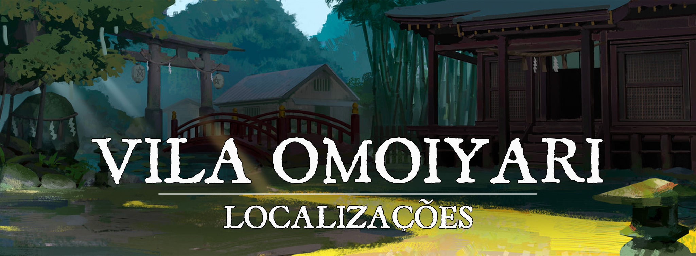

# Vila Omoiyari

!!! info ""
    “Dê uma chance à vida antes de recorrer à morte.”
# Descrição
A Vila Omoiyari é construída entre boas fontes de ervas e vegetações, sem vastas estruturas, a vila cresceu ao redor do Monastério da Misericórdia, fundado pouco após o fim das invasões demoníacas, dentro da Floresta Ashikure. A cultura da população gira em volta das práticas curandeiras do monastério, tendo uma conexão relativamente forte com a natureza. O lugar não recebe muitos viajantes, já que não é um grande ponto turístico, e está fora de rota, mas recebe visitas constantes de compradores de remédios.
 

### Descrição Visual:
[unknown (42).png](../../../img/c0122fcee6a575100408c47ab8ca090a.png) |Vila Omoiyari

Cercada por colinas e vegetação, a Vila Omoiyari é um lugar humilde, e uma das principais características do lugar são seus bambuzais e pequenos riachos que correm por perto da vila. É um lugar verdejante, e é sempre possível ver os monges do monastério caminhando por aí com suas máscaras cobrindo seus rostos. 
 

# Sociedade
 

### População:
O povo da Vila Omoiyari é relativamente diverso, contando com um grande número de humanos e meio-elfos. Em menor número, shifters e outros descendentes de youkais são bem comuns. 
 

### Cultura:
Na Vila Omoiyari o povo é bem ligado à natureza, e suas práticas são bem ritualísticas. É comum ver crianças mais jovens sabendo como se virar bem em meio a floresta, e adultos com um conhecimento natural além do comum. As práticas são muito incentivadas pelo Monastério da Misericórdia, que é a razão pela qual a vila existe hoje em dia.
 

### Caráter:
O povo da vila é bem receptivo, e é visível que é um daqueles lugares onde todos se conhecem, então atividades suspeitas são rapidamente conhecidas por todos. Caso os viajantes se portem bem, eles não ligam de compartilhar informação, ou oferecer um lugar para dormirem em casos de necessidade.
 

### Datas e Festividades:
Além dos festivais de cada uma das estações (citados nas outras cidades grandes de Turgon), a Vila Omoiyari tem o costume de se reunir na primeira lua cheia de cada mês na floresta, onde pedem pelas bênçãos dos Kami para tornar seus remédios mais poderosos, e na manhã seguinte, alguns monges partem da vila para entregar esses remédios aos povos necessitados de [Turgon](1c609a45-4466-4e05-be89-f71b3665d84f.md), trazendo-lhes saúde. 
 

### Religião:
Assim como todas as cidades de Turgon, o povo da Vila Omoiyari adora a [Inari](../../panteao/panteao-Erio/858c7e35-095b-4805-b058-65af37e9b691.md), a deusa raposa da prosperidade, dos andarilhos e dos espíritos da natureza. O povo é muito religioso, mas sua cultura não exalta a adoração como outros povos. É comum na Vila Omoiyari que as pessoas de vez em quando visitem templos, santuários, ou simplesmente façam artesanato e pequenas preces para os Kami. Raramente é encontrada opressão religiosa pelo local. 
 

# Economia
O grande pilar da economia de Vila Omoiyari são os seus remédios, e o trabalho dos monges curandeiros, que são muito requisitados por toda parte. Apesar da vila ser pequena e humilde, sem grandes plantações ou comércios, ela tem uma boa situação financeira, e usa isso para importar mais alimentos para suprir bem a região, além das caças que já conduzem na própria floresta. A caça é um aspecto secundário da economia, mas bem aproveitado, geralmente focado apenas para a própria vila, sem exportações. 
 

### Serviços:
**Os Monges da Misericórdia** são médicos muito bem treinados, e podem tratar ferimentos com uma certa facilidade, cobrando um preço justo para cada cidadão, seja ele uma peça de ouro, um quilo de alimento, ou uma história. Também é comum encontrar alguns outros medicamentos e poções à venda na Vila.
 

# Governo
A vila é governada por Hokusai Omoiyari, um velho monge que foi o fundador do Monastério da Misericórdia. Por ser uma comunidade relativamente pequena, a lei não é a das mais estritas, mas ainda assim, existem guardas qualificados para proteger os cidadãos e prender más-influências. Muitos dos crimes são julgados diretamente por Hokusai, que aplica a justiça temperada com sua sabedoria. 
 

### Poderio Militar:
A vila conta com seus monges caso realmente precise de proteção, mas suas forças no dia-a-dia se resumem a uma guarda que se dedica a proteger os limites da vila. 
 

# Conflito
Apesar da região onde a Vila Omoiyari ser localizada ser uma grande fonte de recursos naturais e ervas para a produção de seus remédios, também há o lado ruim. Lendas dizem que antes do Monastério ter sido estabelecido, a Floresta Ashikure era repleta de youkais que hoje em dia foram esquecidos. Muitos contam histórias sobre esses youkais agressivos que atacam ao anoitecer principalmente para as crianças não saírem pela noite. No entanto existem relatos reais sobre esses ataques, que tiveram de ser resolvidos com pressa, nunca se sabe quando algo novo pode surgir, então o povo da Vila Omoiyari é cauteloso, e garante suas preces e orações para os Kami bondosos os protegerem. 
 

# Organizações Relevantes

**Andarilhos Sem-Rosto**: Os Andarilhos Sem-Rosto são treinados no Templo da Misericórdia no caminho monástico da misericórdia, onde aprendem vastamente sobre medicina, e sobre a própria energia vital que permeia a natureza e os seres vivos, e são treinados para manipular essa energia vital, seja para o bem, ou mal. Eles atuam como médicos na vila e também no resto de Turgon, não apenas trazendo a cura, mas também terminando a vida daqueles que sofrem. Quando seus estudos e treinamentos chegam a certo ponto, muitos decidem viajar pelo reino, levando a misericórdia aos necessitados. Todos vestem máscaras personalizadas aos seus gostos, tomando o papel daqueles que trazem a vida e a morte.
 

# Locais Relevantes
**Monastério da Misericórdia**: O monastério foi a primeira estrutura fundada, e a vila cresceu ao seu redor, e por isso é a maior estrutura de toda a vila, que recebe constantes reformas para aprimorá-la, sendo o ponto principal do lugar. Nele são treinados monges no Caminho da Misericórdia, onde são ensinados sobre herbalismo, poções, e a própria energia vital. Esses monges são treinados para garantir o florescer da vida, ou o descanso da morte. Um monge que termina o seu treinamento básico se torna um Andarilho Sem-Rosto, e a partir daí, decide o que fará com sua vida. A maioria decide viajar por Turgon, mas outros ficam na vila pois acreditam que não devem abaixar muito os seus números. 

O Monastério costuma aceitar muitos órfãos que são encontrados nas viagens dos andarilhos, esses são treinados no caminho da misericórdia, como um investimento para o futuro.
 

# NPCs Relevantes
[unknown (41).png](../../../img/c111acc1c87d752d1ad0efa74fa9203b.png) |Hokusai Omoiyar

**Hokusai Omoiyari:** Hokusai é o fundador do Monastério da Misericórdia e governante da vila. Um homem velho, que à primeira vista parece inofensivo, mas guarda consigo uma enorme proeza marcial que não usa há anos. O maior objetivo de Hokusai é acumular conhecimento medicinal e produzir seus remédios para auxiliar as outras pessoas. Por isso fundou o Monastério da Misericórdia, onde ensina seus pupilos sobre a energia vital, e como manipulá-la. Histórias dizem que Hokusai estava presente na invasão abissal, e foi um grande lutador e médico, e por isso acreditava que deveria passar esse conhecimento para o futuro, para preparar as futuras gerações para grandes perigos. Um homem paciente e gentil, é muito fácil esquecer que ele já foi um grande lutador.
 

# Origem
Após o fim das invasões abissais, um homem chamado Hokusai Omoiyari decidiu se firmar na Floresta Ashikure, que era repleta de ervas medicinais, um lugar perfeito para fundar seu monastério, e ensinar seus seguidores. Desde então, acumula conhecimento medicinal, ensina seus seguidores e produz muitos medicamentos que são vendidos por Turgon. 
 
# Acontecimentos
 