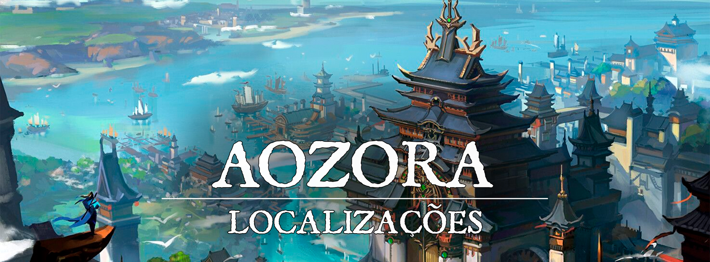

# Aozora

!!! info ""
    "Seja forte, seja destemido, seja sublime. E acredite que qualquer coisa é possível quando você tem as pessoas certas ao seu lado.”
# Descrição
A cidade de Aozora nasceu a cidade entre as águas e os rios, erguida pelos seguidores de [Seiryuu](turgon-1/56c7d107-3bca-4412-a5d0-8fea3bc09d94.md), o Dragão Azul do Leste. É uma das quatro cidades dedicadas ao [Quatro Lordes](turgon-1/55335815-5aec-4f93-81b0-62b662ea1f6a.md), criada com o intuito de reunir o Clã do Dragão e firmar os limites do [Domínio Espiritual de Turgon](08314742-6006-4c88-8e3e-743fbd532d0d.md). 

Lar dos Ryuuzai e de muitos outros trabalhadores e guerreiros de [Turgon](1c609a45-4466-4e05-be89-f71b3665d84f.md), a cidade também é conhecida como “Cidade das Águas” devido a sua estrutura e grande abundância de rios e riachos que deságuam no Lago do Dragão, através de uma enorme cachoeira conhecida como A grande queda de Seiryuu. A maior parte das estruturas é localizada em cima da água do lago, e diversas outras casas se erguem acostadas sobre as montanhas próximas no Vale das Serpes. 

A cidade é conhecida pelo seu enorme número de moinhos, posição peculiar entre as águas e pela força de seus lutadores, que tem uma forte aptidão com a magia do ambiente e com os próprios youkais.
 

### Descrição Visual:
[unknown (21).png](../../../img/3976bfb5942a3ca0adf1afd80b1b40fe.png) |Aozora - Vista para o Lago do Dragão

Uma bela cidade erguida acima do lago de águas azuis como o céu. Existe uma enorme cachoeira ao fundo, e além dela, diversas montanhas onde se encontram ainda mais casas. Na parte de baixo, a cidade é vasta, e diversos canais são feitos entre as estruturas, onde é possível ver diversos barcos pequenos atravessando a cidade e auxiliando no trabalho do dia-a-dia. É o lugar onde há o maior índice de pessoas, onde crescem diversos comércios, e a maioria das coisas de Aozora tem seu lugar por ali.

Acima da cachoeira, pontes de pedra conectam ambos os lados do grande rio e das montanhas, diversos pequenos riachos que lembram serpentes caem sobre as pedras fazendo seu caminho para o curso de água principal. A abundância da água é impressionante, e os residentes aproveitam ela para a agricultura. Muitos moinhos são vistos nessa região, montados perto das casas utilizando o máximo possível dos rios. E é entre esses picos que boa parte da agricultura tem espaço. Conforme as montanhas vão ficando mais distantes e mais altas, é visível que as estruturas começam a ficar gradualmente maiores, entre elas se encontra o Palácio Ryuuzai e o grande Templo de Seiryuu.

A grande divisória da cidade é a cachoeira, e para subir é necessário uma grande caminhada entre escadas, ou uma subida através de elevadores que funcionam a partir de magia, propulsionados pela água da cachoeira.

[unknown (20).png](../../../img/8b08ffb7a27c80b2056373609d8616ea.png) |Aozora - Vale das Serpes

# Sociedade
 

### População:
Principalmente composta por humanos, meio-elfos e outros youkais com traços dracônicos. Os traços dracônicos são muito vistos, principalmente entre aqueles com maior proximidade do Clã do Dragão e de [Seiryuu](turgon-1/56c7d107-3bca-4412-a5d0-8fea3bc09d94.md).
 

### Cultura:
Um dos pontos mais perceptíveis da cultura de Aozora é a lealdade de seu povo, o respeito aos seus ancestrais, aos mais velhos, e principalmente ao Clã do Dragão é muito expressivo. O povo comum tem um grande apego a agricultura, pescaria e produção de grãos, então a culinária da região é um dos pontos chamativos para visitantes, além das várias movimentações feitas nas águas, é perceptível que muitos pequenos barcos são usados para atravessar a cidade, e fazem um papel importante no trabalho do dia-a-dia. 

A relação do povo com a água dos rios e do lago é quase como algo sagrado, então tomam todo o cuidado. Para eles, maltratar a água a sujando é algo extremamente desrespeitoso, e isso tende a mudar bastante a forma como tratam estrangeiros. Além disso, também esperam um comportamento respeitoso dos visitantes. Se agirem respeitosamente, são recebidos com o dobro de hospitalidade, mas caso sejam desrespeitosos, os visitantes não serão vistos com bons olhos.

Já entre as classes mais altas e as pessoas dotadas com os traços dracônicos, é criada uma cultura bem voltada a prática de magia, principalmente conectada aos youkais e a própria energia espiritual do ambiente. A ideologia da cidade acabou por moldar esses praticantes, e eles acabaram criando duas subdivisões distintas no Clã do Dragão, e entre esses seres dracônicos. Os Olhos de Azure foram os que se dedicaram a estudar a magia para o povo, focando em usá-la para fazer a vida ser mais aproveitada, e para facilitar o dia-a-dia, sem nenhum foco em combate. Alguns até mesmo diriam que os Olhos de Azure são pacifistas, mas a verdade é que simplesmente não é a função deles. Alguns treinavam a cura, e outros buscavam habilidades mais práticas para inovar na infraestrutura da cidade, entre outros muitos usos. É uma tradição que os Olhos de Azure tenham pinturas azuis em seus rostos, principalmente abaixo dos olhos, não necessariamente sendo algo muito chamativo. Enquanto isso, Os Lâminas de Azure foram aqueles que se focaram na magia para o combate, sendo por aprimoramento físico, ou por utilizar a magia de forma mais agressiva e direta. Alguns também utilizavam técnicas de invocação, apesar de menos disseminada. Era quase como se a coragem estivesse no sangue deles, os Lâminas de Azure eram guerreiros excepcionais, e alguns diriam que seriam uma das maiores forças de todo o império se seu número fosse maior. É uma tradição que os Lâminas de Azure tenham pinturas azuis em suas mãos e braços, não necessariamente sendo algo muito chamativo.

Apesar de seu poder, a magia sozinha do Clã do Dragão não se compara com a magia dos Exorcistas de Inari, com suas funções um pouco mais simples se comparadas à complexidade dos exorcistas.

As subdivisões dos Lâminas e Olhos de Azure ficaram conhecidas como Descendentes de Azure, quando buscavam referir-se a ambos. Ser um Descendente de Azure era algo respeitável na sociedade, era uma condecoração semelhante a de um “Cavaleiro”. 
 

### Caráter:
O povo de Aozora é leal e respeitoso, na maioria das vezes prezando pela ordem. Por isso é muito comum ver eles se organizando para muitas coisas. No entanto, eles também exigem que sejam respeitosos à altura com eles. Desvalorizar ou desonrar suas tradições e costumes é uma das coisas que eles mais odeiam. 
 

### Datas e Festividades:
Festival do Verão: 21 de Junho; Festival do Outono: 22 de Setembro; Festival de Inverno: 21 de Dezembro; Festival de Primavera: 21 de Março. Em cada uma das estações, Turgon tem um grande festival em honra a [Inari](../../panteao/panteao-Erio/858c7e35-095b-4805-b058-65af37e9b691.md), e a um dos [Quatro Lordes](turgon-1/55335815-5aec-4f93-81b0-62b662ea1f6a.md).

**Festival do Verão.** No dia 21 de Junho ocorre o Festival do Verão, dedicado a [Suzaku](turgon-1/0ab39346-0286-4a6c-a6de-0bffbea262f9.md) e Inari. Por tradição, uma grande festa ocorre, e à meia-noite os turgonitas preparam lanternas de papel, escrevem desejos dentro delas, e as jogam aos céus, preenchendo-os com luzes e desejos que podem ser vistos de muito longe. O festival também é conhecido como “Festival das Lanternas”.

**Festival do Outono**. No dia 22 de Setembro ocorre o Festival do Outono, dedicado a [Byakko](turgon-1/47fd52b8-9390-40b5-aecd-3160c4f914c3.md) e Inari. É uma época onde as últimas colheitas antes do inverno são feitas, e por isso o festival de outono é cheio de diversas comidas. Geralmente passado na cidade, em seus centros comerciais as pessoas passeiam e festejam, bebendo e comendo o quanto podem.

**Festival de Inverno.** No dia 21 de Dezembro ocorre o festival de inverno, dedicado a [Genbu](turgon-1/cda84df3-0c32-4cb5-9e06-43fa716451b3.md) e Inari. Diferente dos outros festivais, esse dia é um pouco mais calmo. Conforme a neve cai, as pessoas se dedicam a fazer uma visita ao templo de Inari, e passam um tempo com seus familiares e amigos. 

**Festival da Primavera.** No dia 21 de Março ocorre o Festival da Primavera, dedicado a [Seiryuu](turgon-1/56c7d107-3bca-4412-a5d0-8fea3bc09d94.md) e Inari. Durante o dia o festival ocorre perto dos rios, lagos, e em outros lugares onde a natureza floresce. É a data onde as cerejeiras desabrocham, se despedindo do inverno. O festival também é conhecido como “Festival da Lótus”. Em Aozora o festival é especialmente exaltado, ocorrendo por todo lado. Crianças nascidas perto da época do festival são vistas como abençoadas, e a chance de terem os traços dracônicos que geralmente aparecem entre o povo de Aozora é mais comum nessa época. 
 

### Religião:
Assim como todas as cidades de Turgon, o povo de Aozora adora a [Inari](../../panteao/panteao-Erio/858c7e35-095b-4805-b058-65af37e9b691.md), a deusa raposa da prosperidade, dos andarilhos e dos espíritos da natureza e a [Seiryuu](turgon-1/56c7d107-3bca-4412-a5d0-8fea3bc09d94.md), entidade dos [Quatro Lordes](turgon-1/55335815-5aec-4f93-81b0-62b662ea1f6a.md) patrono do clã do Dragão, e consequentemente, de Aozora também. O povo é muito religioso, mas sua cultura não exalta a adoração como outros povos. Em Aozora o respeito à religião é muito forte, e a tradição expressiva. É muito fácil encontrar menções a Seiryuu em estátuas, manufaturas e até mesmo no nome de alguns locais. 
 

# Economia
Provavelmente a cidade mais forte economicamente entre as cidades dos Quatro Lordes, em Aozora muito é investido na agricultura e pescaria, e muitos dizem que suas terras são abençoadas com os peixes e águas. Diversos moinhos trabalham a todo momento, e a cidade é uma das maiores exportadoras de grãos de Turgon. As vilas próximas fornecem o suporte necessário para complementar a economia do local. 
 

### Serviços:
Serviços e viagens de barco entre a cidade e o Lago do Dragão, diversos comércios são encontrados na cidade. No geral, a cidade não oferece nada muito fora do comum, mas os Olhos de Azure muitas vezes produzem itens mágicos comuns que auxiliam o dia-a-dia. 
 

# Governo
A cidade é governada por Seiji Ryuuzai, que toma as decisões mais importantes, e logo abaixo dele, é o Clã do Dragão que cuida da maioria das burocracias, principalmente entre os Olhos de Azure, que possuem a grande maioria dos cargos administrativos e burocráticos de relevância. A lei é estrita, e eles tentam ao máximo aplicar a justiça sempre que possível. 
 

### Poderio Militar:
Aozora conta com diversos samurais e conjuradores, e muitos são responsáveis por proteger até mais do que a cidade, muitos guerreiros são enviados a outros pontos de [Turgon](1c609a45-4466-4e05-be89-f71b3665d84f.md)  em tempos de necessidade. Entre esses samurais, existe a Elite conhecida como Lâminas de Azure, guerreiros que usam a magia do ambiente para se fortalecer e aprimorar suas técnicas de combate. Somado a sua natural aptidão física devido aos traços dracônicos, os Lâminas de Azure são guerreiros formidáveis, e são uma das principais forças de Turgon. Algumas vezes também utilizam magia de invocação. 

No Vale das Serpes são encontrados alguns youkais dragões que foram chamados de Serpes, criaturas perigosas e bestiais, mas desde muito tempo atrás Aozora treinou alguns deles para serem grandiosas montarias dos guerreiros mais valorosos. Por serem raras, as Serpes existem em um número muito baixo, e são designadas apenas para a elite entre os Lâminas de Azure. Esses por sua vez são conhecidos como Montadores de Serpe, e desempenham patrulhas pela região do Vale, lutando junto de suas Serpes treinadas caso necessário.
 

# Conflito
Aozora em si é muito tranquila, mas as redondezas são um pouco problemáticas. Mais ao longe no Vale das Serpes são encontrados alguns youkais mais perigosos longe da civilização. Dizem que essa cadeia de pequenas montanhas foi palco de muitas batalhas desde antes de Turgon se estabelecer, e também durante os Dias de Tormenta e por isso sobram algumas ruínas e lugares há muito tempo abandonados, mas de difícil acesso para as pessoas. De tempos em tempos essas ruínas são exploradas, ou abertas, e acabam acordando coisas que não deviam.

Outro problema atual de Aozora é estar logo de frente ao deserto, não é muito incomum encontrar alguns bandidos das areias pelas estradas mais próximas, e algumas vezes até outras ameaças à fronteira. É o Clã do Dragão que lida com uma das fronteiras mais perigosas de Turgon, logo depois do Clã da Fênix ao Sul.
 

# Organizações Relevantes
**O Clã do Dragão** é um dos quatro grandes clãs de [Turgon](1c609a45-4466-4e05-be89-f71b3665d84f.md) , é dedicado ao Kami [Seiryuu](turgon-1/56c7d107-3bca-4412-a5d0-8fea3bc09d94.md) e foi fundado pela família Ryuuzai. O Clã se estabeleceu para seguir seu Kami e proteger as fronteiras do [Domínio Espiritual de Turgon](08314742-6006-4c88-8e3e-743fbd532d0d.md). Desde que se estabeleceram acima das águas do Vale das Serpes, os Ryuuzai mantêm a ordem em Aozora. 

A tradição é que sempre que o líder do clã se aproxima de sua morte, é feito um grande teste dos adultos das linhagens primárias e secundárias dos Ryuuzai, esse teste é físico e mental, e no final dele, o próprio líder do clã escolhe a dedo quem será seu sucessor, ou os conselheiros dos Descendentes de Azure em caso do líder atual não puder escolher. Para ser qualificado, um deve ser da linhagem primária, capaz de assumir tanto o papel de um dos Olhos de Azure, quanto de um dos Lâminas de Azure. Ao mesmo tempo que o novo líder é escolhido, são selecionados sucessores para os conselheiros dos Descendentes de Azure. Os sucessores dos conselheiros podem ser tanto da linhagem primária quanto secundária. Após a morte, ou a decisão de que o líder atual quer se aposentar, o novo líder assume. Os conselheiros também devem aguardar até que os atuais se aposentem, e passam por um grande período de tutela antes de assumirem o cargo.

Os conselheiros dos Descendentes de Azure são sempre um para os Olhos de Azure, e outro para os Lâminas de Azure, e tradicionalmente, eles seguem como braço direito e esquerdo do líder até a morte. No entanto, outras situações políticas às vezes podem exigir que um cargo seja mudado antes da hora, mas mesmo assim, os Ryuuzai se apegam à tradição o máximo possível.

Para qualquer um dos cargos de líder ou conselheiro, o gênero é irrelevante. Já houveram líderes homens e mulheres, assim como conselheiros.
Os Olhos de Azure são os responsáveis por uma grande parte burocrática e administrativa da cidade, e são os que decidiram investir na magia para ajudar o dia-a-dia do povo. Tanto para ajudar nas construções e na infraestrutura, quanto para fazer muita coisa ser mais simples do que poderia ser. Geralmente eles não são treinados para combate, e acreditam que é um desvio do seu dever aprender técnicas ofensivas. No entanto, muitos aprendem o suficiente para auto-defesa. O conselheiro dos Olhos de Azure é responsável por organizar e administrar vários assuntos da cidade, atende o povo, cuida de relações diplomáticas, e muito mais. Claramente não faz isso diretamente em todos os casos, mas é responsável por organizar os outros Olhos de Azure para tais trabalhos. A informação gira ao redor dele, e ele tem o papel de manter o líder informado e aconselhá-lo para tomar as melhores decisões possíveis. 

Os Lâminas de Azure são os responsáveis pela parte militar de Aozora. Tomando conta da guarda e das patrulhas da cidade, além de revisarem estrategicamente os pontos mais próximos da cidade para garantir a segurança. Mas os exércitos não são compostos apenas por eles, boa parte da guarda não faz parte dos Lâminas de Azure. O Conselheiro dos Lâminas de Azure assume o papel de General dos Exércitos de Aozora, e tem o dever de aconselhar o Líder do Clã para que as melhores decisões sejam tomadas

**A Liga de Jade** é uma organização comerciante que busca estreitar os laços econômicos entre as cidades de Turgon, auxiliando comerciantes e buscando a prosperidade do reino. A Organização tem uma base em Aozora, mas sua base central se localiza em [Nari](eeb29133-6119-4ca5-a018-4b39acc26553.md).

**Os [Exorcistas de Inari](../organizacoes/2e7dc2d0-39f6-440d-953c-a8dc310f2381.md)** são uma organização majoritariamente formada por usuários de magia. A organização tem um grande foco nos youkais, buscando manter o seu equilíbrio e purificar ou banir youkais corrompidos que constantemente assolam a região do império das nuvens. A organização tem uma pequena base em Aozora para auxiliar nos conflitos contra os Youkais. 
 

# Locais Relevantes

**Templo de Seiryuu:** Um dos lugares mais venerados pelo povo de Aozora, o Templo de Seiryuu é erguido no Vale das Serpes, um pouco mais distante da cidade, com uma vista para o horizonte no vale. Por ser relativamente distante, não é muito movimentado, mas alguns monges e sacerdotes residem no local. Apesar de Seiryuu não residir fisicamente no templo, dizem que ali se encontra a entrada de seus domínios, que podem ser acessados por mortais uma vez que sejam convidados pelo próprio Seiryuu.

**Monastério do Dragão Azul:** Anexado ao Templo de Seiryuu, há uma ordem monástica dedicada aos caminhos do Dragão Azul, esses monges são protetores do templo, mas não são ligados diretamente ao Clã do Dragão, e nem à cidade de Aozora. São treinados diferentes estilos, desde o caminho monástico dos quatro elementos, com foco na água, até o mais claro caminho do dragão ascendente.

**O Palácio Ryuuzai:** Visível da parte de baixo da cidade, o Palácio Ryuuzai se encontra em um dos picos mais altos acima da cachoeira, em um lugar onde pode-se ver toda a cidade de cima. É o lar das linhagens primárias do Clã do Dragão e dos Ryuuzai. Nos arredores do palácio existem outras estruturas dedicadas aos exércitos e a própria guarda, onde os Lâminas de Azure treinam e fazem a guarda do Palácio. 

**A Grande Queda de Seiryuu:** É a grande cachoeira que deságua no Lago do Dragão, por incrível que pareça, suas águas são relativamente calmas, e até o dia de hoje pouquíssimos acidentes aconteceram na cachoeira. Lendas dizem que o próprio Seiryuu é quem garante que as águas fiquem calmas. Atrás da cachoeira, existe o Sepulcro de Azure. 

**Lago do Dragão**: É o grande lago em que Aozora está construída em cima, a água é cristalina, e é um lago bem fundo. Diversos peixes estão presentes no lago, que muitas vezes também surgem nos canais da cidade. Diversos barcos pesqueiros são vistos navegando, e também existem diversas estátuas de dragões erguidas pelo lago.

**Os Três Grandes Distritos**: Os Três Grandes Distritos são dispostos em uma formação triangular, divididos por canais, e deixando espaço entre eles para outras construções.

- **Distrito da Troca**: O Distrito da Troca é o mais próximo da entrada da cidade, e mais distante da Grande Queda de Seiryuu, é nele onde ocorrem os principais comércios de Aozora, e também onde se encontra uma base da Liga de Jade, que está estabelecida na cidade, bem próxima do centro do distrito.

- **Distrito Sublime**: O Distrito Sublime é um dos mais próximos da Grande Queda de Seiryuu e das subidas para acima da cachoeira. Esse distrito é muito dedicado ao entretenimento, mas também tem um foco grande na cultura do lugar. É lar de restaurantes mais refinados, teatros, escolas e outros luxos. Também visto como um dos distritos mais caros para se morar, é visível que suas estruturas têm um toque mais refinado no geral. É onde fica localizado o Colégio Engeki-Ha. Muitos projetos individuais dos Olhos de Azure são montados nesse distrito, ou em seus arredores. Nas partes mais externas existem diversas tavernas e estalagens, na região mais próxima do Distrito da Troca. 

- **Distrito da Confecção**: O Distrito da Confecção também é relativamente próximo da Grande Queda de Seiryuu, e mais distante da entrada principal da cidade. É onde muitos produtos são refinados e redirecionados para serem vendidos, incluindo ferramentas, processamento de outros grãos e peixes, barcos para uso dentro da cidade e esse tipo de coisa. É um dos distritos menos movimentados, mas de grande importância para os trabalhadores do lugar.

**Câmara Central de Azure:** No centro dos Três Grandes Distritos existem algumas estruturas governamentais, incluindo uma base da guarda, e a Câmara Central de Azure, que é o lugar onde os Olhos de Azure se reúnem de tempos em tempos para assuntos administrativos, onde separam as verbas e investem nos pontos necessários da cidade. Também é o lugar onde os cidadãos vão para resolver diversas burocracias da cidade. 

**Colégio Engeki-Ha:** É um colégio relativamente novo em Aozora, dedicado às artes, incluindo performance, música, pintura e a arte da espada. Localizado no Distrito Sublime, qualquer um pode entrar, mas deve ter dinheiro para pagar as taxas. Nesse colégio são formados muitos Bardos das Espadas, ou artistas que não desejam aprender sobre a aplicação da espada na arte. 

**Sepulcro de Azure:** Desde que Aozora foi erguida, o Sepulcro de Azure também foi criado. Uma ponte de pedra é formada acima da água para atravessar a Grande Queda de Seiryuu, o Sepulcro se encontra do outro lado da enorme cachoeira. Para passar por ela é necessário um conjurador capaz de impedir o fluxo violento da água da cachoeira, e é necessário ser do Clã do Dragão para ter permissão de entrar lá. Ou ser acompanhado diretamente por um dos Descendentes de Azure. É tradição do lugar enterrar todos os membros do Clã do Dragão, junto com suas relíquias no Sepulcro de Azure. Enterros cerimoniais geralmente são feitos, e os cidadãos podem ver os caixões sendo levados pela ponte de pedra até além da cachoeira. Na parte interna do Sepulcro, a água também é bem presente, e pontes de pedra levam a caminhos diferentes dentro da estrutura, que é bem grande.
 

# NPCs Relevantes
[unknown (22).png](../../../img/127010465c47a329a0345ba7cbf6be03.png) |Seiji Ryuuzai, Líder do Clã do Dragão

**Seiji Ryuuzai, Líder do Clã do Dragão:** Seiji é um homem centrado, e passa a impressão de ter uma personalidade leve e calma, mas quando os assuntos importantes estão em cheque, é possível sentir a intensidade em seus olhos, e o ímpeto em sua voz, com um poder de decisão admirável, e que faz com que as pessoas tenham vontade de segui-lo. É um homem alto de cabelos longos azuis esverdeados. Ainda é relativamente novo como líder, não tendo chegado aos seus 40 anos de idade. Então acaba dependendo um pouco de seus conselheiros, mas os últimos anos têm sido frutíferos, e o povo está contente com a escolha de seu antecessor. 

[unknown (23).png](../../../img/5ab83db719485ebb47dc1df4c1f1cd89.png) |Sorei Ryuuzai, Conselheiro dos Olhos de Azure

**Sorei Ryuuzai, Conselheiro dos Olhos de Azure:** Sorei é um homem calmo e elegante, sempre trabalhando em diversos assuntos. Alguns tem suas dúvidas de como o homem é capaz de trabalhar tanto e nunca sem ficar cansado. Ele tenta fazer com que os diálogos sejam práticos e sem rodeios, mas ainda mantendo a educação. É muito respeitado pelo povo, e é uma grande inspiração para os Olhos de Azure. Geralmente pode ser encontrado na Câmara Central de Azure, mas também atende assuntos pelos distritos em pessoa. 

[unknown (24).png](../../../img/f3584c525aaf3aca77418ff2877e339d.png) |Ryusui Ryuuzai, Conselheira dos Lâminas de Azure

**Ryusui Ryuuzai, Conselheira dos Lâminas de Azure:** Ryusui é uma mulher destemida, conhecida por sua poderosa manipulação de invocações, sua exímia técnica com a espada, e seu pensamento estratégico. Ela usa um tapa-olho em seu olho esquerdo, e é a general dos exércitos de Aozora, e também sua principal estrategista. É extremamente leal a Seiji, e é uma pessoa difícil de se conseguir uma audiência, apenas casos mais extremos são atendidos diretamente por ela.
 

# Origem
A cidade de Aozora, junto com as outras cidades dedicadas aos [Quatro Lordes](turgon-1/55335815-5aec-4f93-81b0-62b662ea1f6a.md), é uma das cidades mais antigas que o próprio Império das Nuvens, a cidade foi fundada pelo Clã do Dragão pouco depois da vinda dos Kamis de Inari para o plano material.

Aozora começou pequena com os seguidores de [Seiryuu](turgon-1/56c7d107-3bca-4412-a5d0-8fea3bc09d94.md). Era um bom ponto e uma bela cidade, assim que o [Império das Nuvens](1c609a45-4466-4e05-be89-f71b3665d84f.md) nasceu, a cidade cresceu muito, se tornando uma grande força econômica e militar.
 

# Acontecimentos
 