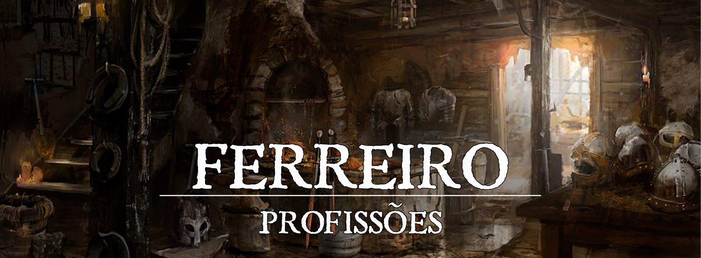

# Ferreiro

Um paladino levanta sua enorme espada dourada e aponta contra a horda de cadáveres putrefatos que salivam enquanto correm em direção a uma vila. Um assassino, com um clique, abre um pequeno compartimento em sua adaga e despeja um líquido esverdeado viscoso enquanto olha sua próxima vítima do outro lado da taverna. A fera que vem aterrorizando os fazendeiros cai aos pés do patrulheiro, que mostra seu arco escuro com grande orgulho.

Enquanto se dá muita ênfase nos diversos contos sobre grandes exércitos, guerras e os lendários heróis e vilões do mundo, raros são os casos aonde estes enormes feitos foram realizados sem o equipamento apropriado. A habilidade de um guerreiro é fundamental para sua vitória em combate, mas uma boa arma pode significar a diferença entre a vida e a morte.

E os grandes responsáveis pela criação deste equipamentos tão essenciais que por muitas vezes passam despercebidos pela história mas são de extrema importância para a ascendência e o declínio de reinos e impérios, são os Armeiros.

Um guerreiro corre em investida contra uma atroz besta e, utilizando sua armadura pesada, deflete as poderosas garras antes de fincar sua espada no coração da fera. Esgueirando-se nas sombras, o assassino espera sua vítima se aproximar, sua presença, assim como sua armadura de couro, se mesclando com a escuridão durante a noite. Uma saraivada de flechas voa em direção ao paladino, mas são todas paradas por seu enorme escudo.

Assim como se não se pode vencer um combate sem uma boa arma para atacar, também não se pode vencer um bom combate sem ter a capacidade de se defender. Enquanto um bom guerreiro deve sempre contar com sua habilidade, o equipamento de proteção que este guerreiro veste é igualmente importante, e pode significar a diferença entre a vida e a morte.

Se os Armeiros são a espada que trouxeram a ascendência e a queda de reinos, os Armadureiros são as armaduras e os escudos que levaram a espada até lá.

## Benefícios
**À Ferro e Fogo** - Ao iniciar a jornada como um Ferreiro, a primeira coisa que se precisa saber é como manusear os seus instrumentos de trabalho. **Ao escolher esse Ofício, o personagem adquire proficiência em Kit de Ferreiro.** Para exercer seu Ofício dentro da Guilda, não é necessário ter consigo um Kit, pois a Oficina lhe providencia tudo que é necessário.

**Reforçar Equipamento** - Para os Ferreiro de Campo de Batalha, é essencial preparar e cuidar dos equipamentos de todos no Grupo. Durante um descanso curto ou longo, o Ferreiro pode reforçar 1/2 de seu Rank (Arredondado para baixo) armas corpo à corpo ou à distância e Armaduras. Isso faz com que, para armas o primeiro impacto delas seja mais efetivo, garantindo ao primeiro ataque que acerte um bonus de Dano igual ao Rank do Ferreiro. Já as armaduras são mais efetivas em mitigar os danos recebidos: a primeira instância de dano que o usuário sofre é reduzida em 1/2 do Rank do Ferreiro, arredondado para baixo (mínimo de 1). Para isso, é necessário que o Ferreiro tenha consigo um Kit de Ferreiro, que custa 40 PO.

## Classes e Sinergias

Diversas vezes, um Aventureiro traduz para a sua Classe muitas das experiências de seu Ofício.

Portanto, algumas Classes são mais predominantes e mais passivas de se favorecerem com os conhecimentos trazidos da Manufatura.

Ao atingirem o nível 9 de Classe, o Artesão recebe um bônus de +1 na rolagem para definir a Qualidade do Item a ser fabricado.

Em caso de um personagem ter 2 das classes listadas a baixo no nível 9, o bonus acumula até +2.

As classes que recebem este beneficio são:

* Artífice Armadureiro - **Apenas Armaduras**
* Artífice Artilheiro
* Artífice Ferreiro de Batalha
* Bardo Colégio das Espadas - **Apenas Armas**
* Clérigo do Domínio da Forja
* Guerreiro Mestre da Batalha
* Monge Kensei - **Apenas Armas**

# Fabricando Armas e Armaduras

A fim de exercer seu Ofício com profissionalismo e dedicação, é importante que o Ferreiro saiba também suas limitações. Ao iniciar um trabalho, o Ferreiro poderá fazer Armas e Armaduras segundo os parâmetros descritos nesta sessão.

#### Tabela de Produção

| Rank Do Artesão | Nível do Item |
| --- | --- |
| 1 - Novato | Armas e Armaduras Nv1 |
| 2 - Aprendiz | Armas e Armaduras Nv2 |
| 3 - Aspirante | Armas e Armaduras Mágicas Comuns |
| 4 - Notável | Armas e Armaduras Nv3 |
| 5 - Experiente | Armas e Armaduras Nv4 |
| 6 - Perito | Armas e Armaduras Mágicas Incomuns |
| 7 - Veterano | Armas e Armaduras Nv5 |
| 8 - Mestre | Armas e Armaduras Nv6 |
| 9 - Grão-Mestre | Armas e Armaduras Mágicas Raras |

Para se definir o Nível de uma Arma ou Armadura, basta somar o Nível do Material com o Nível da Modificação do item, caso ele tenha.

## Produzindo itens mágicos e adquirindo Diagramas

Para a produção de itens mágicos, é necessário que a Guilda tenha disponível o Diagrama para a realização daquele item específico, caso contrário, os membros não deterão o conhecimento de como o fabricarem.

Constantemente, a Caravana poderá trazer Diagramas que ensinarão a Fabricação de um ou mais Itens Mágicos. Para tal, a Guilda, através de recursos próprios ou doações de membros, pode adquirir esses Diagramas, que ficarão à disposição da Oficina relacionada com o tipo específico de Item Mágico ensinado por aquele Diagrama, indeterminadamente.

A Guilda ou um próprio membro pode, enquanto uma Caravana estiver na Guilda, encomendar Diagramas para que a próxima Caravana os traga. Para tal, pagará 50% a mais do valor e garantirá que sua encomenda chegará na próxima visita.

## Valor de Venda

Os itens produzidos pelo ferreiro devem sempre seguir a tabela de preços a seguir:

| Nível | Armas e Armaduras | Preço |
| --- | --- | --- |
| 1 | Armas e Armaduras Nv1 | Preço do PHB |
| 2 | Armas e Armaduras Nv2 | Preço do PHB + 150 PO (Armas) ou 100 PO (Armaduras) |
| 3 | Armas e Armaduras Mágicas Comuns | Preço do PHB + 250 PO (Armas) ou 200 PO (Armaduras) |
| 4 | Armas e Armaduras Nv3 | Preço do PHB + 400 PO (Armas) ou 350 PO (Armaduras) |
| 5 | Armas e Armaduras Nv4 | Preço do PHB + 600 PO (Armas) ou 550 PO (Armaduras) |
| 6 | Armas e Armaduras Mágicas Incomuns | Preço do PHB + 800 PO (Armas e Armaduras) |
| 7 | Armas e Armaduras Nv5 | Preço do PHB + 1500 PO (Armas) ou 1000 PO (Armaduras) |
| 8 | Armas e Armaduras Nv6 | Preço do PHB + 2400 PO (Armas) ou 1200 PO (Armaduras) |
| 9 | Armas e Armaduras Mágicas Raras | Preço do PHB + 4000 PO (Armas e Armaduras) |

## Tempo e Requisitos de Produção
Armas e Armaduras variam nos diversos tipos, estilo e complexidade de produção. Portanto, alguns itens demoram mais tempo do que outros para serem confeccionados, ainda mais se forem itens mágicos.

Armaduras grandes e revestidas dos diversos tipos de metais são em geral mais difíceis de serem fabricadas do que camisetas de linho. Da mesma forma que uma adaga, ou um dardo dispendem menos esforços e requerem menos tempo de produção do que um Machado de Batalha

Inclusive, quanto maior for o nível do item, maior será o tempo gasto para aperfeiçoá-lo a ponto de poder ser utilizável.

#### Tempo e Requisitos - Armas / Munições

| Tipo do Item | Tempo de Produção | Requisitos |
| --- | --- | --- |
| Armas e Munições Não-Mágicas | 1 + 1/2 do Nível da Arma ou Munição* | - |
| Armas e Munições Mágicas Comuns, Armas de Fogo Especializadas | 4 Dias | Rank 3 - Aspirante |
| Armas e Munições Mágicas Incomuns | 7 Dias | Rank 6 - Perito |
| Armas e Munições Mágicas Raras | 10 Dias | Rank 9 - Grão-Mestre |

*O tempo relacionado com a 1/2 do Nível, é arredondado pra baixo, com o mínimo de 0 dias.

#### Tempo e Requisitos - Armaduras e Escudos

| Tipo do Item | Tempo de Produção | Requisitos |
| --- | --- | --- |
| Armaduras Leves e Escudos. | 2 + 1/2 do Nível da Armadura | - |
| Armaduras Médias. | 3 + 1/2 do Nível da Armadura | - |
| Armaduras Pesadas. | 3 + Nível da Armadura | Rank 3 - Aspirante |
| Armaduras Leves e Escudos Mágicos Comuns | 5 Dias | Rank 3 - Aspirante |
| Armaduras Médias Mágicas Comuns | 6 Dias | Rank 3 - Aspirante |
| Armaduras Pesadas Mágicas Comuns | 10 Dias | Rank 4 - Notável |
| Armaduras Leves e Escudos Mágicos Incomuns | 8 Dias | Rank 6 - Perito |
| Armaduras Médias Mágicas Incomuns | 10 Dias | Rank 6 - Perito |
| Armaduras Pesadas Mágicas Incomuns | 14 Dias | Rank 7 - Veterano |
| Armaduras Leves e Escudos Mágicos Raros | 11 Dias | Rank 9 - Grão-Mestre |
| Armaduras Médias Mágicas Raras | 13 Dias | Rank 9 - Grão-Mestre |
| Armaduras Pesadas Mágicas Raras | 18 Dias | Rank 9 - Grão-Mestre |

#### Itens Mágicos Próprios

| Raridade | Produção | Requisito |
| --- | --- | --- |
| Comum | 4 dias | Rank 3 - Aspirante |
| Incomum | 7 dias | Rank 6 - Perito |
| Raro | 10 dias | Rank 9 - Grão-Mestre |

#### Armas

| Material | Nível | Cor | Efeito |
| --- | --- | --- | --- |
| Ferro | 1 | (Minério) Cinza | - |
| Madeira | 1 | (Madeira) | - |
| Prata | 2 | (Minério) Prata | Danos de ataques realizados com esta arma ultrapassam resistêcia de certas criaturas, como Licantropos. |
| Mithral | 2 | (Minério) Branco | Armas de uma mão ganham a propriedade "leve" e "acuidade". Armas de duas mãos com a propriedade "pesada" não impõe desvantagem em rolagens de ataque em criaturas de até uma categoria abaixo. |
| Teixo Encantado | 2 | (Madeira) Marrom Amarelado | Armas de uma mão ganham a propriedade "leve" e "acuidade". Armas de duas mãos com a propriedade "pesada" não impõe desvantagem em rolagens de ataque em criaturas de até uma categoria abaixo. |
| Erudito | 2 | (Minério) Levemente Azulada | A arma pode ser utilizada como Foco Arcano. |
| Adamantium | 4 | (Minério) Levemente Esverdeado | Danos de ataques realizados com esta arma ultrapassam resistências de Constructos e causam 1d8 extra de dano (da arma) nessas criaturas. Adicionalmente, acertos em objetos que não estejam sendo carregados ou vestidos são considerados acertos críticos. |
| Gelo Verdadeiro | 4 | (Versátil) Azul e Branca | Como uma ação Livre, o empunhador pode usar uma palavra de comando para o dano dessa arma passar a ser Frio, até que o comando seja desfeito, também como uma ação Livre. |
| Ignum | 4 | (Versátil) Vermelha e Preto | Como uma ação Livre, o empunhador pode usar uma palavra de comando para o dano dessa arma passar a ser Fogo, até que o comando seja desfeito, também com uma ação Livre. |
| Madeira das Fadas | 4 | (Madeira) Normal com Fios Verdes | Aumenta a categoria de dano em um dado. (Não disponível para munições) |
| Orichalcum | 4 | (Minério) Tom Amarelado | Aumenta a categoria de dano em um dado. (Não disponível para munições) |
| Finimagus | 5 | (Minério) Vermelha com Fios Azuis | Todo dano causado por esta arma impõe desvantagem em testes de concentração. Adicionalmente esta arma causa 1d4 de dano de energia extra em criaturas que estão concentrando magias. |
| Skyrite | 5 | (Minério) Azulado Reluzente | Em um acerto crítico, o alvo deve passar em um Teste de Constituição CD 18 ou será atordoado até o início de seu próximo turno. |
| Matéria Prismática | 5 | (Versátil)Transparente (Muda após a Forja) | Como uma ação Livre, o empunhador pode usar uma palavra de comando para o dano dessa arma passar a ser Acido, Eletrico, Fogo, Frio ou Trovão e causar 1d4 de dano extra. Apenas um elemento deve ser escolhido durante a fabricação da Arma. Adicionalmente, enquanto a arma estiver empunhada, o empunhador pode usar sua reação para receber resistência ao sofrer dano do tipo escolhido. A resistência termina após o dano sofrido. O empunhador pode utilizar esta reação especial um numero de vezes igual metade da proficiência por descanso longo. |

#### Modificações de Armas

| Modificação | Nível Adicional | Tipo de Arma | Efeito |
| --- | --- | --- | --- |
| Aprimoramento Concussivo Simples | 1 | Armas de Dano Concussivo (Bludgeoning) | Em um acerto crítico, o empunhador pode forçar a criatura alvo, caso ela seja de uma categoria de um tamanho superior ou menor ao empunhador, a fazer um Teste de Resistência de Força CD 14. Em uma falha, a criatura é derrubada. |
| Aprimoramento Cortante Simples | 1 | Armas de Dano Cortante (Slashing) | Em um acerto crítico a criatura recebe 1d6 de dano adicional. No final de cada turno, o alvo deve realizar um Teste de Resistência de Constituição CD 14, recebendo 1d6 de dano em uma falha, ou cessando o efeito em um sucesso. Alternativamente, um teste de Medicina de mesma dificuldade feito pela criatura ferida ou outra a 5ft dela pode parar o sangramento. |
| Aprimoramento Perfurante Simples | 1 | Armas de Dano Perfurante (Piercing) | Em um acerto crítico, o alvo deve realizar um Teste de Resistência de Força CD 14. Em caso de uma falha, a velocidade de movimentação da criatura atingida é reduzido em 3m (10 pés) por 1 minuto. (A criatura afetada nunca fica com menos de 10 pés de movimento) Efeito não cumulativo. |
| Peso Balanceado | 1 | Não sejam Pesadas e/ou Duas Mãos | Adiciona a propriedade arremessável (Thrown) de 6/18m (20/60 pés). Desde que não seja uma Lança de Montaria ou um Chicote. |
| Lâmina Fina | 1 | Armas Leves com Lâminas | Concede vantagem em Testes de Habilidade para esconder a arma. |
| Lâmina Serrilhada | 1 | Armas com Lãminas | Ao causar dano com esta arma se pelo um dos dados sair dano máximo, a arma causa 1d4 de dano adicional. |
| Mira | 1 | Arcos, Armas de Fogo e Bestas | Como uma ação bônus, você pode mirar mais precisamente, concedendo vantagem no primeiro ataque desferido até o fim do turno. |
| Compartimento Para Líquido | 1 | Todas as Armas | Como uma ação bônus, você pode despejar um líquido no compartimento da arma. Este compartimento pode conter venenos e componentes alquímicos. |
| Guarda Simples | 2 | Corpo a Corpo | Enquanto estiver empunhando esta arma e tomar a Ação de Esquiva (Dodge), você ganha +2 de bônus de CA. |
| Aprimoramento Concussivo Avançado | 2 | Armas de Dano Concussivo (Bludgeoning) | Em um acerto crítico, o empunhador pode forçar a criatura alvo, caso ela seja de uma categoria de tamanho superior ou menor ao empunhador a fazer um Teste de Resistência de Força DC 16. Em uma falha, a criatura é empurrada 3m (10 pés) para trás e/ou derrubada. |
| Aprimoramento Cortante Avançado | 2 | Armas de Dano Cortante (Slashing) | Em um acerto crítico a criatura recebe 1d8 de dano adicional. No final de cada turno, o alvo deve realizar um Teste de Resistência de Constituição CD 16, recebendo 1d8 de dano em uma falha, ou cessando o efeito em um sucesso. Alternativamente, um teste de Medicina de mesma dificuldade feito pela criatura ferida ou outra a 5ft dela pode parar o sangramento. |
| Aprimoramento Perfurante Avançado | 2 | Armas de Dano Perfurante | Em um acerto crítico, o alvo deve realizar um Teste de Resistência de Força CD 16. Em caso de uma falha, a velocidade de movimentação da criatura atingida é reduzido em 6m (20 pés) por 1 minuto. (A criatura afetada nunca fica com menos de 10 pés de movimento) Efeito não cumulativo. |
| Cabo Alongado | 2 | Armas de Duas Mãos ou Versáteis | A arma ganha a propriedade alcance (aumenta seu alcance em 1,5m (5 pés). enquanto empunhada com as Duas Mãos. |
| Aprimoramento Concussivo Perfeito | 3 | Armas de Dano Concussivo (Bludgeoning) | Em um acerto crítico, o empunhador pode forçar a criatura alvo, caso ela seja de uma categoria de tamanho superior ou menor ao empunhador, a fazer um Teste de Resistência de Constitução Dificuldade 18. Em uma falha, a criatura é Empurrada 3m (10 pés) para trás, e/ou derrubada. |
| Aprimoramento Cortante Perfeito | 3 | Armas de Dano Cortante (Slashing) | Em um acerto crítico a criatura recebe 1d10 de dano adicional. No final de cada turno, o alvo deve realizar um Teste de Resistência de Constituição CD 18, recebendo 1d10 de dano em uma falha, ou cessando o efeito em um sucesso. Alternativamente, um teste de Medicina de mesma dificuldade feito pela criatura ferida ou outra a 5ft dela pode parar o sangramento. |
| Aprimoramento Perfurante Perfeito | 3 | Armas de Dano Perfurante (Piercing) | Em um acerto crítico, o alvo deve realizar um Teste de Resistência de Força CD 18. Em caso de uma falha, a velocidade de movimentação da criatura atingida é reduzido em 9m (30 pés) por 1 minuto. (A criatura afetada nunca fica com menos de 10 pés de movimento) Efeito não cumulativo. |

#### Armaduras

| Material | Nível | Efeito |
| --- | --- | --- |
| Couro | 1 | - |
| Ferro | 1 | - |
| Prata (Ferro) | 2 | Criaturas com aversão à prata tem desvantagem em ataques corpo-a-corpo feitos contra criaturas equipadas com esta armadura. |
| Erudito (Ferro) | 2 | A Armadura concede +1 de bônus em testes para manter concentração de magias. |
| Sedasombra (Couro) | 2 | A Armadura concede Vantagem em Esconder-se (Stealth) em áreas de Penumbra (Armaduras não-Metálicas) |
| Linho de Fragmento de Criação (Couro) | 2 | A Armadura concede +1 de Bônus em Testes de Resistência para Manter Concentração |
| Pele de Sapo Elemental (Couro) | 4 | Enquanto equipado com esta armadura, o usuário pode gastar metade do seu deslocamento para sair de agarrão automaticamente. Dobra distância de Salto. |
| Meteorito (Ferro) | 4 | Se a criatura que atacou o usuário da armadura tirar um 1 ou um 20 naturais, ele pode escolher dar 2d6 de dano de Fogo na criatura atacante. |
| Prata Astral (Ferro) | 4 | Com uma ação bônus, o usuário pode dizer uma palavra de comando para receber uma quantidade de em Pontos de Vida Temporários igual a 20. A armadura pode prover pontos de vida temporários novamente somente no próximo nascer do sol. |
| Couro de Crag Cat (Couro) | 5 | A armadura concede vantagem em testes de resistências contra magias de um único alvo de 5º Círculo ou inferior. |
| Couro de Hydra (Couro) | 5 | Enquanto equipado com esta armadura, o usuário não recebe penalidade no deslocamento de nado e pode segurar a respiração embaixo d'agua por 1 hora. Adicionalmente, Se estiver com menos de metade de seus pontos de Vida Máxima, você recebe 5 pontos de vida no inicio dos seus turnos desde que não esteja inconsciente ou sofrido dano de fogo desde o último turno. |
| Linho de Essência Divina (Couro) | 5 | A Armadura concede Vantagem em Testes de Resistência de Inteligência e Carisma para resistir efeitos mágicos. |
| Finimagus (Ferro) | 5 | A Armadura concede desvantagem em ataques mágicos feitos contra o usuário. |
| Skyrite (Ferro) | 5 | A Armadura concede desvantagem em ataques corpo-a-corpo realizados por Corruptores, Aberrações e Mortos-Vivos (Fiends, Aberrations e Undeads) contra o usuário. |

#### Modificações Armaduras

| Aprimoramento | Nível Adicional | Efeito |
| --- | --- | --- |
| Aprimoramento Defensivo Simples | 1 | A armadura concede redução de -1 a dano concussivo, cortante e perfurante recebido (Esse dano é reduzido antes de se aplicar resistência) |
| Manopla da Proteção | 1 | O usuário tem vantagem em testes contra ser desarmado. |
| Cravos | 1 | Caso o usuário esteja agarrando e ou sendo agarrado, o oponente sofre 1d4 de dano perfurante no início do turno dele. |
| Aprimoramento Defensivo Avançado | 2 | A armadura concede redução de -2 a dano concussivo, cortante e perfurante recebido (Esse dano é reduzido antes de se aplicar resistência). |
| Espinhos | 2 | Caso você esteja agarrando e ou sendo agarrado, o oponente sofre 1d6 de dano perfurante no início do turno dele. |
| Patas de Aranha | 2 | Movimento de Escalada não custa movimento extra, nem exige testes. |
| Aprimoramento Defensivo Concussivo Perfeito | 3 | A armadura concede resistência a dano Concussivo. |
| Aprimoramento Defensivo Cortante Perfeito | 3 | A armadura concede resistência a dano Cortante. |
| Aprimoramento Defensivo Perfurante Perfeito | 3 | A armadura concede resistência a dano Perfurante. |
| Espinhos Reforçados | 3 | Caso você esteja agarrando e ou sendo agarrado, o oponente sofre 1d8 de dano perfurante no início do turno dele. |

#### Escudos

| Material | Nível | Efeito |
| --- | --- | --- |
| Ferro | 1 | - |
| Madeira | 1 | - |
| Ferro Negro | 2 | O escudo concede bônus de +1 em tentativas de Shove (Empurrar ou Derrubar) |
| Madeira Negra | 2 | O escudo concede bônus de +1 em tentativas de Shove (Empurrar ou Derrubar) |
| Orichalcum | 4 | O escudo concede redução de -1 a danos físicos causados por ataques à distância. (Esse dano é reduzido antes de se aplicar resistência) |
| Madeira das Fadas | 4 | O escudo concede redução de -1 de danos físicos causados por ataques à distância. (Esse dano é reduzido antes de se aplicar resistência) |
| Arcanita | 4 | O escudo concede redução de -2 a dano contra efeitos mágicos, exceto psíquico, na somatória final (Esse dano é reduzido antes de se aplicar resistência) |
| Madeira Mística | 4 | O escudo concede redução de -2 a dano contra efeitos mágicos, exceto psíquico, na somatória final (Esse dano é reduzido antes de se aplicar resistência) |
| Titanium | 6 | O escudo concede redução de -2 a dano contra todo tipo de dano, exceto psíquico. Para danos mágicos, o dano é computado na somatória final. Para danos físicos, é computado por ataque. (Esse dano é reduzido antes de se aplicar resistência) |

