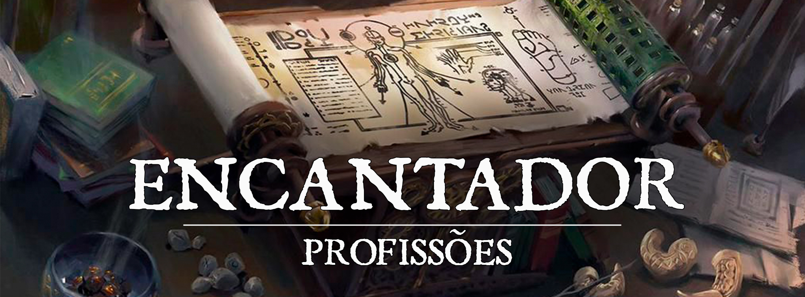

# Encantador

Durante a criação do multiverso o bastão de criador passou por diversas mãos, mas aqueles que o reteram por mais tempo e mostraram mais poderes foram os Primordiais. Seres manipuladores do elementos e da força que estes tinham sobre o tudo e o nada, manipuladores da prórpria vida e de conhecimento hoje perdido por entre os fragmentos do que chamamos de existência.

Através dos milênios, os excessos destes elementos foram se assentando e tomando formas físicas voláteis e puras, cristalizando-se. Conforme as civilizações foram se aprimorando, seres com afinidade maior com a trama começaram a ter lapsos de como manipular estes elementos cristalizados, que passaram a ser conhecidos como Fragmentos de Criação, e começaram a manipular objetos e o mundo ao redor, moldando-os de acordo com suas necessidades. E aqueles que aprenderam a imbuir estes Fragmentos em objetos são conhecidos como Encantadores.

## Benefícios

**Conversão Mágica** - Ao iniciar a jornada como um Encantador, a primeira coisa que se precisa saber é como manusear os seus instrumentos de trabalho. Ao escolher esse Ofício, o personagem adquire proficiência em Kit de Encantamento. Para exercer seu Ofício dentro da Guilda, não é necessário ter consigo um Kit, pois a Oficina lhe providencia tudo que é necessário.

**Síntese Mágica** - Um encantador preparado, munido de seus instrumentos de trabalho, pode auxiliar no preparo dos Itens Mágicos de seu grupo. Durante um descanso curto ou longo, o Encantador pode reforçar 1/2 de seu Rank (Arredondado para baixo) Bolsas de Componentes, Focos Arcanos, Símbolos Sagrados, Focos Druídicos ou qualquer outro item que possa ser usado como Foco de Magia. Isso faz com que a primeira conjuração delas seja mais efetiva, garantindo à primeira magia conjurada um bonus de 1/2 do Rank do Encantador (Arredondado para baixo) em Dano ou Cura. Para isso, é necessário que o Encantador tenha consigo um Kit de Encantamento, que custa 40 PO.

## Classes e Sinergias

Diversas vezes, um Aventureiro traduz para a sua Classe muitas das experiências de seu Ofício.

Portanto, algumas Classes são mais predominantes e mais passivas de se favorecerem com os conhecimentos trazidos da Manufatura.

Ao atingirem o nível 9 de Classe o Artesão recebe um bônus de +1 na rolagem para definir a Qualidade do Item a ser fabricado.

Em caso de um personagem ter 2 das classes listadas a baixo no nível 9, o bonus acumula até +2.

As classes que recebem este beneficio são:

* Mago Escriba - **Apenas Pergaminhos**
* Guerreiro Rúnico - **Apenas Runas**
* Bardo Colégio da Criação
* Clérigo do Domínio Arcano
* Guerreiro Arqueiro Arcano - **Apenas Runas**
* Bruxo do Gênio - **Apenas Runas**

# Fabricando Runas, Pergaminhos e Itens Mágicos

A fim de exercer seu Ofício com profissionalismo e dedicação, é importante que o Encantador saiba também suas limitações. Ao iniciar um trabalho, o Encantador poderá fazer Runas e Pergaminhos por conta própria, segundo os parâmetros descritos nesta sessão.

#### Tabela de Produção

| Rank Do Artesão | Nível do Item |
| --- | --- |
| 1 - Novato | Runas Comuns e Pergaminhos Truques / 1º Ciclo |
| 2 - Aprendiz | Runas Comuns e Pergaminhos 2º Ciclo |
| 3 - Aspirante | Itens Mágicos Comuns |
| 4 - Notável | Runas Incomuns e Pergaminhos 3º Ciclo |
| 5 - Experiente | Runas Incomuns e Pergaminhos 4º Ciclo |
| 6 - Perito | Itens Mágicos Incomuns |
| 7 - Veterano | Runas Raras e Pergaminhos 5º Ciclo |
| 8 - Mestre | Runas Raras e Pergaminhos 6º Ciclo |
| 9 - Grão-Mestre | Itens Mágicos Raros |

Magias que consomem materiais devem ter o custo integral do material adicionado ao custo de fabricação. Um Encantador só pode transcrever magias de listas das classes que possua e de círculos que possa conjurar daquela classe. Ex: Um mago2/Clérigo1 possui espaço de 2º Círculo mas, pode apenas fazer pergaminhos de TODAS as magias de 1º Círculo da lista de mago e da lista de clérigo.

As Runas Maiores, por sua característica mágica, apenas podem ser utilizadas em armas, armaduras e equipamentos mundanos (não-mágicos). Todavia, as Runas Menores podem dividir espaço com encantamentos mais poderosos podendo, assim, ser aplicadas em itens mágicos. Obedecem ainda a regra de apenas uma Runa Menor por item mágico.

Um encantador poderá confeccionar Itens Mágicos Maravilhosos por conta própria. Contudo, para criar Armas ou Armaduras, deverá seguir a regra abaixo.

## Produzindo itens mágicos e adquirindo Diagramas

Para a produção de itens mágicos, é necessário que a Guilda tenha disponível o Diagrama para a realização daquele item específico, caso contrário, os membros não deterão o conhecimento de como o fabricarem.

Constantemente, a Caravana poderá trazer Diagramas que ensinarão a Fabricação de um ou mais Itens Mágicos. Para tal, a Guilda, através de recursos próprios ou doações de membros, pode adquirir esses Diagramas, que ficarão à disposição da Oficina relacionada com o tipo específico de Item Mágico ensinado por aquele Diagrama, indeterminadamente.

A Guilda ou um próprio membro pode, enquanto uma Caravana estiver na Guilda, encomendar Diagramas para que a próxima Caravana os traga. Para tal, pagará 50% a mais do valor e garantirá que sua encomenda chegará na próxima visita.

## Tabela de Preços

Os preços dos itens produzidos por um encantador seguem as seguintes tabelas:

#### Pergaminhos

| Nível do pergaminho | Preço |
| --- | --- |
| Truques | 10 PO |
| 1º Círculo | 25 PO |
| 2º Círculo | 60 PO |
| 3º Círculo | 150 PO |
| 4º Círculo | 300 PO |
| 5º Círculo | 400 PO |
| 6º Círculo | 500 PO |

#### Runas

| Raridade | Preço |
| --- | --- |
| Comum (Menor) | 50 PO |
| Comum (Maior) | 100 PO |
| Incomum (Menor) | 200 PO |
| Incomum (Maior) | 600 PO |
| Rara (Maior) | 1200 PO |

## Tempo e Requisitos de Produção

O ofício de Encantador se divide em três principais seções: Inscrição de Runas, Criação de Pergaminhos e Criação de Itens Mágicos. Cada um tem suas peculiaridades, facilidades e dificuldades, conforme descrito nesta sessão.

#### Inscrição Rúnica

| Raridade | Produção | Requisito |
| --- | --- | --- |
| Comum | 2 dias | Rank 1- Novato |
| Incomum | 4 dias | Rank 4 - Notável |
| Rara | 6 dias | Rank 7 - Veterano |

**Cada equipamento só pode ter uma runa Maior e uma Menor embuída por vez.**

#### Criação de Pergaminhos

| Raridade | Produção | Requisito |
| --- | --- | --- |
| Truques | 1 dia | Rank 1 - Novato |
| 1º Círculo | 1 dia | Rank 1 - Novato |
| 2º Círculo | 2 dias | Rank 2 - Aprendiz |
| 3º Círculo | 3 dias | Rank 4 - Notável |
| 4º Círculo | 4 dias | Rank 5 - Experiente |
| 5º Círculo | 5 dias | Rank 7 - Veterano |
| 6º Círculo | 7 dias | Rank 8 - Mestre |

#### Itens Mágicos Próprios

| Raridade | Produção | Requisito |
| --- | --- | --- |
| Comum | 4 dias | Rank 3 - Aspirante |
| Incomum | 7 dias | Rank 6 - Perito |
| Raro | 10 dias | Rank 9 - Grão-Mestre |

OBS. Esses itens são especificamente os que o encantador pode fazer sozinho. Armas, Armaduras e Poções devem ser consultadas nas abas de Ferreiro e Alquimista.

# Lista de Encantamentos

## Gerais

Essas runas se aplicam a quaisquer dos tipos de equipamentos abaixo. E as regras de cada tipo ainda se aplicam.

| Runa | Raridade | Efeito |
| --- | --- | --- |
| Iluminação | Comum (Menor) | Com uma ação, você diz uma palavra de comando, fazendo com que o Item encantado emanar um brilho de 3m (10 pés) de luz plena e 3m (10 pés) adicionais de penumbra. O Brilho emitido é da cor que o portador desejar. Munições não permanescem emitindo luz se acertarem um alvo. (NÃO PODE ENCANTAR ARMADURAS) |
| Impecabilidade | Comum (Menor) | Este Item sempre está limpo e brilhante. Ele não se deteriora com a passagem do tempo, e sempre que algo o suja, este se limpa magicamente. (NÃO PODE ENCANTAR MUNIÇÕES) |
| Chamado | Comum (Menor) | Como uma ação bonus, você pode dizer uma palavra de comando e o Item, que esteja até 60ft, retorne para sua mão equipado. (NÃO PODE ENCANTAR ARMADURAS E MUNIÇÕES) |
| Redução | Comum (Menor) | Com uma ação, você diz uma palavra de comando, fazendo com que o Item encantado reduzir/aumentar de tamanho, alternando entre o tamanho de uma polegada e o tamanho original. (O Item não aumenta se não tiver espaço)(O Item perde suas propriedades enquanto reduzido)(NÃO PODE ENCANTAR ARMADURAS E MUNIÇÕES) |
| Silêncio | Comum (Menor) | O item encantado com esta runa não produz som (NÃO PODE ENCANTAR ARMADURAS E MUNIÇÕES) |

## Runas em Armas, Armas Naturais e Ataques Desarmados

Apenas Equipamentos, Armas Naturais e Ataques Desarmados com Runas de Rank Raro são considerados Mágicos com o propósito de ultrapassar resistências e imunidades.

| Runa | Raridade | Efeito |
| --- | --- | --- |
| Disfarce (Apenas Armas) | Comum (Menor) | Como uma ação, você diz uma palavra de comando fazendo com que sua arma tenha a aparência (mas não as propriedades) de um outro objeto que tenha aproximadamente as mesmas dimensões (por exemplo, uma espada longa pode obter a aparência de uma bengala, mas esta ainda cortaria quem tocasse o fio). O objeto e a aparência devem ser determinados no momento do encantamento, e uma vez escolhido não pode alterado. |
| Versatilidade (Apenas Armas Naturais ou Ataques Desarmados) | Comum (Menor) | Você pode escolher entre o dano ser contundente, cortante ou perfurante para seus ataques desarmados ou com armas naturais. |
| Brutalidade Menor | Comum (Maior) | Em um acerto crítico, esta arma, arma natural ou ataque desarmado causa 3d4 de dano adicional. Este dano é do mesmo tipo da arma. |
| Elemental Menor | Comum (Maior) | Esta arma, arma natural ou ataque desarmado causa 1d4 de dano adicional de Ácido, Elétrico, Ígneo, Gélido ou Trovejante, no primeiro ataque que acertar um alvo durante o turno. Apenas um elemento deve ser escolhido durante a fabricação da runa. |
| Punho de Adamantium | Incomum (Maior) | Ataques desarmados ou com armas naturais que acertarem um objeto ou estrutura são considerados acertos críticos. |
| Elemental | Incomum (Maior) | Esta arma, arma natural ou ataque desarmado causa 1d6 de dano adicional de Ácido, Elétrico, Ígneo, Gélido ou Trovejante, no primeiro ataque que acertar um alvo durante o turno. Apenas um elemento deve ser escolhido durante a fabricação da runa. |
| Brutalidade Maior | Incomum (Maior) | Em um acerto crítico, esta arma, arma natural ou ataque desarmado causa 6d4 de dano adicional. Este dano é do mesmo tipo da arma. |
| Ignição Maior | Raro (Maior) | Esta arma, arma natural ou ataque desarmado causa 1d8 de dano ígneo adicional, no primeiro ataque que acertar um alvo durante o turno. Adicionalmente, você pode conjurar o truque ‘Raio de Fogo’ uma vez por dia, podendo usá-lo novamente no próximo nascer do sol. O bônus de acerto deste truque é igual Mod. habilidade da Arma + Proficiência. |
| Congelamento Maior | Raro (Maior) | Esta arma, arma natural ou ataque desarmado causa 1d8 de dano gélido adicional, no primeiro ataque que acertar um alvo durante o turno. Adicionalmente, você pode conjurar o truques 'Raio de Gelo' uma vez por dia, podendo usá-lo novamente no próximo nascer do sol. O bônus de acerto deste truque é igual Mod. habilidade da Arma + Proficiência. |
| Corrosão Maior | Raro (Maior) | Esta arma, arma natural ou ataque desarmado causa 1d8 de dano ácido adicional, no primeiro ataque que acertar um alvo durante o turno. Adicionalmente, você pode conjurar o truque ‘Acid Splash’ uma vez por dia, podendo usar este truque novamente após o próximo nascer do sol. A CD de resistência deste truque é igual 8 + Mod. habilidade da Arma + Proficiência. |
| Raio Maior | Raro (Maior) | Esta arma, arma natural ou ataque desarmado causa 1d8 de dano elétrico adicional, no primeiro ataque que acertar um alvo durante o turno. Adicionalmente, você pode usar o truque ‘Shocking Grasp’ uma vez por dia, podendo fazê-lo novamente no próximo nascer do sol. O bônus de acerto deste truque é igual Mod. habilidade da Arma + Proficiência. |
| Tempestade Maior | Raro (Maior) | Esta arma, arma natural ou ataque desarmado causa 1d8 de dano trovejante adicional, no primeiro ataque que acertar um alvo durante o turno. Adicionalmente, você pode conjurar o truque ‘Thunderclap’ uma vez por dia, podendo fazê-lo novamente no próximo nascer do sol. A CD de resistência deste truque é igual 8 + Mod. habilidade da Arma + Proficiência. |

## Runas Defensivas
As Runas Defensivas podem ser inseridas em armaduras ou vestimentas (como em capas, luvas ou braçadeiras). Um personagem pode estar sob efeito de apenas uma Runa Defensiva por vez. Além disso, encantamentos em vestimentas apenas funcionam se o personagem não estiver vestindo nenhuma armadura. Apenas Armaduras com runas de Rank Raro são consideradas mágicas.

| Runa | Raridade | Efeito |
| --- | --- | --- |
| Glamourização Menor | Comum (Menor) | No momento do encantamento, você determina a aparência desta roupa, incluindo o estilo, a cor e os acessórios, mas a armadura retém seu mesmo tamanho e peso, e uma vez encantado, esta aparência não pode ser alterada. |
| Resistência Elemental Menor | Comum (Maior) | Uma vez por turno, você pode reduzir qualquer dano Ácido, Elétrico, Ígneo, Gélido ou Trovejante que receba em 1. Você deve escolher o dano em um descanso curto. |
| Saúde Menor | Comum (Maior) | Você recebe 5 Pontos de Vida Máximos enquanto estiver vestindo uma armadura ou vestimenta com esta runa. |
| Glamourização | Incomum (Menor) | Como uma ação bônus, você pode falar uma palavra de comando e fazer com que esta armadura assuma a aparência de um conjunto de roupas ou outro tipo de armadura. Você determina a aparência desta roupa, incluindo o estilo, a cor e os acessórios, mas a armadura retém seu mesmo tamanho e peso. |
| Resistência Elemental | Incomum (Maior) | Uma vez por turno, você pode reduzir qualquer dano Ácido, Elétrico, Ígneo, Gélido ou Trovejante que receba em 2. Você deve escolher o dano em um descanso curto. |
| Saúde | Incomum (Maior) | Você recebe 10 Pontos de Vida Máximos enquanto estiver vestindo uma armadura ou vestimenta com esta runa. |
| Resistência Elemental Maior | Raro (Maior) | Uma vez por turno, você pode reduzir qualquer dano Ácido, Elétrico, Ígneo, Gélido ou Trovejante que receba em 3. Você deve escolher o dano em um descanso curto. |
| Reflexão Mágica | Raro (Maior) | Uma vez por turno, ao receber dano de um feitiço, o conjurador recebe 5 de dano energético. Para causar esse dano, você deve estar a pelo menos 60 pés do alvo. |
| Saúde Maior | Raro (Maior) | Você recebe 15 Pontos de Vida Máximos enquanto estiver vestindo uma armadura ou vestimenta com esta runa. |

## Runas em Escudos
Apenas Equipamentos com Runas de Rank Raro são considerados Mágicos.

| Runa | Raridade | Efeito |
| --- | --- | --- |
| Alerta | Incomum (Maior) | Enquanto estiver empunhando o escudo, você tem vantagem em rolagens de iniciativa. |
| Alvorada | Incomum (Maior) | Como uma ação, você pode fazer com que seu escudo solte um flash de luz. Uma criatura de sua escolha faz um Teste de Resistência de Constituição CD 13 ou ficará cega até o fim do turno dela. O escudo ganha a capacidade de soltar um novo flash de luz no próximo nascer do sol. |
| Protetor Menor | Incomum (Maior) | Como uma ação bônus, o usuário pode proferir uma palavra de comando, recebendo 10 pontos de vida temporário enquanto equipado com o escudo. O escudo ganha a capacidade de prover estes Pontos de Vida Temporários novamente no próximo nascer do sol. |
| Atração de Projéteis | Incomum (Maior) | Como uma reação, você pode falar uma palavra de comando e atrair um único projétil que tenha um alvo à até 3m (10 pés). O projétil necessita passar sua CA para dar dano. |
| Guardião | Raro (Maior) | Como uma ação, o usuário pode proferir uma palavra de comando, fazendo com que seu escudo flutue e proteja uma área de cubo de 5 fts aonde este se encontra por 1 minuto. Enquanto uma criatura estiver dentro da área, ela recebe um bônus em seu CA equivalente ao CA provido pelo escudo. Durante o tempo que a runa estiver ativa, o usuário fica com suas mãos livres, mas não pode se beneficiar de aumento de CA de outros escudos. Como uma ação, o usuário pode proferir a palavra de comando novamente, desativando o efeito prematuramente, e se uma criatura estiver ocupando o espaço, poderá pegá-la sem a necessidade de ação, caso contrário a arma cai no chão no lugar que ocupava. Somente criaturas que tenham proficiência em escudos poderão ativar os efeitos desta runa. A runa pode animar um escudo novamente no próximo nascer do sol. |
| Protetor | Raro (Maior) | Como uma ação bônus, o usuário pode proferir uma palavra de comando, recebendo 25 pontos de vida temporário enquanto equipado com o escudo. O escudo ganha a capacidade de prover estes Pontos de Vida Temporários novamente no próximo nascer do sol. |
| Reflexão de Impacto | Raro (Maior) | Quando uma criatura erra um ataque corpo a corpo contra o usuário do escudo, a criatura recebe 5 de dano de energia. |

